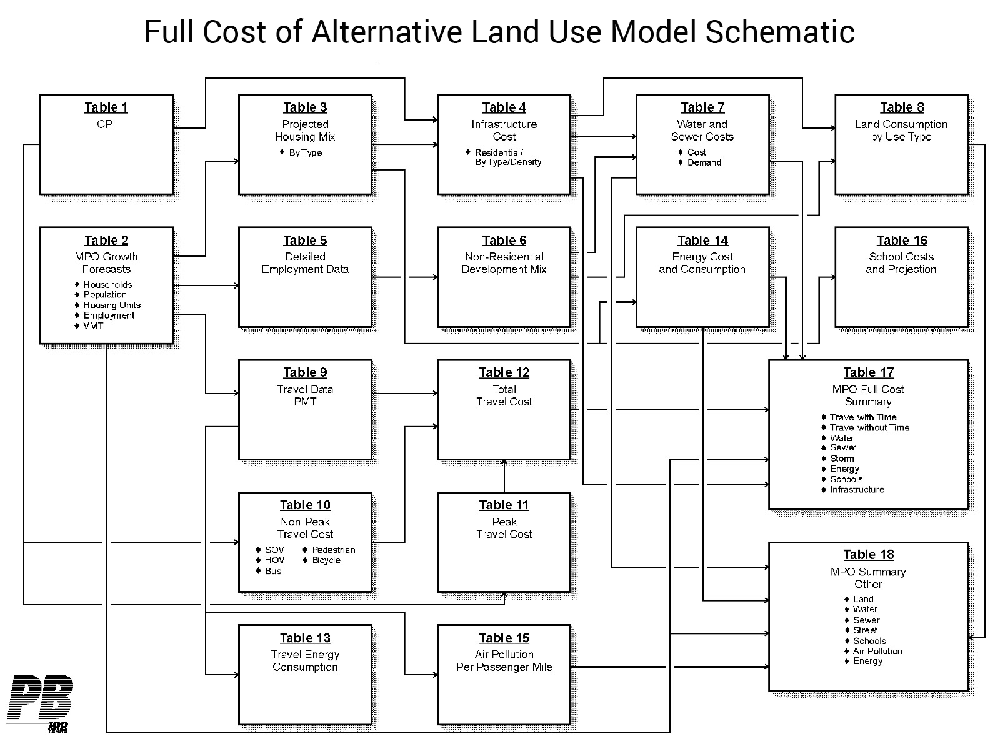

# Data and Models

Learn more about the CUUATS modeling suite including local transportation, land use, emissions, social costs, accessibility, and mobility data.

# Data and Models

![Diagram showing the types of software used to develop the future vision. CUUATS staff started with the Travel Demand Model and Urban Sim. These two programs analyze the vehicle miles traveled, mode choice, traffic volume by road link, congestion speed, population projections, employment projections, and areas of future growth. From there, the data collect from the Travel Demand Model and Urban Sim are used in three other programs: Social Cost of Alternative Land Development Scenarios (SCALDS), Motor Vehicle Emissions Simulator (MOVES), and Neighborhood Level Accessibility Analysis (Access Score). SCALDS measures transportation cost by mode, energy cost, infrastructure cost, and water and sewer cost. MOVES calculates GHG emissions, urban/rural emissions, and PM 25 and other emissions. Access Score measures the level of traffic stress, by transportation mode, accessibility score by transportation mode, and the accessibility scores by destination type.](LRTP2045_modelingdiagram_final.jpg)

Diagram of the modeling process used by CUUATS staff to develop the Long-Range Transportation Plan 2045 vision. Note: To expand the image to full-size, right-click the graphic and choose 'open image in new tab'.

Image:
[CUUATS](https://ccrpc.org/)

As described in the [modeling
section](https://ccrpc.gitlab.io/lrtp2045/vision/model/), the CUUATS modeling
suite is designed to provide a holistic approach to planning analysis through
the integration of localized transportation, land use, emission, social costs,
accessibility, and mobility data. Each model addresses a specific area of
concern at the necessary level of detail to make it appropriate for Champaign
County or the metropolitan planning area. The synergy of the different models
allows CUUATS planners to assess how different population changes and
development patterns will impact the transportation system in the future. By
quantifying the various impacts of potential transportation system changes,
planners are able to compare different future development scenarios as well as
develop individual performance measures. While all transportation improvements
require some combination of labor, materials, and expertise to carry out, some
desired improvements are more straightforward to measure and model than others.
For instance, completing gaps in the bicycle network or improving curb ramps to
improve multimodal connectivity can be counted, measured, and tracked as
improvements are completed over time. Other desired improvements, like limiting
sprawl development or reducing greenhouse gas emissions to improve environmental
health, rely on a number of additional factors and future unknowns that are not
as clearly measurable and are therefore more difficult to model for the future.

Two models serve as the foundation of the CUUATS modeling suite: a land use
model and a travel demand model (TDM). The land use model projects population,
employment, and land use change into the future while the TDM estimates the
number and location of auto and transit in the future. The TDM is integrated
with the land use model, running in a 5-year iterative process over the 25-year
planning period, to identify the relationships between land use changes and
travel patterns in the region. Three additional models, SCALDS, MOVES, and
Access Score, use the outputs from the first two models to project different
costs of development, vehicle emissions, and transportation network
accessibility for all modes. Models can’t *predict* the future, but they can
help us *imagine* the future and try to understand how our actions today could
impact our transportation system down the road. Countless variables will
determine the health and relative success of the region over the next 25 years.
While the LRTP 2045 models and projections were carefully designed and validated
whenever possible, they are not perfect reflections of the social and physical
processes in play, and the input data used is imperfect.

The following sections provide additional documentation or links to additional
documentation about the methodologies and input data used for each of the
models.

## Travel Demand Model (TDM)

CUUATS built the first travel demand model (TDM) for the Champaign-Urbana
urbanized area in 2003, which was later expanded to include all of Champaign
County. The current Champaign County TDM is the foundation of the CUUATS
modeling suite, producing fundamental information needed to plan for the future
transportation system such as the current and projected transportation demand of
persons and goods in Champaign County. Since 2003, CUUATS has been maintaining,
documenting, and expanding the TDM capabilities to serve the planning needs of
the region and to support and advance travel demand modeling initiatives across
the state.

**The [TDM Documentation page](https://ccrpc.gitlab.io/lrtp2045/data/tdm/) details
the different components, inputs, outputs, and processes that make up the
Champaign County TDM.**

**A brief summary of the main TDM outputs for the LRTP 2045 is included in the
[Modeling](https://ccrpc.gitlab.io/lrtp2045/vision/model/#travel-demand-model-tdm)
section of the plan.**

## Land Use Model: UrbanSim

Effective coordination of land use development and transportation planning can
produce policies and strategies that preserve and enhance valued natural and
cultural resources and facilitate healthy, sustainable communities and
neighborhoods.

[UrbanSim’s](https://urbansim.com/)
[UrbanCanvas](https://urbansim.com/urbancanvas) modeler is a microsimulation
land use model designed to support the regional transportation planning process
by forecasting future scenarios based on the interactions of individual persons
and households. UrbanCanvas consists of a series of interconnected models that
allow planning agencies to analyze anticipated and possible future changes in
land use and development patterns, regulations, and growth rates, over a
designated planning horizon. The outputs forecasted by the model can vary based
on the wide array of inputs.

**To learn more about the inputs used in the land use model, visit the [CUUATS
land use site in
GitLab.](https://gitlab.com/ccrpc/land-use-model)**

**To explore the parcel-level outputs of the land use model, visit [CUUATS land
use model results site](https://maps.ccrpc.org/land-use/). There you can select
from a series of drop-down menus to display the land use model results for any
year between 2015 and 2045.**

**A brief summary of the main land use model outputs for LRTP 2045 is included in
the [Modeling](https://ccrpc.gitlab.io/lrtp2045/vision/model/#urbancanvas-land-use-modeling)
section of the plan.**

## Social Cost of Alternative Development Scenarios (SCALDS)

The [Social Cost of Alternative Land Development Scenarios (SCALDS)
model](https://www.fhwa.dot.gov/scalds/scalds.html) was sponsored by the Federal
Highway Administration and developed under contract with Parsons Brinckerhoff,
Quade and Douglas Inc. (PB), to estimate the full cost of alternative land use
patterns. The EXCEL-based spreadsheet builds on three areas of research - least
cost planning, full cost of travel studies, and cost of service/cost of sprawl
research.

Full Cost of Alternative Land Use Model Schematic from FHWA's documentation on the SCALDS model. Note: To expand the image to full-size, right-click the graphic and choose 'open image in new tab'.

Image:
[Excerpt from 'The Full Social Costs of Alternative Land Use Patterns: Theory, Data, Methods, and Recommendations.' Prepared for USDOT, FHWA by Parsons Brinckerhoff Quade & Douglas, Inc. ECONorthwest, June, 1998.](https://www.fhwa.dot.gov/scalds/fullrpt98.pdf)

SCALDS requires detailed input data from a variety of different sources relevant
to development costs and trends at the national and local level. In
addition to current data, SCALDS also requires data specific to the different
future scenarios being modeled in order to compare them against the base year
and against one another such as population and employment projections, housing
mix, and land use changes. Some inputs come from the other models in the CUUATS
modeling suite as illustrated in the diagram at the top of the page.

SCALDS is made up of 19 detailed and interconnected spreadsheets that calculate
different costs based on the inputs provided for the base year and the
scenarios. The following is a summary of the four main components of the SCALDS
inputs and outputs.

* The first step in estimating **transportation** cost is to estimate the total
  number of daily trips produced in the region, which is obtained by multiplying
  the number of households by the average household trip production rate. The
  trips are then divided among different modes of travel using the mode choice
  estimates. Person miles traveled (PMT) for each mode is estimated by
  multiplying average trip lengths by the number of trips. PMT for different
  modes is them multiplied by the average cost per mile for each mode to get
  total transportation cost. Assumptions about the [advent of connected and
  autonomous
  vehicles](https://ccrpc.gitlab.io/lrtp2045/data/tdm/#modeling-for-the-advent-of-electric-connected-and-autonomous-vehicles)
  for the future scenarios impacted these inputs, as detailed further in the TDM
  documentation. SCALDS has separate cost estimates for peak and off-peak travel
  for each mode of transportation. Finally, all of the costs for all of the
  modes are combined to get one estimate of the total transportation cost for a
  scenario.
* Demand for **water, sewer, and storm-water** infrastructure is estimated based
  on the type of household. As such, the projections for the number of households
  are broken down into different categories using observed housing mix in the
  region. Localized estimates for water and sewer demand for each type of housing
  are then used to estimate total residential water and sewer demand. A similar
  process is followed to estimate non-residential demand where employment
  projections are divided between different industrial classifications. The
  average demand for each type of non-residential use is then used to calculate
  non-residential water and sewer usage costs.
* **Energy** cost estimates are based on local data on the average annual energy
  use of different types of households. These estimates are multiplied by the
  number of households associated with each category to get the total energy
  usage for each type of household. The total energy cost can then be estimated
  from the total energy by considering the average cost of energy usage.
  Existing plans and projections to expand solar energy production in the region
  were taken into account when calculating the energy inputs for future
  scenarios. The proliferation of [electric
  vehicles](https://ccrpc.gitlab.io/lrtp2045/data/tdm/#modeling-for-the-advent-of-electric-connected-and-autonomous-vehicles)
  was also incorporated into calculations for future energy consumption.
* SCALDS estimates the cost of **infrastructure** for new developments based on
  the type of development. Based on housing projections, the number of new housing
  units are estimated for fixed intervals of time, such as 2020 to 2025, which are
  then used to estimate the infrastructure cost for new developments.
  Infrastructure costs are divided into two categories: streets and utilities.
  SCALDS uses local estimates for the infrastructure costs of street and utilities
  for different types of housing units.

SCALDS provides as outputs cost estimates for every five years over the planning
horizon. **A brief summary of the main SCALDS outputs for LRTP 2045 is included
in the
[Modeling](https://ccrpc.gitlab.io/lrtp2045/vision/model/#social-cost-of-alternative-land-development-scenarios-scalds)
section of the plan.**

## Motor Vehicle Emission Simulator (MOVES)

EPA’s [MOtor Vehicle Emission Simulator (MOVES)](https://www.epa.gov/moves) is a
state-of-the-science emission modeling system that estimates emissions for
mobile sources at the national, county, and project level for criteria air
pollutants, greenhouse gases, and air toxics.

Although the Champaign-Urbana urbanized area is currently an attainment area for
all emissions quality standards, CUUATS staff proactively includes MOVES in the
modeling suite to estimate the environmental impact of alternative planning
scenarios. This data also allows the region to continually track and better
understand how ongoing development affects emissions in order to remain an
attainment area.

Before the LRTP 2045 modeling process officially began, CUUATS was one of only
four agencies from around the country chosen by the EPA to provide critical data
for a project looking at air quality and greenhouse gas emissions caused by
transportation. This work helped CUUATS staff prepare local MOVES functionality
as part of the modeling suite used for the LRTP 2045.

**The CUUATS case study, part of a document published on the EPA’s
website titled [Applying TEAM in Regional Sketch
Planning,](https://nepis.epa.gov/Exe/ZyPDF.cgi?Dockey=P100VOWM.pdf) finalized in
November 2018, looks at ways for Champaign County to realize a significant
decrease in greenhouse gas emissions if certain strategies are implemented in
the Champaign-Urbana region.**

Several calculated assumptions impact the MOVES 2045 outputs including
[increased
temperature](https://www.vox.com/a/weather-climate-change-us-cities-global-warming),
a significant increase in the share of [electric, connected, and autonomous
vehicles](https://ccrpc.gitlab.io/lrtp2045/data/tdm/#modeling-for-the-advent-of-electric-connected-and-autonomous-vehicles),
and [transportation network
recommendations](https://ccrpc.gitlab.io/lrtp2045/vision/futureprojects/).

**A brief summary of the main MOVES outputs for LRTP 2045 is included in
the [Modeling](https://ccrpc.gitlab.io/lrtp2045/vision/model/#mobile-source-emissions-moves)
section of the plan.**

## Neighborhood Level Accessibility Analysis: Access Score

Many of the long-range transportation planning assessment processes are
concerned with data and trends that occur at the regional level. While this is
beneficial for understanding the overall future direction of the community, it
is not localized enough to help identify specific limitations in the
transportation network. To help address this spatial mismatch and make the
CUUATS transportation planning and modeling processes more complete, staff
developed a geography neutral, multimodal accessibility assessment, known as
Access Score. This tool utilizes level of traffic stress (LTS) assessments for
each mode and travel time to calculated accessibility scores to several
destination types. These accessibility scores help staff to assess the current
and potential future status of accessibility in the Champaign-Urbana region, to
identify areas in need of improvement, and to observe potential benefits from
the construction of new infrastructure.

To develop Access Score staff utilized an existing bicycle level of traffic
stress (BLTS) assessment from the [Mineta Transportation
Institute](http://transweb.sjsu.edu/research/low-stress-bicycling-and-network-connectivity),
and an existing pedestrian level of traffic stress (PLTS) assessment from the
[Oregon Department of
Transportation](https://www.oregon.gov/ODOT/Planning/Documents/APMv2_Ch14.pdf).
Automobile level of traffic stress (ALTS) is assessed using an in-house
analysis, created by CUUATS staff to emulate the assessments for BLTS and PLTS,
by considering elements of the automobile transportation network and its
interactions with other modes. Each segment in the network was assigned an
overall level of stress based on the highest, or most stressful score it
received for any one of the characteristics considered. Transit level of traffic
stress (TLTS) is assessed using the Pandana accessibility tool, which uses
general transit feed specification (GTFS) and transit headway and schedule data
to assess transit trips based on the time required to reach a destination, which
is then combined with the pedestrian score required to get from the point of
origin to the nearest bus stop.

Once the modal LTS scores were complete, accessibility was calculated by
multiplying the LTS scores by the travel time. The assessment includes
accessibility to the following ten destination types: grocery stores, health
facilities, jobs, parks, public facilities, retail stores, restaurants, schools,
arts and entertainment, and services.

**The accessibility scores for Champaign County can be seen in the [Access Score
application](https://ccrpc.gitlab.io/access-score/#map=12/40.11032/-88.22888)
embedded below. Expand the menu in the top left corner to explore the
scenarios, travel modes, and destinations.**

Map of the pedestrian crashes within the metropolitan planning area from 2012 to 2016.

**To learn more about the code and documentation for level of traffic stress
calculations, visit the [CUUATS LTS site in
GitLab.](https://gitlab.com/ccrpc/cuuats.snt.lts)**

**For more information about the code and documentation regarding Access Score
calculations, visit the [CUUATS Accessibility site in
GitLab.](https://gitlab.com/ccrpc/cuuats.snt.accessibility)**