# TDM Documentation

The Champaign County Travel Demand Model (TDM) is a transportation planning tool
developed to evaluate the existing transportation system and forecast future
travel demand in the region. The model utilizes the roadway network, transit
network, socio-economic data, land use data, and existing travel patterns to
estimate traffic volumes in relation to roadway capacity. The model also
predicts the future travel patterns in the region and project-level future
traffic conditions based on changes to the roadway network in combination with
socio-economic, land-use, and other data.

The TDM is a necessary tool to meet federal agency requirements established for
transportation planning in urban areas. As per federal guidelines, the
Metropolitan Planning Organizations (MPOs) are required to project
transportation demand over at least a 20-year planning horizon as part of the
Long Range Transportation Plan (LRTP). In addition, the U.S. Environmental
Protection Agency (EPA) under the Clean Air Act (CAA) requires EPA-approved
emission factor models for non-attainment areas (areas where pollutants exceed
National Ambient Air Quality Standards) which rely on TDM outputs including
vehicle speeds and Vehicle Miles Traveled (VMT). The Federal Transit
Administration (FTA) also emphasizes the need for a reliable travel demand model
for proposed New Start and Small Start projects. As the foundation for many
transportation planning efforts, the Federal Highway Administration (FHWA)
continuously supports research and development of travel demand modeling through
the Travel Model Improvement Program (TMIP).

The TDM has been used to evaluate and compare future scenarios during the
development of the CUUATS Long Range Transportation Plan (LRTP) updated every
five years. The TDM has also been used to perform corridor planning and traffic
impact studies or to evaluate future development scenarios, sub-area planning,
transit planning, land use planning, transportation funding allocation, and
other transportation planning studies in Champaign County. The TDM is especially
beneficial for determining transportation needs and providing data to support
infrastructure development in rural areas of Champaign County. In addition, the
TDM provides crucial inputs to the Champaign County Social Cost of Alternative
Land Development Scenarios (SCALDS) model, the Motor Vehicle Emission Simulator
(MOVES) model, and the UrbanSim land use model.

## The Passenger Travel Demand Model Process

The Champaign County TDM is a person trip model built on the Citilabs Cube
transportation modeling software platform and follows the typical four-step
forecasting process, illustrated in the graphic below. The following elements
are the major modules of a four-step model:

[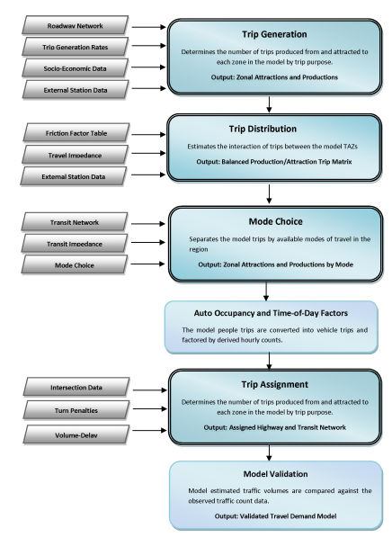](/destination)

Image:

Champaign County TDM

* Trip Generation
* Trip Distribution
* Mode Choice
* Trip Assignment

A “trip” is defined as person/vehicle traveling from an origination to a
destination without any intermediate stops. In the modeling process, trips
(person/vehicle) are generated, distributed between model zones, and assigned on
the roadway network. A trip within the model can be made for various purposes,
such as going to work for shopping, recreation, etc. The model categorizes trips
into various trip purposes to capture the characteristics of each trip type. The
major trip purposes are Home Based Work (HBW), Home Based Other (HBO), and
Non-Home Based (NHB). These basic trip classifications can be subdivided further
to increase the sensitivity of the model.

The model study area is divided into smaller geographical areas, known as
traffic analysis zones (TAZs) for analysis. Trip generation utilizes land use,
socio-economic data, and trip rates/equations to estimate the number of trips
beginning and ending at each TAZ by trip purpose. The trip distribution step
allots the trips from one zone to every other zone in the model. The gravity
model is the most common trip distribution model and uses spatial separation
between zones and magnitude of zonal activity to distribute the trips.

The mode choice module splits the model trips by the competing modes of travel
in the region. Once the transit and non-motorized trips are separated from the
total trips, the remaining person trips are converted into automobile trips
using auto occupancy factors. Finally, the trip assignment step assigns the auto
and transit trips on the highway network and the transit network, respectively.
Various models using different trip allocation and route selection
methodologies are available for executing the trip assignment step.

### Model Validation and Calibration

A travel demand model is not considered reliable for future year forecasts until
it is validated to replicate the existing base year traffic patterns in the
region. Model calibration is the process of adjusting the model input parameters
to ensure the model results are comparable to the observed data. The [Model
Validation and Reasonability Checking Manual](https://www.fhwa.dot.gov/planning/tmip/publications/other_reports/validation_and_reasonableness_2010/fhwahep10042.pdf)
prepared for the Federal Highway Administration (FHWA) defines validation and
calibration as the following:

> *“Validation is the application of the calibrated models and comparison of the
> results against observed data. Ideally, the observed data are data not used for
> the model estimation or calibration but, practically, this is not always
> feasible. Validation data may include additional data collected for the same
> year as the estimation or calibration of the model or data collected for an
> alternative year. Validation should also include sensitivity testing."*

> *“Calibration is the adjustment of constants and other model parameters in
> estimated or asserted models in an effort to make the models replicate observed
> data for a base (calibration) year or otherwise produce more reasonable
> results. Model calibration is often incorrectly considered to be model
> validation."*

Errors in a travel demand model can be propagated through a lack of reliable
input data, errors in processing the input data, and/or inadequate knowledge of
model tools and scripting. Ideally, the model results are validated after each
forecasting step to ensure model credibility.

For each of the TDM steps, the manual recommends a set of comprehensive
calibration and validation checks. The sources for the Champaign County TDM
validation data include region household surveys, on-board transit surveys,
socioeconomic data not used as model input, National Cooperative Highway
Research Program Report 365: Travel Estimates for Urban Planning (NCHRP Report
365) data, National Household Travel Survey (NHTS) data, 2015 American Commodity
Survey data, and 2015 base year traffic counts.

### Modeling for the Advent of Electric, Connected, and Autonomous Vehicles

In 2018, CUUATS carried out a qualitative connected/autonomous vehicles
(C/AV) scenario planning exercise through a University of Illinois at
Urbana-Champaign Master of Urban Planning student’s [capstone project](https://www.ideals.illinois.edu/handle/2142/103847). This section details
CUUATS’s attempts to explore the impacts of C/AVs quantitatively through
modeling. It is worth emphasizing that this C/AV modeling exercise is by no
means a comprehensive and accurate depiction of the future C/AVs might bring, as
the technology is still under active development and its implications are still
unfolding. CUUATS’s assumptions on the impact of C/AVs and their representation
in the TDM were based on an extensive literature review of existing academic
research and other transportation planning practitioners’ experience.

The table below shows CUUATS’s assumptions for electric vehicle (EV) and C/AV
fleet and travel share. CUUATS assumed all autonomous vehicles are electric but
not all electric vehicles are autonomous. The main sources for EV and C/AV
projections as percent of US stock are
[IMF](https://voxeu.org/article/riding-energy-transition-oil-beyond-2040) and
[Fox-Penner, et
al.](https://www.sciencedirect.com/science/article/pii/S0301421518304737) Other
sources used for projections as percent of total US sales include, but are not
limited to, Bloomberg New Energy Finance, AV Adoption, Edison Electric, Illinois
PIRG, JP Morgan, and Forbes Energy Policy Simulator model. CUUATS utilized the
low end of the averaged projections from various sources for our region in 2045
because we assume that this technology will take off earlier and quicker in
major metropolitan areas.

For the 2045 future scenarios, CUUATS TDM considered the uncertainties of C/AVs
and their potential impacts on the demand side (trip generation and trip
distribution) and supply side (network capacity) of travel in the region, as
shown in the table below. There are still many uncertainties C/AVs might bring
that the CUUATS TDM cannot meaningfully incorporate. CUUATS will keep following
the best practices of modeling for C/AVs and modify the TDM to the best of our
abilities.

## Traffic Analysis Zones

The passenger TDM study area covers all of Champaign County. For modeling
purposes, a series of small geographical areas called traffic analysis zones
(TAZs) is used to divide the study area into smaller components. TAZs are used
to evaluate the traffic flow patterns in the region by functioning as the
locations where trips begin (trip producers) and end (trip attractors). A TAZ in
a model is represented by a centroid and is connected to the roadway network via
centroid connectors. The spatial extent of a TAZ is based on the U.S. Census
block data, land use characteristics, density of population and employment,
physical/jurisdictional boundaries, natural barriers, and the model roadway
network. Ideally, the TAZs contain similar land uses to minimize intrazonal
trips. The size of the TAZ also depends on the density of the area and the
nature of the model. Urban areas are expected to have smaller TAZs compared to
rural areas.

External stations along the intersection of major roadways (Interstates,
State/County routes) and the county boundary are entries and exits to the County
that can be used to determine the amount of internal-external/external-internal
and external-external travel in the model.

The Champaign County TDM updated for LRTP 2045 continues to use the [TAZs and
external station locations defined for LRTP
2040](https://lrtp.cuuats.org/lrtp-appendices_011615_reduced_f-tdm/), as there
haven’t been drastic changes in the region that would warrant a re-delineation
of the TAZ boundaries or reselection of the external stations. However,
socio-economic data for the TAZs as well as traffic volume, through traffic
percentage, and truck traffic percentage information for the external stations
were updated in the TDM. The Champaign County TDM study area contains 307 TAZs
(internal zones) and 26 external stations.

## Roadway Network

The model roadway network is an essential input to the passenger TDM and
represents the supply side of the modeling processes. The roadway network is
used to distribute and assign model trips as well as store model outputs such as
traffic volume and Vehicle Miles Traveled (VMT). The model network was updated
from the 2010 roadway network used in the previous LRTP to represent the 2015
base year roadway network using QGIS. Cube Voyager accommodates multiple
networks to represent base year and alternate/future scenarios.

### Roadway Network Structure

The model network is composed of nodes and links. Nodes represent the
intersection of roadway links. Node attributes include node number,
x-coordinate, and y-coordinate. Links represent the roadway segments in the
model. The network links store basic roadway information such as link
attributes, which are used to distribute/assign trips in the model. Basic link
attributes include lane configuration (one-way/two-way, number of lanes), link
length, area type, facility type, speed, and roadway capacity. The accuracy of
these attributes is essential to develop a reliable travel demand model. The
roadway network in a travel demand model is limited to interstates/freeways,
arterials, and collector roadways. The local roadway system is too detailed for
modeling purposes and is represented using centroid connectors. Some local
roadways are included in the model when they provide crucial network connection
to major roadways. The Cube model network also stores the intermediate model
calculation and final model outputs in the “assigned” model network after a
model run.

The TDM 2015 base year roadway network added one roadway connection (Florida
Avenue extension to east of Abercorn Street) and modified three roadway segments
from the 2010 roadway network.

The LRTP and the TIP, along with other planning documents and processes were
used to identify proposed fiscally constrained roadway improvements through
2025, including the I-74 and I-57 interchange reconstruction, MCORE projects,
Olympian Drive extension, North Lincoln Avenue extension, I-74 posted speed
limit reduction, etc. Discussions with the local municipalities led to
identification of several fiscally unconstrained vision roadway projects till
2045.

### Model Network Link Attributes

The basic link attributes required for the modeling process are link distance,
speed, and capacity. All other input link attributes are used to either identify
a link in the network (A and B nodes) or to calculate link distance, speed, and
capacity. The table below shows the link attributes incorporated in the
Champaign County TDM. Attributes 1 - 3 are used to identify a link in the
network. Attributes 4 - 11 are used to calculate link speed, capacity, and
volume delay. Volume delay (SPD\_CRV) is based on the facility type and free flow
speed of the link and is used as an input in the trip assignment module.
Attributes 17 through 22 are the final model outputs. The accuracy of the travel
demand model depends heavily on the quality of the input variables.

#### Facility Type/Functional Classification

> *“Functional classification is the process by which streets and highways are
> grouped into classes, or systems, according to the character of traffic service
> that they are intended to provide”* ([Flexibility in Highway Design,
> FHWA](https://www.fhwa.dot.gov/environment/publications/flexibility/flexibility.pdf)).

The functional classification, also called link facility type in Cube Voyager,
is used to determine the free flow speed, capacity and volume-delay
characteristics for the network link. Illinois Department of Transportation
(IDOT) functional classification, which is based on the FHWA guidelines, was
used in the Champaign County TDM network. The countywide roadway network links
were classified into the following seven functional classifications:

**Centroid Connectors** represent the majority of the local roadways in the
model and connects the model TAZ centroids to the adjacent roadway network.
These links have high capacity and very low speed. The TAZ centroid is the
point of trip origin and destination and contains the socio-economic
information pertaining to the TAZ. The centroid connectors represent the local
roadways in the model and provide links between the centroids and the adjacent
roadway network.

**Local roadways** provide limited mobility and offer primary access to the
local land uses. These links have low capacity and low volume. Local roadways
are rarely represented in the model network.

**Collectors** connect local roadways/centroid connectors with arterials. These
roadways balance mobility with local access. Collectors make up for the
majority of the links in the roadway network.

**Minor Arterials** are high volume links connecting collectors/local roadways
to major collectors and interstates. These links have moderate speed and
capacity. Access to land use activities are limited.

**Major Arterials** serve major traffic movement in the community with high
mobility and limited land access. These links have high speed and capacity.

**Freeways** provide the highest mobility and high speed with limited access
via ramps.

**Ramps** connect freeways/interstates with the rest of the roadway network.

The following map shows the roadway facility types in the Champaign County TDM.

Map of roadway facility types in the Champaign County TDM.

#### Area Type Classification

Area type is used to categorize the TAZs and the adjacent roadway links based on
the socio-economic characteristics and land use density. Population and
employment density have a direct impact on the speed and the capacity of the
adjacent roadway links. High density TAZs are expected to have more traffic
congestion, intersection and access density, and pedestrian volumes, which can
be related to slower speed and lower roadway capacity. A roadway link in or
bordering a high density urban TAZ is expected to have low speed and capacity
compared to a link associated with a low density rural TAZ. The area type for
the TAZs should be changed in future scenarios based on proposed future changes.
The countywide area types were categorized as follows:

1. Very High Density Commercial/Residential
2. High Density Commercial
3. Moderate Density Commercial
4. High/Moderate Density Residential
5. Very Low Density Commercial/Residential

The table below shows the area type criterion associated with the population and
employment density per square mile. The information in the table was used in the
model script to uniformly assign the area types to the network links.

#### Link Distance

The network link distance information was derived from the IDOT roadway
centerline shapefile. The shapefile contains the link length based on the true
shape of the roadway. The link distance in miles is automatically saved as an
attribute when the roadway network shapefile is imported into Cube.

#### Link speed

The ideal method to estimate the link speed, referred to as the free flow speed,
is by conducting travel time studies along the roadway included in the model
network. Due to time and financial constraints, this approach is not always
feasible for the Champaign County TDM. The free flow links speeds for the
Champaign County TDM were estimated based on the link facility type, the area
type, available literature, and models from other regions. The free flow speed
is usually lower than the posted speed limits in urban areas. The following
table shows the link free flow speeds included in the model script to uniformly
assign the link speed to the network links.

#### Link capacity

The daily capacity for each link in the Champaign County TDM network was
calculated based on its facility type and area type, as shown in Table 6. The
link capacity was used to determine the volume delay functions in the trip
assignment process. For example, if a Two-Way Left Turn Lane (TWLTL) was
present, the link capacity increased by 30 percent. The centroid connectors have
high capacity and very low speed (15mph).

### Turn Penalties

The turn penalties are a crucial input in the trip assignment process that add
delay to the turn movements in the model network. In certain cases, turn
penalties can also be used to prohibit a turn in the network. Each turn penalty
entry is a combination of three successive nodes making up the turn which needs
to be restricted or prohibited. Specific turn penalties can be adjusted to
represent the existing and future conditions. The Champaign County travel demand
model includes a three second delay for all right turns and a six second delay
for all left turns in the model network.

### Intersection Junction Data

An intersection junction file was used in the TDM to simulate intersection
traffic operation. The intersection junction data includes phases and signal
timing information for major signalized intersections which is used in the trip
assignment process to estimate the delay at the intersections. A total of
fifty-eight (58) signalized intersections were coded/updated in the urbanized
area.

### Transit Network

In addition to the highway network, a transit network was also coded
concurrently to model the transit trips. The transit lines were coded over the
existing highway links and use the same network nodes. The basic network
attributes such as link distance, speed and travel time are shared between the
roadway and transit network. To maintain consistency between the networks, any
changes to the roadway or transit networks require that the other network be
modified accordingly. The transit network for the Champaign County TDM was based
on the individual route itineraries and transit stops published by the
Champaign-Urbana Mass Transit District (MTD). MTD operates transit lines in the
Champaign-Urbana urbanized area. The MTD route structure varies marginally
during morning and evening peak hours. Since the route difference is minor, a
single transit route was coded for each line. CUUATS staff met with C-U MTD
staff and identified potential transit operation changes for 2045. The following
table shows the attributes used in the transit network.

### Model Network Validation

The Champaign County travel demand model network was compared against the
existing roadway network as part of the validation process. Local knowledge and
aerial photography were used to validate and make necessary adjustments to the
model network. The following attributes were checked in the validation process:

* Number of Lanes
* Facility Type
* Area Type
* Centroid and Centroid Connector Locations
* Intersection Junction data
* One-way Links
* Two Way Left Turn Lanes (TWLTL)
* Free Flow Speed & Capacity
* Transit Routes and Non-Transit Leg Connections

The freeway to freeway ramp coding was checked for proper connections. The ramp
link lengths were corrected to match the actual curved distance on the actual
roadway. The ratio of distance between the coded length on the highway network
link and the actual distance on the field was compared for accuracy. The actual
distance was obtained from the GIS street shapefile. Any ratio which fell
outside of the range between 0.9 and 1.1 was corrected.

The location of the zone centroids and the access points at which the centroid
connectors were linked to the highway network was compared with aerial
photographs. The location of some of the centroids/ external stations and the
access points were corrected to match with the existing ground condition. The
network connectivity was checked using the tools provided in Cube Voyager.

Origin-destination paths were plotted between zones in Cube and checked for
reasonability.

## Socio-Economic Inputs

Zonal socioeconomic data is another important input for the modeling process.
Basic socio-economic data by TAZ includes population, household, and employment
data for Champaign County. Trips produced from each TAZ are related to the
household characteristics of each zone, while the attractions to each TAZ are
based on the zone’s employment information. Data for the base year was
aggregated or disaggregated to match the TAZ-level data structure of the model.

### Population & Household Data

Zonal population and household data used in the TDM were generated by the
UrbanCanvas land use model. The UrbanCanvas model and TDM run in an iterative
process, in five-year intervals, that allows any congestion or other
transportation patterns that may impact regional development in the next 25
years to be considered in UrbanCanvas’s prediction of future development. Based
on local knowledge, staff made some adjustments to UrbanCanvas’s modeled zonal
population and household values to better reflect what currently exists in the
county, as well as certain known futures.

The base year total household value was established by combining the 2010 Census
Champaign County total household value and the group quarter population total.
This was done because the model does not otherwise account for populations that
are not represented by conventional households. These include the University of
Illinois student population living in dormitories, as well as institutionalized
persons in the county. This total was then projected forward to 2045 using a
growth rate established based on historic Census data. For each scenario, the
population synthesizer then created a total population value for each simulation
year, based on the total number of households and household size characteristics
from the Census Bureau’s American Community Survey (ACS). The population was
then assigned to specific blocks using the household location choice model. The
population projections generated by UrbanCanvas were validated using [Illinois
Department of Public Health (IDPH) county population projections from 2010 to
2025](https://www2.illinois.gov/sites/hfsrb/InventoriesData/Documents/Population_Projections_Report_Final_2014.pdf).

### Employment Data

Like the population projections, UrbanCanvas employment projections are based on
producing jobs at the regional level to match the total provided by an
employment control table. The control table totals were created based on the
2015 regional jobs data gathered by NAICS sector. This data was then projected
forward using sector-specific growth rates, which were based on sector-specific,
Bureau of Economic Analysis (BEA) average change rates from 2010 to 2015.
Research was done to confirm that these rates are anticipated to remain
consistent over the next 25 years, based on national projections. For each
scenario, the jobs were then located in specific zones using the employment
location choice model.

## Trip Generation

The trip generation module estimates the trips being produced and attracted to
each zone in the model, based on the zonal socio-economic data. The trip
productions are associated with zonal household data whereas the trip
attractions are associated with the employment in the zone. The trips are
generally produced at home and attracted to the activity centers, although some
trips that do not start or end at home are also modeled. Model trips include
Internal-Internal (I-I) trips where both trips end within the model study area,
Internal-External (I-E) trips where one trip ends outside the model study area
and External-External (E-E) trips where both trips end outside the model study
area. This section discusses the steps involved in the trip generation process:

* Determining the model trip purposes
* Estimating the trip production and attraction rates by trip purpose
* Estimating the amount of external travel (I-E/E-I and E-E trips)
* Balancing I-I, I-E/E-I, and E-E trip productions and attractions
* Validating the model trip generation rates

The inputs to the trip generation step include zonal household and employment
data, any available household or/and external surveys, and the Average Daily
Traffic (ADT) counts at the external stations. The outputs of this step were the
zonal trip attractions and productions by trip purpose, which were used in the
trip distribution module for zone-zone trip distribution.

### Trip Purposes

Production and attraction trips are categorized into different trip purposes
based on the nature of the trip. While most of the model trips either start or
end at home, the trips are categorized based on the activity at the trip
destination. Trip purposes differ in characteristics such as trip length and
auto occupancy and are sensitive to specific socio-economic data. The three
basic trip purposes are Home Based Work (HBW), Home Based Other (HBO), and Non
Home Based (NHB). The trip purposes are further classified to increase the
sensitivity of the model to the regional planning needs. For the Champaign
County TDM, the Home Based Other (HBO) trips were further disaggregated into
Home Based School (HBSc) and Home Based Shopping (HBSh). In some cases, two or
more linked trips (pass by trips) were combined to establish the trip purpose.
Below is a more comprehensive explanation of the model trip classifications:

* Home Based Work (HBW) – Model trip between home and work or work-related activities.
* Home Based School (HBSc) – Model trips between home and school (including both K-12 and university).
* Home Based Shopping (HBSh) – Model trips between home and shopping activities.
* Home Based Other (HBO) – Model trips between home and other social and
  recreational activities such as movie theaters, visiting other peoples’ homes,
  banking, recreation centers, etc. HBO includes all home based trips which do
  not fit into the above three trip categories (HBW, HBSc, & HBSh).
* Non Home Based (NHB) – Model trips which neither start nor end at home such as a trip from work to restaurant for lunch.

### Trip Production & Attraction Rates

Trip production and attraction rates are developed to estimate the amount of
travel generated in the region based on disaggregated socioeconomic data. These
trip rates are used to estimate the Internal-Internal (I-I) and
Internal-External (I-E) trips for the model TAZs. The trip rates for each
purpose vary based on the specific household and employment variables, such as
household size and employment type. Trip production rates estimate the
production trips from each model TAZ based on the household data. The trip
attraction rates estimate the trips attracted to each TAZ and are based on
employment (by type) and total households. The trip rates for the Champaign
County model continue to be based on the 2002 Champaign Urbana Urbanized Area
Transportation Study (CUUATS) household travel survey and the NCHRP Report 365
nationwide average trips rates. The Champaign County model was divided into
urbanized and non-urbanized area to estimate the trip rates. CUUATS is actively
looking into funding sources to conduct a new round of household travel survey
to update the trip rates in the future.

#### Urbanized Area Trip Rates

The Champaign-Urbana urbanized area boundary defined by the U.S. Census Bureau
was used as the urbanized area boundary in the Champaign County TDM. The trip
production rates for the urbanized areas TAZs were obtained from the CUUATS TDM,
which in turn were derived from the 2002 CUUATS household travel survey.
Champaign-Urbana is home to the University of Illinois at Urbana-Champaign
(UIUC), which enrolls approximately 48,000 students and employs more than 10,000
additional faculty, administrators, and staff. Since the University District is
considered a special generator, the trip rates were revised for HBSc trips in
the urbanized area TAZs. The following table presents the trip rates for the
other four trip purposes, derived from the CUUATS household travel survey.

<rpc-table
url=“TripProductionUATAZs.csv”
text-alignment=“c”
table-title=“Trip Production Rates for Urbanized Area TAZs”
switch=“false”
source=” NCHRP Report 365”

Due to lack of survey data to establish the trip attraction rates, the trip
attraction rates for the urbanized area model TAZs were taken from the
Non-Central Business District (NCBD) attraction rates provided in the NCHRP
Report 365. The NCHRP Report 365 categorizes model trips into basic three
purposes: HBW, HBO, and NHB. The HBO trip attraction rates from the report were
distributed into HBSc, HBSh, and HBO trip purposes similar to the trip
production rate distribution. HBSc trip attraction rates were revised to account
for the university special generator.

The total zonal productions and attractions were balanced prior to use in the
trip distribution process. FHWA validation guidelines (The Travel Model
Validation and Reasonability Checking Manual, FHWA) recommend that the regional
productions and attractions by purpose should be within ten percent of each
other, prior to balancing. Since the trip production rates were developed using
a more reliable source, the trip attraction rates were adjusted accordingly. The
following table presents the balanced trip attraction rates for the other four
trip purposes.

<rpc-table
url=“TripAttractionUATAZs.csv”
text-alignment=“c”
table-title=“Trip Attraction Rates for Urbanized Area TAZs”
switch=“false”
source=" NCHRP Report 365"

#### Non-Urbanized Area Trip Rates

The model study area outside the Champaign-Urbana urbanized area is classified
as the non-urbanized area. Due to the lack of travel survey data outside the
urbanized area, the trips rated for the non-urbanized area were taken from
national trip rate averages presented in the NCHRP Report 365. The trip rates
were based on the national averages for areas with populations between 50,000 to
199,999. The weighted average trip rates based on household size were used. The
NCHRP Report 365 distributes the model trips into HBW, HBO, and NHB. The HBO
trips were further distributed into HBSc, HBSh, and HBO trips proportional to
the urbanized area trip purpose distribution. The person trip rates were further
adjusted during the model calibration process. The following table shows the trip
production rates obtained from the NCHRP Report 365. The trip attraction rates
for the non-urbanized area TAZs were derived from the NCHRP Report 365, like the
urbanized area trip attraction rates.

<rpc-table
url=“TripProductionRuralTAZs.csv”
text-alignment=“c”
table-title=“Trip Production Rates for Non-Urbanized Area TAZs”
switch=“false”
source=" NCHRP Report 365"

The following table presents the trip attraction rates for the non-urbanized
area TAZs derived from the NCHRP Report 365.

<rpc-table
url=“TripAttractionRuralTAZs.csv”
text-alignment=“c”
table-title=“Trip Attraction Rates for Non-Urbanized Area TAZs”
switch=“false”
source=" NCHRP Report 365"

#### Special Generator: University District

Special generators are introduced in a model when the model trip generation
rates do not accurately estimate the trip activity or travel patterns for
certain facilities/establishments in the model. Common examples of special
generators include universities, airports, hospitals, amusement parks, and
military bases. A large university, such as UIUC, in a small or medium sized
community has significantly different travel characteristics than the rest of
the community. The majority of UIUC students live close to or within campus
making the university trips shorter with higher rates of transit, biking, and
walking.

The HBSc trip rates derived based on the 2002 household travel survey
severely underestimated the university trips in the region. Considering that
there were approximately 48,000 students attending the University of Illinois at
Urbana-Champaign campus in 2015, the estimation of 35,472 HBSc trips (K-12 and
University) was considered to be low. To address this issue, a travel survey was
conducted among UIUC students to understand the campus travel patterns and
update the HBSc trip generation rates for the urbanized area TAZs. The survey
was designed to collect information on the respondent’s academic status on
campus (e.g. freshman, sophomore, etc.), residential location, travel mode
choice, and typical travel behavior for a regular weekday. A total of 3,190
completed surveys accounted for a 22 percent response rate. The study found that
the majority of undergraduate students reside within the campus area and the
majority of the masters and PhD students reside outside the campus area. Walking
and transit are the most utilized travel modes by UIUC students, especially
undergraduates. Based on the survey results, the HBSc trip purpose generation
rates were modified to reflect the university trips in the region and the
corresponding travel patterns. The other trip purposes (HBW, HBSh, HBO, & NHB)
were kept the same for the urbanized area zones. The following equations present
the revised HBSc trip generation rates for the urbanized area TAZs:

**HBSc Production (urbanized area) = 0.89*HH1 + 0.47*HH2 + 0.32*HH3 + 0.50*HH4
+22.7*FRP + 25.1*SOP + 25.6*JUP + 33.4*SEP + 15*MP + 8.5*PP**

**HBSc Attraction (urbanized area) = 1.26*RET + 0.24*SER + 0.07*OTH + 0.13*THH +
22.7*FRA + 25.1*SOA + 25.6*JUA + 33.4*SEA + 15*MA + 8.5*PA**

Where,  
THH = Total Households  
HH1 = Total number of 1-person households  
HH2 = Total number of 2-person households  
HH3 = Total number of 3-person households  
HH4 = Total number of 4-person households  
TEMP = Total employees  
RET = Total retail employment  
SER = Total service employment  
OTH = Total other employment  
FRP/A = Total freshman student productions/attractions  
SOP/A = Total sophomore student productions/attractions  
JUP/A = Total junior student productions/attractions  
SEP/A = Total senior student productions/attractions  
MP/A = Total master’s student productions/attractions  
PP/A = Total PhD student productions/attractions

### External Travel

Model trips with one or both trips ending outside the study area are defined as
external trips. Trips with one end outside the model study area are called
External-Internal (E-I) trips or Internal-External (I-E) depending on the origin
of the trip. Some of the I-E trips are calculated along with I-I trips as part
of TAZ productions. Trips with both ends outside the model study are called
External-External (E-E) trips. Even though the E-E trips do not originate or end
within the study area, the trips utilize the model network and should be
included in the trip assignment process.

The external stations are identified at locations where major roadways, such as
interstates, state routes, and major county roadways, cross the model area
boundary. The volumes on these major routes account for the majority of the
traffic entering/exiting the model study area. Table 12 lists the 26 external
stations identified for the Champaign County TDM and the 2015 AADT, through
traffic percentage, and truck traffic percentage at each station.

Ideally, an external cordon survey or Origination-Destination (OD) survey is
recommended to estimate the external travel in the model. Due to the lack of
time and resources to conduct an external station OD survey, the I-E/E-E and the
E-E trips for the Champaign County travel demand model were determined based on
a procedure outlined in the NCHRP Report 365 and the data available from the
CUUATS urbanized area travel demand model. The following steps were performed to
determine the I-E/E-I and the E-E trips:

* Estimate split between through (E-E) trips and I-E/E-I trips
* Estimate through percentage at each external station
* Estimate I-E (production) trips and E-I (attraction) trips by trip purpose

<rpc-table
url=“externalstations.csv”
text-alignment=“c”
table-title=“External Station Data”
switch=“false”
source=" Champaign County TDM"

### Trip Generation Validation

The countywide trip rates were compared against the 1998 National Cooperative
Highway Research Program Report 365: Travel Estimation Techniques for Urban
Planning (NCHRP 365) data, 2009 National Household Travel Survey (2009 NHTS)
data, and trip rates developed for other similar regions. The following checks
were performed to validate the 2016 base year Champaign County travel demand
model trip rates:

* Average daily person trips by household size: The following table shows
  a positive relationship between the household size and the trip rate; as the
  household size increases, the trip rate increases. The trip rates derived for
  the Champaign County TDM were close to the nationwide averages and the trip
  rates from other similar regions.

<rpc-table
url=“AveDailyPersonTripsHH.csv”
text-alignment=“c”
table-title=“Comparison of Average Daily Person Trips per Household”
switch=“false”
source=" Champaign County TDM"

* Percent distribution of trips by purpose: The trip percentage for the rural
  (non-urbanized) area TAZs was derived from the NCHRP Report 365. The trip
  percent distribution for the urbanized area TAZs, which was derived from the
  household travel survey, closely match the trip distribution used in other
  similar regions.

  <rpc-table
  url=“PercentTripPurpose.csv”
  text-alignment=“c”
  table-title=“Comparison of Percentage Trip Distribution by Purpose”
  switch=“false”
  source=" Champaign County TDM"
* Trip Rates per Person & per Household: The trip rates for the Champaign County
  model were found to be consistent with the validation sources, listed in the
  table below.

  <rpc-table
  url=“TripRatesPersonHH.csv”
  text-alignment=“c”
  table-title=“Comparison of Person Trip Rates per Person and per Household”
  switch=“false”
  source=" Champaign County TDM"

The trip attraction rates used in the CUUATS travel demand model are solely
based on the NCHRP 365 report. There are no available data or procedures to
validate the trips attraction rates for the Champaign County TDM.

## Trip Distribution

Trip distribution allots the trips generated from each TAZ to every other TAZ in
the model study area by trip purpose. The Champaign County TDM uses the standard
gravity model for trip distribution. In the gravity model, the allocation of
trips between zones depends on the magnitude of activities at the destination
zone and the spatial separation between the two zones. The following equation
describes the gravity model:

[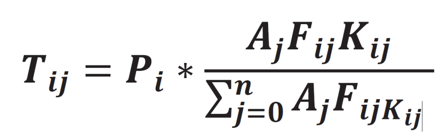](/destination)

Image:

Champaign County TDM gravity model equation

Where,  
Tij = Number of trips from zone i to zone j  
Pi = Number of trip productions in zone i  
Aj = Number of trip attractions in zone j  
Fij = Friction factor relating to spatial separation between zone i to zone j  
Kij = Trip distribution adjustment factor between zone i to zone j

The gravity model utilizes network travel/highway impedance and friction factors
to distribute trips between the zones. The zone to zone travel impedance matrix
represents the path of least resistance between the zone pair. Friction factor
is a measure of impedance or unwillingness of persons to make a trip based on
spatial separation between zones. K-factors are occasionally used in travel
demand models to adjust the attractiveness of trips between two zones due to a
physical barrier or distinct zonal socio-economic characteristics. K-factors
were not used in the Champaign County TDM. This section discusses the following
steps involved in the trip distribution process:

* Estimating the network impedances
* Estimating the model friction factors
* Distributing the External-External Trips

The input to the trip distribution step is the balanced trip production and
attractions and the travel impedance matrix. The output of this step was a
zone-to-zone trip production/attraction matrix for each trip purpose.

### Network Impedance

The countywide travel impedance represents the shortest travel time path between
the zone pair. Zonal highway/travel impendence matrices are created based on
travel times, distance, and additional factors influencing travel (e.g. turning
movement time penalties at intersections) between zones. When more than one
variable is used, a generalized cost function is used to derive a single
impedance variable. Travel impedance in the Champaign County model network was
calculated using the following generalized cost variable equation:

**Cost Variable = Travel time \* Cost of time + Travel distance \* Cost of distance**

Where,  
Cost of time = $16.2 per hour = $0.27/minute (based on the Bureau of
Labor Statistics)  
Cost of distance = Average fuel price ($ per gallon) / Average
fuel economy (miles per gallon) = $0.17/mile  
Average fuel price = $3.40 per gallon (based on the US Department of Energy Fuel Economy Guide)  
Average fuel economy = 20 miles per gallon (based on US Energy Information Administration statistics)

### Friction Factors

Friction factors measure the impact of spatial separation and travel time
between the two zones for the model trips. The friction factors are used to
enhance the gravity model by regulating the trip lengths and trip length
frequency distribution for each trip purpose. Adjustments to the friction
factors reflect the change in travel patterns across the region. As travel time
increases, the friction factor decreases. The friction factors for the Champaign
County TDM were calculated using the following gamma function equation:

[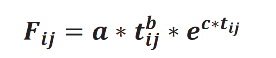](/destination)

Image:

Champaign County TDM friction factor equation

Where,  
Fij = the friction factor between zone I and j  
a, b, and c = model coefficients  
tij = the travel time between zone I and j   
e = the base of natural logarithms

The friction factors were developed using the NCHRP Report 365 Synthetic
Friction Factors and adjusted based on the observed travel data derived from the
CUUATS household travel survey. The iterative process recommended in NCHRP
Report 365 was used to calibrate the friction factors to match the observed trip
length frequency. The initial gamma function coefficients from NCHRP Report 365
are shown in the following table.

<rpc-table
url=“gamma.csv”
text-alignment=“c”
table-title=“Initial Gamma Function Coefficients”
switch=“false”
source=" NCHRP Report 365"

The NCHRP Report 365 provides gamma function coefficients for three basic trips purposes: HBW, HBO, and NHB. The initial gamma function coefficients for HBO were used for HBSh. The HBSc trip purpose employs the same friction factors as HBW in the Champaign County TDM. The following steps were followed to calibrate the friction factors:

* The friction factors were calculated for the maximum travel time expected in the study area. The friction factors for the Champaign County TDM were calculated for up to 57 minutes, in one minute intervals.
* The initial set of friction factors were used in the TDM and the corresponding trip length distribution was estimated.
* The resulting trip length frequency distribution was compared against observed trip length frequency distribution and the revised friction factors were calculated based on the following formula for every one minute interval:

[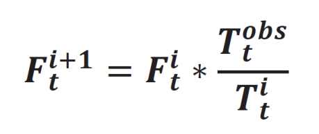](/destination)

Image:

Champaign County TDM revised friction factor equation

* The revised friction factors were used to calculate the revised gamma function model coefficients for the next iteration.
* An iterative process was performed until the estimated trip length frequency distribution curve is insensitive to change in friction factors or if it matches the observed trip length frequency distribution.

During the calibration process it should be noted that the faster the friction
factors decrease, the shorter the trip length. The gamma functions for the
revised countywide friction factors are shown in the following table. The
friction factors decrease with time when both the gamma coefficients (b & c) are
negative. If the gamma parameter “b” is positive, the friction factor increases
or remains stable to a point and then decreases as travel time increases. In
some cases, as was the case for HBO, when the model parameter “c” is positive,
the friction factors decrease to a point and then increase as travel time
increases.

<rpc-table
url=“CCTDMgamma.csv”
text-alignment=“c”
table-title=“Gamma Function Coefficients for the Champaign County TDM”
switch=“false”
source=" Champaign County TDM"

The friction factors derived using the gamma parameters were manually adjusted
to a small extent for the HBW, HBSc, and NHB trip purposes to match the observed
trip length frequency distribution. The following table shows the final friction
factors used in the Champaign County TDM.

<rpc-table
url=“CCTDMfrictionfactors.csv”
text-alignment=“c”
table-title=“Friction Factors Used in the Final Champaign County TDM”
switch=“false”
source=" Champaign County TDM"

### External-External Trip Distribution

The distribution of E-E trips between external stations depends on the
percentage of through trips at the origin and the destination station, the
average daily traffic volume, and the route connectivity between the external
stations. The functional classification of the destination stations dictates the
use of one of the following equations from the NCHRP Report 365 to estimate the
distribution of through trips between the external stations:

Interstates:

Principle Arterials:
[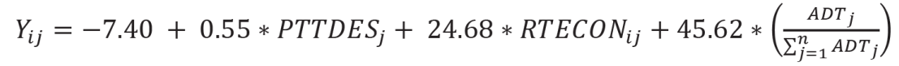](/destination)

Other Roadways:
[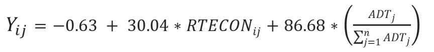](/destination)

A higher percentage of trips are assigned between external stations with direct
connectivity. The following map shows the external stations with direct
connectivity through the model area.

Map of external stations in the Champaign County TDM.

The traffic movement patterns were verified against local knowledge of the
region and adjusted to reflect the base year traffic patterns. The resulting E-E
trip percentages were normalized to equal 100 percent. Ideally, the trips
entering and exiting the model area at an external station should be the same.
The E-E trips between zone pairs were balanced using an iterative proportional
factoring (Fratar) process. The balanced E-E trip matrices were utilized in the
trip assignment process. The E-E trip distribution was corroborated against
local knowledge.

### Trip Distribution Validation

The following checks were performed to validate the trip distribution step of
the modeling process:

* Travel Time Impedance: The following figure shows the histogram for the
  shortest travel time paths in the model. As can be seen in the figure, the
  majority of the Champaign County TDM paths are between five and fifteen
  minutes. The second peak around 25 minutes can be associated with trips
  traveling to/from the Champaign-Urbana urbanized area and the surrounding
  municipalities (e.g. Rantoul and Mahomet).

  <rpc-chart url=“travelimpedanceline.csv”
  chart-title=“Line Chart”
  x-label=“Travel Time (minutes)”
  y-label=“Frequency”
  type=“line”
  source=" Champaign County TDM"
* Average Trip Length by Trip Purpose: The following table shows the average
  trip lengths by trip purpose for the urbanized area and the rural area.

<rpc-table
url=“AveTripLengthPurpose.csv”
text-alignment=“c”
table-title=“Average Trip Length by Trip Purpose”
switch=“false”
source=" Champaign County TDM"

## Mode Choice

Mode choice is the third step of the four-step modeling process. This step of
the forecasting process allocates the model person trips to the different
transportation modes in the region. The person trips matrix between the TAZ
pairs are split into auto, transit, and non-motorized (walk/bike) trip matrices.
These trip matrices are assigned to the highway and the transit network
accordingly. The mode split of the model trips is essential to reflect the
existing and future transit use in the study region and improves the estimate of
auto trips in the model. This chapter also describes the auto-occupancy
component and the time-of-day component of the TDM.

The input to the mode choice step was the balanced trip production and
attraction (P/A) matrix between the TAZs. The outputs of the mode choice step
were the balanced trip P/A matrices by different modes of travel in the region.
The auto person trip matrix was converted into vehicle trips and distributed
hourly over a 24 hour period.

### Mode Choice Model Inputs

The model structure along with the mode choice inputs were developed by a
consultant, Dowling Associates. The mode choice assumptions were mainly derived
from the travel demand model for Sonoma County, California. The inputs to the
multinomial model include mode choice coefficients, regional parking cost,
transit cost, auto cost, transit accessibility, and shared ride occupancy. A
parking variable was included in the model to restrict parking in certain zones
and apply a parking cost for HBW and HBUniv trips in specific model TAZs. The
shared ride time penalties (in minutes) were defined to account for the time
spent in carpool pickups and drop-offs. The following table shows shared ride
penalties derived from the Sonoma County, CA model.

<rpc-table
url=“SharedRidePenalty.csv”
text-alignment=“c”
table-title=“Shared Ride Penalty Used in the Mode Choice Step”
switch=“false”
source=" Sonoma County, CA TDM"

The transit and auto costs in the following table were used in the model to help
estimate the mode share in the region. There is no transit cost associated with
HBUniv transit trips, since the transit fee for the university students is
included in their semester school fees. The auto trips were divided into drive
alone and shared ride.

<rpc-table
url=“ModeCosts.csv”
text-alignment=“c”
table-title=“Mode Costs Used in the Mode Choice Step”
switch=“false”
source=" Champaign County TDM"

The shared ride occupancies by trip purpose shown in the following table were
used to determine the individual cost for the person trips. The shared ride auto
occupancy factors were derived from the 2002 CUUATS household travel survey.

<rpc-table
url=“AutoOccupancy.csv”
text-alignment=“c”
table-title=“Auto Occupancy Factors for Shared Ride Trips”
switch=“false”
source=" 2002 CUUATS Household Travel Survey"

Mode choice coefficients are used in the model to account for mode bias which is
not captured by other input variables. The mode choice coefficients used in the
Champaign County TDM were derived from other travel demand models and are listed
in the following table.

<rpc-table
url=“ModeChoiceCoefficients.csv”
text-alignment=“c”
table-title=“Mode Choice Coefficients Used in the Champaign County TDM”
switch=“false”
source=" Champaign County TDM"

### Auto Occupancy

After the transit and non-motorized trips were separated from the total person
trips, the remaining trips (drive alone and shared ride) were converted into
vehicle trips. The auto occupancy rates for trip purpose were derived from the
2002 CUUATS household travel survey. The following table shows the auto
occupancy factors for all vehicle trips and shared ride trips used in the
Champaign County TDM. The model input data were compared against the national
averages from the 2009 NHTS survey. The shared ride auto occupancy factors were
used to convert the shared ride person trips to vehicle trips. A factor of 1.0
was applied to the drive alone person trips.

<rpc-table
url=“AutoOccupancyCompared.csv”
text-alignment=“c”
table-title=“Auto Occupancy Factors Compared”
switch=“false”
source=" Champaign County TDM, 2009 NHTS"

### Time-of-Day Factors

Time-of-day factors are used to distribute the model trips throughout the day.
Incorporating the time-of-day factors in the travel demand model enables the
analysis of both daily and peak hour conditions. The HBW and HBSc trips occur
during the peak hour; whereas the HBSh, HBO, and NHB trips tend to occur during
off-peak hours. The estimation of travel over specific periods of the day is
necessary for certain transportation planning studies, such as peak hour
congestion, emission analyses, and transit services.

In the Champaign County TDM, the daily Origin/Destination trip tables are
divided into time periods using hourly factors derived from the 2002 CUUATS
household travel study. The following table presents the hourly distribution of
trips for each trip purpose used in the Champaign County TDM. The hourly
distribution is for autos only and does not consider other modes of
transportation.

<rpc-table
url=“TimeDayFactors.csv”
text-alignment=“c”
table-title=“Time-of-Day Factors Used in the Champaign County TDM”
switch=“false”
source=" Champaign County TDM"

## Trip Assignment

In this last step of the modeling process, model trips are loaded onto the
roadway network. The auto (vehicle) trips were assigned to the roadway network
and the transit (person) trips were assigned to the transit network. The trips
were assigned as daily or by time-of-day, using the User Equilibrium method.

### Auto Trip Assignment

The User Equilibrium process is based on Wardrop’s principle which considers
equilibrium to be reached when no traveler can reduce the travel time below a
specified value between two zones by switching to an alternate path. In this
method, the traveler uses the fastest possible route between the origin and
destination. This is the most common process used in trip assignment. Other trip
assignment algorithms/methods include stochastic equilibrium, all-or-nothing,
and incremental capacity-restrained assignment.

In the User Equilibrium process, the auto trips are loaded on the shortest path
between the origin and destination. Based on the assigned volume from the 1st
iteration, the congested travel times are calculated using the Bureau of Public
Roads (BPR) curves. The model trips are then reloaded on the model network using
the new congested travel times. This process is followed until the check for
convergence is satisfied. A convergence criterion of 0.05 percent was used for
the Champaign County TDM. The turn penalty and the intersection junction data
were included in the trip assignment process.

#### Volume-Delay Function (BPR Curves)

The BPR curves present the relationship of the assigned volume and resulting
delay on the roadway link due to congestion. The BPR curves estimate the change
in travel time with respect to the change in the volume to capacity ratios. As
the free flow speed increases, travel time decreases.

[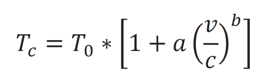](/destination)

Image:

Champaign County TDM BPR curves equation

The facility types were further classified into thirteen (13) different
categories (SPD\_CRV) to calculate the BPR functions, based on the number of
lanes and the free flow speed. Each link class was assigned a BPR curve. The
parameters for the BPR curve for each link class were chosen based on the 2000
Highway Capacity Manual (HCM) and calibrated during the modeling process. The
following table shows the link classification and BPR coefficients used in the
Champaign County TDM. The following figure shows the BPR curve for each of the
link classes.

<rpc-table
url=“VolumeDelay.csv”
text-alignment=“c”
table-title=“Volume-Delay Parameters Used in the Champaign County TDM”
switch=“false”
source=" Champaign County TDM"

### Transit Assignment

Unlike auto trips, transit passengers walk to the transit stop and possibly
transfer between transit lines to reach their destination. The transit trips
were loaded on the transit network using the multirouting process in the Public
Transport (PT) module of the Cube Voyager software. The multirouting process
evaluates multiple routes and calculates the probabilities of using each one.
The multirouting method is usually preferred in regions with well-developed
public transport systems. Various parameters such as “BESTPATHONLY” and
“AONMETHOD” can be included in the Cube model script to alter the transit trip
loading process, if required.

### Trip Assignment Validation

Validation checks for trip assignment are important since it not only addresses
the assignment process but also the entire model. The following checks were
performed to validate the trip assignment step of the modeling process.

#### Traffic Volumes

In the trip assignment validation process, the model assignment is compared
against the observed regional data to ensure that the model reasonably
replicates the base year (2015) traffic patterns. The observed 2015 traffic
counts were obtained from the IDOT database. The estimated model volumes were
compared against the observed traffic counts for 2,882 roadway segments in the
Metropolitan Planning Area (MPA).

The following table shows the number of segments by major facility types
compared. The table also shows the percent error between model-estimated and
observed traffic for the Champaign County TDM as well as the target values set
by FHWA’s Travel Model Validation and Reasonability Checking Manual. The percent
error in traffic volumes by facility type indicates how well the model
assignment loads the trips on the roadway links by functional classification.
The model-estimated volumes were further validated using the coefficient of
determination (R²), the Root Mean Square Error (RSME), and %RMSE.

<rpc-table
url=“estVobsVolume.csv”
text-alignment=“c”
table-title=“Model-Estimated vs. Observed Volume for the MPA”
switch=“false”
source=" Champaign County TDM"

The model-estimated volumes were compared against the observed link volumes to
estimate the coefficient of determination (R²). The linear regression
coefficient between the two variables can be measured from 0 to 1, with 1 being
a perfect correlation. The correlation coefficient check is important to verify
the assignment of trips on different facility types and highlights any network
link coding errors. The “Model Validation and Reasonableness Checking Manual”
suggests a value of 0.88 or above as a good measure of the model. The following
figure presents the R² between the model-estimated volume and the observed
traffic count data compared at 2,882 locations in the model study area. The
Champaign County TDM shows an R² value of 0.91, which indicates high correlation
between the model-estimated volume and the observed traffic volume.

[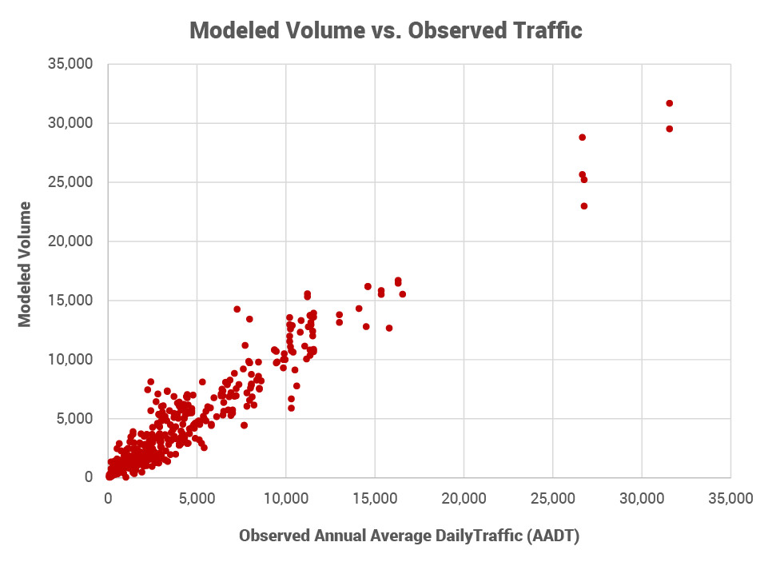](/destination)

Image:

Champaign County TDM

RMSE and %RMSE measure the average error between the observed and the
model-estimated traffic volume. The RMSE and %RMSE are calculated using the
formulas below. The following table shows the RMSE and %RMSE for the Champaign
County TDM by facility type.

[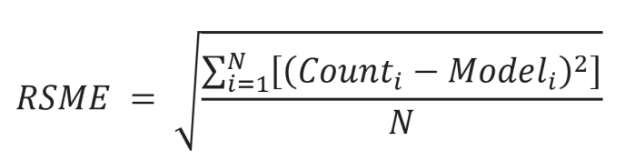](/destination)

Image:

Champaign County TDM RMSE equation

[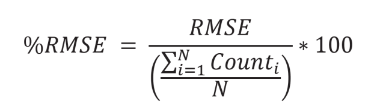](/destination)

Image:

Champaign County TDM %RMSE equation

<rpc-table
url=“RMSEtable.csv”
text-alignment=“c”
table-title=“RMSE for the Champaign County TDM by Facility Type”
switch=“false”
source=" Champaign County TDM"

#### Vehicle Miles Traveled (VMT)

The vehicular travel in the model can be validated by comparing the
model-estimated VMT against the observed VMT. The VMT checks for the Champaign
County TDM were made at the regional level and by facility type. The observed
VMT by facility type for Champaign County was obtained from IDOT.

“Regional VMT summaries provide an indication of the reasonability of the
overall level of travel. The results help confirm that the trip generation, trip
distribution and the mode choice model, or their activity-based modeling
corollaries, as well as the assignment process, are performed reasonably. VMT
summarized by facility type provide an overall indication of the operation of
the assignment procedures. The results of these summaries might indicate issues
with free-flow speeds, link capacities, or volume-delay functions” (Travel Model
Validation and Reasonableness Checking Manual - Second Edition, 2010).

The following table compares modeled and observed VMT by facility type. The
percent difference between the model-estimated and observed VMT were compared
against the FHWA recommended targets. The regional VMT and the VMT by facility
type were within the acceptable parameters.

<rpc-table
url=“modelVobsVMT.csv”
text-alignment=“c”
table-title=“Model VMT vs. Observed VMT for the Champaign County TDM”
switch=“false”
source=" Champaign County TDM"

#### Screenline Analysis

The screenline analysis was performed to compare traffic flow (model-estimated
vs. observed) between major activity centers in the model study area. A
screenline extends completely across the model study area, or in some cases,
extends across major facilities in the region (cutline). Similar to a
screenline, a cordon line was also used as part of the validation check. A
cordon line completely encompasses a designated area and compares the
model-estimated volume and the observed volume entering/exiting the region.
Eleven screenlines and one cordon line were used to verify the movement of
traffic in the region. The map below shows the screenlines and the cordon line
used in the Champaign County TDM.

Map of screenlines in the Champaign County TDM.

The following table shows the comparison of traffic volumes across the model
screenlines. The percent deviation was calculated between the model-estimated
volume and the observed volume for each screenline and was compared with the
maximum desirable deviation as given in the NCHRP Report 255 [Highway Traffic
Data for Urbanized Area Project Planning and
Design](http://teachamerica.com/tih/PDF/nchrp255.pdf).

The maximum desirable deviations were developed based on the assumption that the
maximum desirable percent deviation should not result in a design deviation of
more than one travel lane. The chart and table below show the maximum desirable
deviations from the NCHRP Report 255 along with the model screenline/cordon line
percent deviation. All the model screenlines fall within the maximum derivable
deviation.

[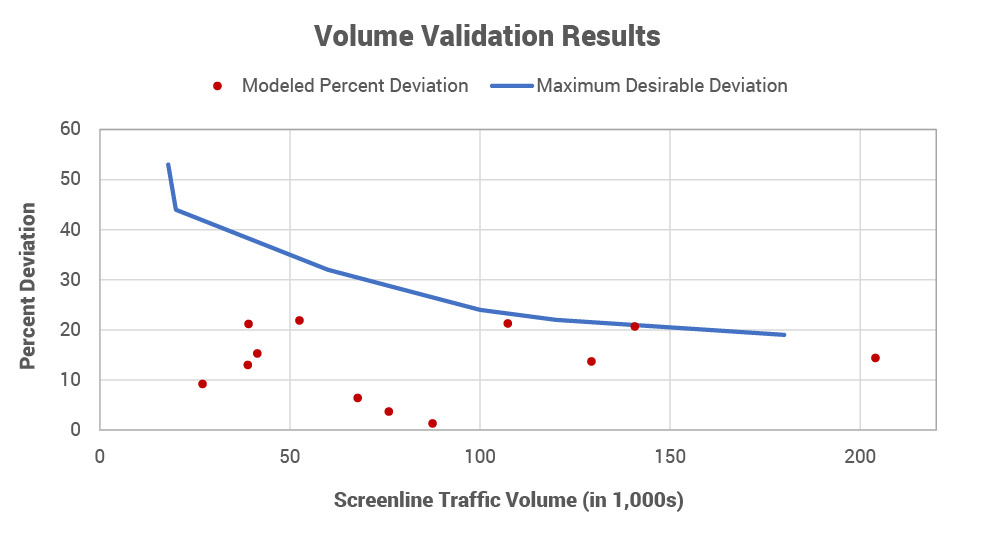](/destination)

Image:

Champaign County TDM