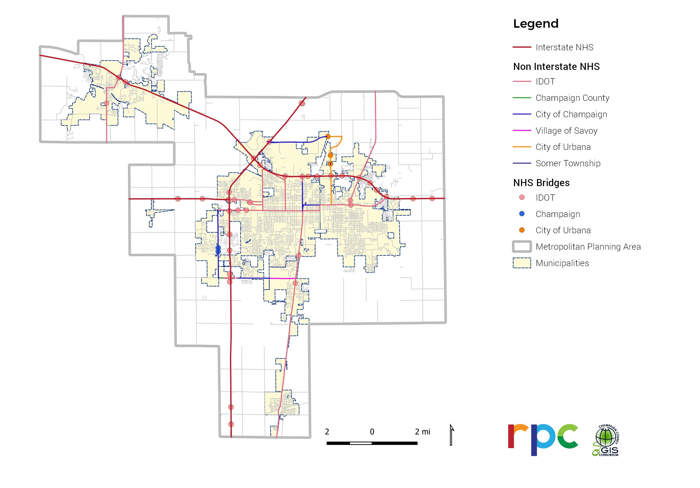
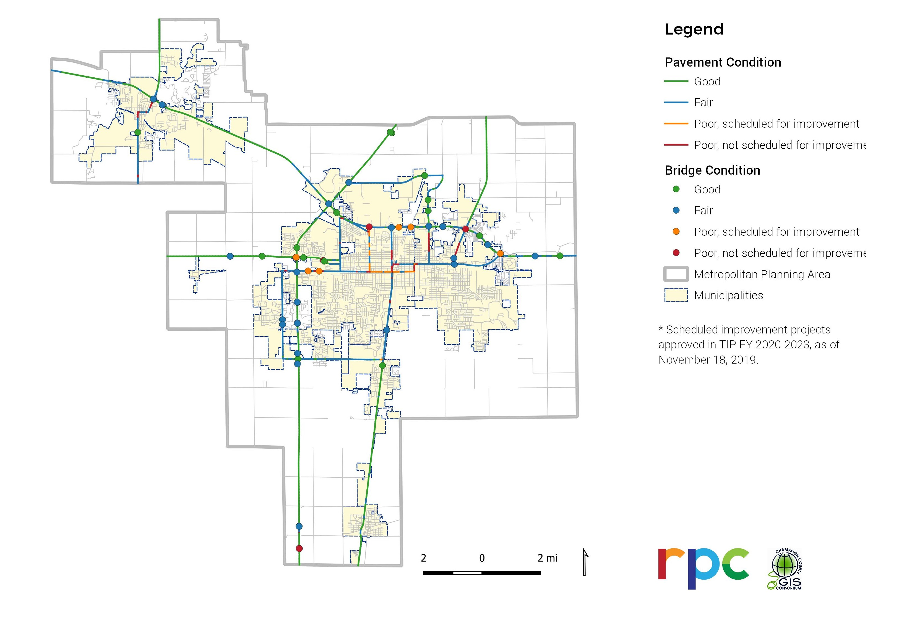

# System Performance Report

An evaluation of system performance with respect to Federal performance targets.

# System Performance Report

## Introduction

The [Moving Ahead for Progress in the 21st Century](https://www.fhwa.dot.gov/map21/legislation.cfm) (MAP-21) enacted in 2012, and the
subsequent [Fixing America’s Surface Transportation Act](https://www.fhwa.dot.gov/fastact/legislation.cfm) (FAST
Act), enacted in 2015,
established a national performance measurement system for the highway and
transit programs. The U.S. Department of Transportation (USDOT) instituted this
performance management requirement by establishing performance measures for four
categories through rulemakings:

* [Highway Safety](https://www.federalregister.gov/documents/2016/03/15/2016-05202/national-performance-management-measures-highway-safety-improvement-program)
* [Pavement and Bridge Condition](https://www.federalregister.gov/documents/2017/01/18/2017-00550/national-performance-management-measures-assessing-pavement-condition-for-the-national-highway)
* [System Performance](https://www.federalregister.gov/documents/2017/01/18/2017-00681/national-performance-management-measures-assessing-performance-of-the-national-highway-system)
* [Transit Asset Conditions](https://www.govinfo.gov/content/pkg/FR-2016-07-26/pdf/2016-16883.pdf)

The state departments of transportation (state DOTs) and metropolitan planning
organizations (MPOs) are required to establish targets for each highway
performance measure while transit agencies and MPOs set targets for transit
asset condition. MPOs have 180 days after DOTs adopt statewide targets to choose
either to set quantitative targets for their metropolitan planning areas or
commit to the state’s targets. For the highway measures, at the conclusion of
each performance period, the USDOT assesses whether “significant progress” has
been made toward achieving the highway targets, which is defined differently
depending on the measure. If states do not make significant progress, they are
required to submit documentation to FHWA on how they will reach the targets; in
certain cases, states are also required to program more federal funds toward
improving conditions. No penalties are assessed on MPOs or transit agencies.

Once the targets are established, MPOs are directed to show how the investments
in the Transportation Improvement Program (TIP) help achieve the targets.
Furthermore, each performance measure’s baseline and targets must be included in
a System Performance Report in the MPO’s Long Range Transportation Plan to
document the condition and performance of the transportation system with respect
to required performance measures.

This System Performance Report starts with an
overview of the process the MPO has taken to establish performance measure
targets. For each of the federal performance management categories, this report
reviews state and MPO baselines and targets and progress made by the MPO toward
achieving the targets. It also includes discussions on how the LRTP 2045
[preferred scenario](https://ccrpc.gitlab.io/lrtp2045/vision/model/) would
improve the conditions and performance of the transportation system. This report
ends with an overview of the linkage between the system performance measures and
infrastructure investment decisions within the Champaign-Urbana Metropolitan
Planning Area (MPA).

## Process

As part of complying with the national performance measurement system
established by MAP 21, Illinois Department of Transportation (IDOT), the
Champaign-Urbana MPO ([CUUATS](https://ccrpc.org/divisions/planning_and_development/transportation/index.php)), and the local
transit agency, Champaign-Urbana Mass Transit District (MTD), have established a
process for data sharing, target setting, and reporting. An Intergovernmental
Agreement for Transportation Performance Management was created to comply with
23 CFR 450.314(h) and executed by [CUUATS Policy
Committee](https://ccrpc.org/divisions/planning_and_development/cuuats_policy_committee/index.php) in April
2018. This Agreement defines rights and obligations for each agency in terms of
cooperatively developing and sharing information related to transportation
performance management data and transit asset management data, performance
target setting, reporting of performance targets, and tracking progress toward
attainment of critical outcomes for the MPO region.

For the Champaign-Urbana MPA, targets for the three sets of National Performance
Management Measures and the Transit Asset Management Performance Measures were
adopted by CUUATS Policy Committee upon discussions at a series of CUUATS
Technical and Policy Committee meetings, as noted below by meeting date and
topic.

* September 6, 2017: CUUATS Technical Committee Meeting, Presentation of CUUATS Safety Performance Targets
* September 13, 2017: CUUATS Policy Committee Meeting, Presentation of CUUATS Safety Performance Targets
* December 6, 2017: CUUATS Technical Committee Meeting, Approval of CUUATS Safety Performance Targets
* December 13, 201: CUUATS Policy Committee Meeting, Approval of CUUATS Safety Performance Targets
* December 13, 2017: Approval of C-U MTD Transit Asset Management Performance Measures
* June 13, 2018: CUUATS Technical Committee Meeting, Presentation of Pavement and Bridge (PM2) and System Performance (PM3) Performance Targets
* June 20, 2018: CUUATS Policy Committee Meeting, Presentation of Pavement and Bridge (PM2) and System Performance (PM3) Performance Targets
* September 5, 2018: CUUATS Technical Committee Meeting, Approval of Pavement and Bridge (PM2) and System Performance (PM3) Performance Targets
* September 12, 2018: CUUATS Policy Committee Meeting, Approval of Pavement and Bridge (PM2) and System Performance (PM3) Performance Targets
* December 4, 2019: CUUATS Technical Committee Meeting, regarding dates for ongoing performance review
* December 11, 2019: CUUATS Policy Committee Meeting, regarding dates for ongoing performance review

## Highway Safety (PM1)

The safety performance measures require state DOTs and MPOs to establish safety targets as five-year rolling averages on all public roads for:

1. The number of fatalities
2. The rate of fatalities per 100 million vehicle miles traveled (VMT)
3. The number of serious injuries
4. The rate of serious injuries per 100 million VMT
5. The number of non-motorized fatalities and non-motorized serious injuries

### State Targets

Injuries and fatalities from traffic crashes vary considerably from year to year
due to numerous factors, and the five-year average is meant to smooth large
changes. IDOT must adopt targets for each safety measure by August 31 on an
annual basis. MPOs must establish targets within 180 days after IDOT. MPOs can
either choose to adopt the state’s targets (Table 1) or set their own
quantitative targets.

### MPO Targets and Performance

[CUUATS Policy Committee](https://ccrpc.org/divisions/planning_and_development/cuuats_policy_committee/index.php) approved
the PM1 targets for 2018 through 2020 based on goals established in the LRTP
2040: Sustainable Choices, approved in December 2014, rather than adopting the
state’s targets. The MPO targets do not differ significantly from the state’s
targets but are slightly more ambitious than the state’s targets and are
consistent with the LRTP.

Table 2 presents the PM1 baseline, 2018-2020 targets, and 2018 performance
assessment for the Champaign-Urbana MPA.

Champaign-Urbana MPA 2014-2018 five-year rolling average crash data shows one
performance measure, number of non-motorized fatalities and non-motorized
serious injuries, met the 2018 target. Out of the four performance measures that
performed worse than the targets set for 2018, three performance measures
maintained or improved from the 2015 baseline (Figure 1-5).

### Moving Towards the Targets

Since the approval of the LRTP 2040 in December 2014,
[CUUATS](https://ccrpc.org/divisions/planning_and_development/transportation/index.php), working with the member
agencies, has taken a series of actions to implement various safety
recommendations to meet the plan’s goals. Below is a list of major studies,
plans, and grant applications
[CUUATS](https://ccrpc.org/divisions/planning_and_development/transportation/index.php) carried out to move the
Champaign-Urbana MPA toward the LRTP 2040 goals as well as the PM1 safety
targets. Note this is not a comprehensive list. See [CUUATS
UTWPs](https://ccrpc.org/transportation/unified_planning_work_program_(upwp).php) for
additional information.

1. Assessed seven Safety and Security Performance Measures through annual LRTP 2040 [report card update](https://data.ccrpc.org/pages/lrtp-2040-annual-report-card) (2015-2019) .
2. Produced the “Traffic Crash Facts for Champaign-Urbana and Selected Crash Intersection Locations (SCIL)” report for 2009-2013 (2015).
3. Prepared and submitted an HSIP grant application for safety improvements on the Cardinal Road/Rising Road intersection on behalf of Champaign County (2015). Requested HSIP funding was granted and improvements at the intersection were implemented.
4. Prepared Complete Streets policies for the Villages of Savoy and Mahomet (2015).
5. Prepared and submitted a Bicycle Friendly Business (BFB) application for CCRPC to the League of American Bicyclists (LAB). CCRPC was designated a Silver Level Bicycle Friendly Business (BFB) by the League of American Bicyclists (LAB) (2015).
6. Reviewed and provided comments on the SRTS non-infrastructure grant application for the C-U SRTS Project (2015).
7. Updated SRTS Maps for public elementary and middle schools in Champaign-Urbana (2015-2019).
8. Prepared a Safe Routes To School Plan for Prairie School in Urbana (2016).
9. Prepared a Safe Routes To School Plan for South Side School in Champaign (2016).
10. Identified 30 bikeway gaps in Champaign, Urbana, Savoy, and Mahomet and sent this information to IDOT in written and GIS form (2016).
11. Prepared Transit Facility Guidelines for the Champaign-Urbana Urbanized Area (2016).
12. Completed the Champaign-Urbana Urbanized Area Sidewalk Inventory and Assessment which provides a database on sidewalk and curb ramp condition and ADA compliance for CUUATS member agencies (2016-2019). CUUATS staff update the database each year.
13. Reviewed, scored and provided comments on all 2016 ITEP applications submitted for funding within the Champaign-Urbana Metropolitan Planning Area (2016).
14. Prepared an HSIP application for installing stop signs at several intersections in rural Champaign County (2017). Requested HSIP funding was granted and stop signs were installed at several rural intersections in Champaign County.
15. Developed a bicycle tracking smartphone application and analysis of bicycle route data (2017-2019).
16. Carried out the Curtis Road Corridor Study (2016-2017), which includes safety analysis and recommendations for safety improvements.
17. Developed Savoy Bike & Pedestrian Plan (2017).
18. Developed the Champaign-Urbana Pedestrian Crossing Enhancement Guidelines (2017).
19. Carried out the Champaign County Five Percent Segments and Intersections Study (2018).
20. Prepared a Highway Safety Improvement Program (HSIP) Grant Application for Sidney Road (2018). Requested HSIP funding was granted and design engineering is being completed.
21. Assessed the implementation of the five Safe Routes to School (SRTS) plans that CCRPC has written (2015-2019).
22. Carried out Before and After Safety Analysis for Selected Intersections Study (2018).
23. Developed Champaign County Rural Safety Plan (2018-2019).
24. Developed Champaign-Urbana Urbanized Area Safety Plan (2018-2019).
25. Developed Urbana Pedestrian Master Plan (2018-2019).
26. Developed Urbana Bicycle Wayfinding Plan (2018-2019).
27. Carried out Bradley Avenue Safety Study (2018). Recommendations from the study are being implemented.
28. Conducted crash analysis for Lincoln Avenue from Nevada Street to Pennsylvania Avenue (2019).

In the current LRTP 2045, a more detailed list of five-year objectives,
additional localized safety performance measures, as well as specific strategies
with responsible parties identified, have been proposed under the Safety Goal to
continue the efforts of moving the Champaign-Urbana MPA toward the [PM1
targets](https://ccrpc.gitlab.io/lrtp2045/goals/safety/).

The modeling section of the [LRTP
2045](https://ccrpc.gitlab.io/lrtp2045/vision/model/) details how the 2045
preferred scenario, in comparison with the 2045 Business-As-Usual scenario, is
projected to result in less Vehicle Miles Traveled (VMT), decreased share of
automobile travel, decreased new infrastructure cost, and increased pedestrian
and bicycle access scores, all of which will likely lead to a positive impact on
achieving the PM1 targets.

## Pavement and Bridge Conditions (PM2)

The infrastructure condition performance measures require state DOTs and MPOs to establish targets for:

1. Percentage of pavements of the Interstate System in Good condition
2. Percentage of pavements of the Interstate System in Poor condition
3. Percentage of pavements of the non-Interstate National Highway System (NHS) in Good condition
4. Percentage of pavements of the non-Interstate NHS in Poor condition
5. Percentage of NHS bridges classified as in Good condition
6. Percentage of NHS bridges classified as in Poor condition

### State Targets

IDOT established PM2 targets for 2020 and 2022 in May 2018 (Table 3). IDOT uses
the Condition Rating Survey (CRS) method for rating pavement condition in
Illinois, and assigns pavement condition ratings based on pavement distress,
such as International Roughness Index (IRI), rutting, cracking, and
deterioration. IDOT performs bi-yearly safety inspections and condition
assessments of bridges. This is the designated frequency in National Bridge
Inspection Standards (NBIS). Through these inspections, condition rating data is
collected for the deck, super structure, and substructure and an overall rating
of Good, Fair, or Poor condition is assigned to each bridge metric per calendar year.

### MPO Targets and Performance

The National Highway System (NHS) within the MPA is the focus of PM2. The NHS is
a federal designation for roadways considered important to the nation’s economy.
In the Champaign-Urbana MPA, this includes all the interstates and some
non-interstate roadways, such as state routes and several local roadways. The
NHS in the MPA has changed over time. Figure 6 shows MPA NHS roadway and bridge
designations in 2018.

#### Figure 6: NHS and NHS bridges in the Champaign-Urbana MPA, 2018

Note: To expand the image to full-size, right-click the graphic and choose 'open image in new tab'.

Image:

CCRPC and Champaign County GIS Consortium

The [CUUATS Policy Committee](https://ccrpc.org/divisions/planning_and_development/cuuats_policy_committee/index.php)
adopted the state’s PM2 targets for the Champaign-Urbana MPA after an analysis
of MPA’s 2017 pavement and bridge baseline condition data as well as 2020
projected conditions estimated using FY 2017-2020 TIP projects.
[CUUATS](https://ccrpc.org/divisions/planning_and_development/transportation/index.php)
receives pavement and bridge condition data from IDOT.

Table 4 presents the PM2 2017 baseline, 2020 and 2022 targets, and 2018
performance assessment for the Champaign-Urbana MPA.

Champaign-Urbana MPA PM2 2018 data shows two performance measures performed
better than the 2017 baseline, and four performed worse than the 2017 baseline.
Out of the four performance measures that performed worse than the 2017
baseline, two performed worse than the 2020 target: percent of non-interstate
NHS pavements in Poor condition and percent of NHS bridge classified as in Poor
condition.

### Moving Toward the Targets

Figure 7 shows 2018 NHS roadway and bridge conditions in the Champaign-Urbana
MPA and scheduled improvement projects approved in TIP FY 2020-2023, as of
November 18, 2019.

#### Figure 7: NHS Pavement and Bridge Conditions & Scheduled Improvements, 2018

Note: To expand the image to full-size, right-click the graphic and choose 'open image in new tab'.

Image:

CCRPC and Champaign County GIS Consortium

The [modeling section](https://ccrpc.gitlab.io/lrtp2045/vision/model/) of the LRTP 2045
details how the 2045 preferred scenario, in comparison with the 2045 Business-As-Usual
scenario, is projected to result in less VMT, decreased share of automobile travel,
decreased new infrastructure cost, and increased pedestrian and bicycle access score,
all of which will likely lead to a positive impact on achieving the PM2 targets.

## System Performance (PM3)

The system performance measures require state DOTs and MPOs to establish targets
for:

1. Percent of reliable person-miles traveled on the Interstate
2. Percent of reliable person-miles traveled on the non-Interstate NHS
3. Percentage of Interstate system mileage providing for reliable truck travel time - Truck Travel Time Reliability Index

For MPOs in non-attainment or maintenance status, there are three additional
performance measures on traffic congestion assessment that are not applicable
for the Champaign-Urbana MPA.

### State Targets

The PM3 measures require the use of the National Performance Management Research
Data Set (NPMRDS). IDOT has procured The Regional Integrated Transportation
Information System (RITIS) to analyze the NPMDRS and provided access to RITIS
for the MPOs within the state to use. IDOT established PM3 targets for 2020 and
2022 in May 2018 (Table 5).

### MPO Targets

[CUUATS](https://ccrpc.org/divisions/planning_and_development/transportation/index.php)
adopted the state’s PM3 targets. Table 6 presents the PM3 2017 baseline, 2020 and 2022
targets, and 2018 performance assessment using NPMRDS INRIX data for the Champaign-Urbana MPA.

Champaign-Urbana MPA PM3 2018 data show all PM3 performance measures maintained or improved from 2017 baseline.

### Moving Toward the Targets

Since the approval of the LRTP 2040 December 2014,
[CUUATS](https://ccrpc.org/divisions/planning_and_development/transportation/index.php),
working with the member agencies, carried out the Champaign County Hazmat Commodity Flows
Study and developed the Champaign-Urbana Region Freight Plan.
[CUUATS](https://ccrpc.org/divisions/planning_and_development/transportation/index.php)
also helped prepare INFRA grant applications on behalf of the Village of Savoy for the
Curtis Road Grade Separation and Complete Streets Project in 2017 and 2019.

The [modeling section](https://ccrpc.gitlab.io/lrtp2045/vision/model/) of the
LRTP 2045 details how the 2045 preferred scenario, in comparison with the 2045
Business-As-Usual scenario, is projected to result in less VMT, decreased share
of automobile travel, decreased new infrastructure cost, and increased
pedestrian and bicycle access score, all of which will likely lead to a positive
impact on achieving the PM3 targets.

## Transit Asset Management (TAM)

Transit Asset Management (TAM) is applicable to providers who are recipients or
sub-recipients of Federal financial assistance under 49 U.S.C. Chapter 53. TAM
is an effort to keep assets and equipment in transit systems in a state of good
repair, so the systems contribute to the safety of the system as a whole. This
supports the idea that a vehicle in good repair will minimize risk and maximize
safety. TAM measures performance for the following asset categories:

1. Equipment
2. Facilities
3. Infrastructure
4. Rolling Stock

The TAM Final Rule requires recipients to set one or more performance targets
per asset class based on State of Good Repair measures. The Final Rule also
requires transit providers to coordinate with MPOs, to the maximum extent
practicable, in the selection of MPO performance targets. The coordination
amongst transit providers and MPOs should influence transportation funding
investment decisions and is intended to increase the likelihood that transit
state of good repair needs are programmed, committed to, and funded as part of
the planning process.

### MTD Targets and performance

The following tables show the C-U MTD’s TAM targets and performance by categories.

### Moving Toward the targets

C-U MTD has received an FTA Bus & Bus Facilities grant to upgrade and expand
Illinois Terminal (Table 7, Passenger Facility) in FY21. In FY21 C-U MTD will
renovate its Administration & Operations Facility and expand into offices
formerly used as tenant space to accommodate its growing staff and
organizational structure.

C-U MTD will replace five 40-foot and six 60-foot standard diesel buses that
have exceeded ULB with diesel-electric hybrid buses in FY20. Additionally, C-U
MTD will replace two standard diesel articulated buses with hydrogen fuel cell
electric articulated buses in FY21. Other revenue vehicles that have exceeded
ULB will be replaced in FY22 and beyond.

## Linking Performance with Investment

### Transportation Improvement Program (TIP)

[CUUATS](https://ccrpc.org/divisions/planning_and_development/transportation/index.php) recognizes the importance
of linking investment priorities to stated performance objectives, and that
establishing this link is critical to the achievement of national transportation
goals and statewide and regional performance targets. As such, [FY 2020-2023
TIP](https://ccrpc.org/transportation/transportation_improvement_plan_(tip)/introduction_and_background_fy_2020_fy_2023.php)
documents the established targets associated with each of the performance
measures as well as the local projects utilizing federal funding that address
the targets.

Pending guidance from IDOT regarding how to document the connection between TIP
projects and the performance measures, at this time,
[CUUATS](https://ccrpc.org/divisions/planning_and_development/transportation/index.php) staff are not able to speak
to the evaluation methods of projects that are led by state and/or federal
agencies. In addition, due to the delayed release of the State’s multi-year
program in October 2019, these tables are currently in the process of being
updated to include which federally-funded local TIP projects address each
performance target, linking investment priorities to those performance targets
as required in 23 CFR 450.326.

### Project Priority Review (PPR)

[CUUATS Policy Committee](https://ccrpc.org/divisions/planning_and_development/cuuats_policy_committee/index.php) approved
the [Project Priority Review (PPR) Guidelines in 2016 (updated in
2017)](https://ccrpc.org/transportation/project_priority_review_ppr_guidelines.php), which
outlines the process by which
[CUUATS](https://ccrpc.org/divisions/planning_and_development/transportation/index.php) evaluates and documents
consistency between the local use of federal Surface Transportation Block Group
(STBG) (formerly Surface Transportation - Urban [STPU]) funds and federal and
regional transportation goals. Local agencies seeking to use STBG funds are
required to submit a project application for review by
[CUUATS](https://ccrpc.org/divisions/planning_and_development/transportation/index.php) staff and the Project
Priority Review working group who use a set of criteria based on federal and
regional transportation goals to score each project.

In 2017, [CUUATS Policy Committee](https://ccrpc.org/divisions/planning_and_development/cuuats_policy_committee/index.php)
approved allocating funding for one project in the MPA in fiscal year 2019. In
2018, [CUUATS Policy Committee](https://ccrpc.org/divisions/planning_and_development/cuuats_policy_committee/index.php)
approved allocating funding for three projects in the MPA in fiscal years 2022
and 2023 based on PPR working group and
[CUUATS](https://ccrpc.org/divisions/planning_and_development/transportation/index.php) staff recommendations. Upon
approval of the LRTP 2045, the PPR Guidelines will be updated to reflect the
federal performance measures as well as the LRTP 2045 goals.

## Conclusion

The emphasis on setting and achieving performance targets represents a major
change in the federal transportation program ushered in by MAP-21 and the FAST
Act. The required MPO targets are a chance for the region to continue connecting
short-term performance measurement to longer-term regional priorities. The MPO
target-setting requirements also give the region another avenue to call
attention to the large investment and funding needs for different elements of
the system. [CUUATS](https://ccrpc.org/divisions/planning_and_development/transportation/index.php) will continue
tracking and updating these measures as needed.