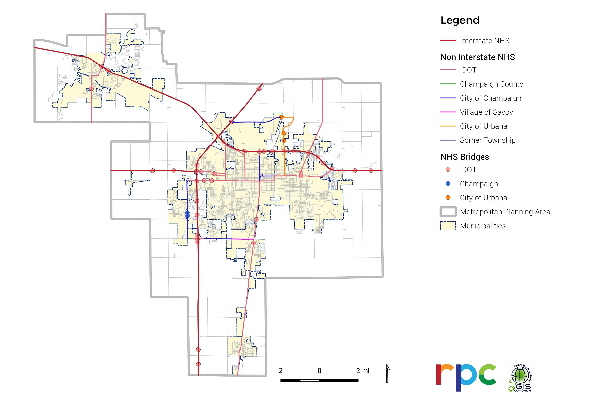
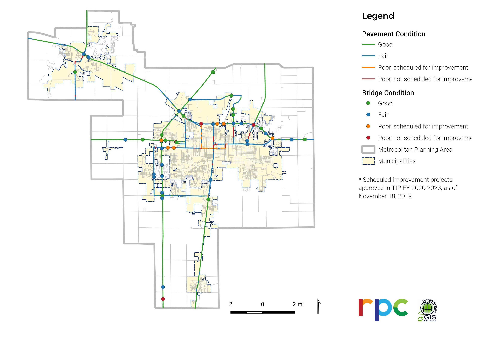

# System Performance Report

An evaluation of system performance with respect to Federal performance targets.

# System Performance Report

## Introduction

Federal transportation legislation has included performance-based planning and programming as a key focus of statewide, metropolitan and transit decision-making. Under MAP-21, the Moving Ahead for Progress in the 21st Century Act, passed by Congress in 2012, a national performance framework was established linking transportation investment and performance to national, state, and local goals. The Fixing America's Surface Transportation (FAST) Act of 2015 and Infrastructure Investment and Jobs Act (IIJA) reaffirmed the federal commitment to use performance data to guide transportation policy, project selection, and investment priorities.

State DOTs, MPOs, and public transportation operators set performance targets for, and report on progress made to achieve, national transportation performance goals. The FHWA and FTA regulations identify which measures, calculations, reporting frequency, and coordination processes apply to the FHWA and FTA transportation performance measures including highway safety, pavement and bridge condition, system reliability and freight movement, traffic congestion, air quality where applicable, transit asset management, and transit safety.

Performance management is intended to make transportation planning more transparent, data-driven, and outcome-oriented. Rather than evaluate capital projects separately, transportation agencies use performance measures and performance targets to assess how scenarios of transportation investments would improve progress toward achieving performance outcomes related to safety, asset preservation, mobility, reliability, environmental stewardship and transportation system management. The result is a closer connection between a region's long-range transportation plan, the Metropolitan Transportation Improvement Program (MTIP), and the investments that ultimately get programmed for implementation.

Consistent with federal planning requirements, this System Performance Report documents the performance measures and targets applicable to TCAMPO and evaluates available baseline and trend data to assess progress toward those targets. Federal regulations require metropolitan transportation plans to include both a description of the performance measures and targets used to assess the transportation system and a System Performance Report that evaluates current conditions, past performance, and progress relative to established targets.

## Highway Safety (PM1)

Effective April 14, 2016, the FHWA established five highway safety performance measures to carry out the Highway Safety Improvement Program (HSIP). These annual performance measures are:

1. Number of fatalities;
2. Rate of fatalities per 100 million vehicle miles traveled (VMT);
3. Number of serious injuries;
4. Rate of serious injuries per 100 million VMT; and
5. Number of non-motorized fatalities and non-motorized serious injuries.

### State Targets

Traffic injuries and fatalities fluctuate from year to year, so five-year averages are used to smooth annual variations. VDOT establishes annual safety targets by August 31, and MPOs must establish targets within 180 days. MPOs may either adopt the State’s targets or establish their own quantitative targets.

<rpc-table url="pm1_illinois.csv" title="Table 1: State Safety Targets" description="Annual targets for highway safety performance measures."></rpc-table>

### MPO Targets and Performance

The TCAMPO’s Policy Committee established PM1 safety targets based on the goals of PLAN2045 rather than adopting the State’s targets. The MPO targets were slightly more ambitious than the State’s targets while remaining consistent with the PLAN2045. Table 2 presents the PM1 baseline, 2018–2020 targets, and 2018 performance assessment.

<rpc-table url="pm1_cu.csv" title="Table 2: MPO Safety Targets & Performance Assessment" description="Champaign-Urbana MPA safety performance baseline, targets, and actual performance."></rpc-table>

<!--
<rpc-chart url="figure1_fatalmpa.csv" type="line" chart-title="Figure 1: Fatalities in the MPA" description="Actual number of fatalities compared to PM1 targets." y-label="Number of Fatalities"></rpc-chart>
<rpc-chart url="pm2_fatalvmt_cu.csv" type="line" chart-title="Figure 2: Fatality Rate per 100 Million VMT" description="Actual fatality rate per 100 million VMT compared to PM1 targets." y-label="Rate per 100M VMT"></rpc-chart>
<rpc-chart url="pm1_injury_cu.csv" type="line" chart-title="Figure 3: Serious Injuries in the MPA" description="Actual number of serious injuries compared to PM1 targets." y-label="Number of Serious Injuries"></rpc-chart>
<rpc-chart url="pm1_injuryvmt_cu.csv" type="line" chart-title="Figure 4: Serious Injury Rate per 100 Million VMT" description="Actual serious injury rate per 100 million VMT compared to PM1 targets." y-label="Rate per 100M VMT"></rpc-chart>
<rpc-chart url="pm1_nonmotorinjury_cu.csv" type="line" chart-title="Figure 5: Non-Motorized Fatalities and Serious Injuries" description="Actual non-motorized fatalities and serious injuries compared to PM1 targets." y-label="Count"></rpc-chart>
-->

### Moving Towards the Targets

Since the adoption of LRTP 2040, CUUATS and its member agencies have implemented various safety studies, plans, and grant applications to advance LRTP goals and PM1 safety targets. The following summarizes major efforts; it is not a comprehensive list. Additional activities are documented in the CUUATS UPWP.

To support progress towards approved highway safety targets, the FY 2021-2024 TIP includes several key safety investments. A total of $8,580,368.00 has been programmed in the FY 2021-2024 TIP to improve highway safety: averaging approximately $2,145,092.00 per year.

LRTP 2045 identifies five-year safety objectives, localized safety measures, and specific strategies with responsible parties to support progress toward PM1 targets. The 2045 preferred scenario is projected to reduce VMT and automobile travel, lower new infrastructure costs, and improve pedestrian and bicycle access compared with the Business-as-Usual scenario. These outcomes are expected to support progress toward the PM1 safety targets.

## Pavement and Bridge Conditions (PM2)

In January 2017, USDOT published the Pavement and Bridge Condition Performance Measures Final Rule. This rule establishes the following six performance measures:

1. Percent of Interstate pavements in good condition;
2. Percent of Interstate pavements in poor condition;
3. Percent of non-Interstate National Highway System (NHS) pavements in good condition;
4. Percent of non-Interstate NHS pavements in poor condition;
5. Percent of NHS bridges by deck area classified as in good condition; and
6. Percent of NHS bridges by deck area classified as in poor condition.

### State Targets

IDOT established PM2 targets for 2020 and 2022 in May 2018. Pavement conditions are assessed using the Condition Rating Survey (CRS), which considers IRI, rutting, cracking, and deterioration. Bridges are inspected biennially under NBIS, with condition ratings assigned to the deck, superstructure, and substructure as Good, Fair, or Poor.

<rpc-table url="pm2_illinois.csv" title="Table 3: State Pavement and Bridge Condition Targets" description="State PM2 targets for 2020 and 2022."></rpc-table>

### MPO Targets and Performance

PM2 focuses on the National Highway System (NHS) within the MPA. The NHS includes roadways of national economic importance, including interstates, state routes, and selected local roads. The NHS network and associated bridge designations may change over time. Figure 6 shows the NHS roadway and bridge designations for 2018.

#### Figure 6: NHS and NHS bridges in the Champaign-Urbana MPA, 2018

The CUUATS Policy Committee adopted the State’s PM2 targets after reviewing 2017 pavement and bridge conditions and projected 2020 conditions based on FY 2017–2020 TIP projects. CUUATS receives pavement and bridge condition data from IDOT. Table 4 presents the 2017 baseline, 2020 and 2022 targets, and 2018 performance assessment.

<rpc-table url="pm2_cu.csv" title="Table 4: MPA Pavement and Bridge Condition Targets & Performance Assessment" description="Champaign-Urbana MPA PM2 baseline, targets, and 2018 performance."></rpc-table>

The 2018 PM2 assessment showed that two performance measures improved from the 2017 baseline, while four declined. Of the four measures that declined, two also performed worse than the 2020 targets: non-interstate NHS pavement in Poor condition and NHS bridges in Poor condition.

### Moving Toward the Targets

Figure 7 shows 2018 NHS roadway and bridge conditions in the Champaign-Urbana MPA, along with improvement projects programmed in the FY 2020–2023 TIP as of November 18, 2019.

#### Figure 7: NHS Pavement and Bridge Conditions & Scheduled Improvements, 2018

The LRTP 2045 preferred scenario is projected to reduce VMT and automobile travel, lower new infrastructure costs, and improve pedestrian and bicycle access compared with the Business-as-Usual scenario. These outcomes are expected to support progress toward the PM2 targets.

To support progress toward the approved PM2 targets, the FY 2021–2024 TIP programmed $8,580,368 for highway safety improvements, averaging approximately $2.15 million annually.

## System Performance (PM3)

In January 2017, USDOT published the System Performance/Freight/CMAQ Performance Measures Final Rule to establish measures to assess passenger and freight performance on the Interstate and non-Interstate National Highway System (NHS), and traffic congestion and on-road mobile source emissions in areas that do not meet federal National Ambient Air Quality Standards (NAAQS). The rule, which is referred to as the PM3 rule, requires MPOs to set targets for the following six performance measures:

1. Percent of person-miles on the Interstate system that are reliable, also referred to as Level of Travel Time Reliability (LOTTR);
2. Percent of person-miles on the non-Interstate NHS that are reliable (LOTTR);
3. Truck Travel Time Reliability index (TTTR);
4. Annual hours of peak hour excessive delay per capita;
5. Percent of non-single occupant vehicle travel (Non-SOV); and
6. Total emissions reduction of on-road mobile source emissions.

Florida, only the two LOTTR performance measures and the TTTR performance measure apply. Because all areas in Florida meet current NAAQS, the remaining three measures do not currently apply in Florida.

### State Targets

PM3 measures rely on the National Performance Management Research Data Set (NPMRDS) to assess system performance. IDOT provides MPOs access to RITIS to analyze NPMRDS data and established PM3 targets for 2020 and 2022 in May 2018.

<rpc-table url="pm3_illinoisvmt.csv" title="Table 5: State System Performance Targets" description="State PM3 targets for 2020 and 2022."></rpc-table>

### MPO Targets

CUUATS adopted the State’s PM3 targets. Table 6 presents the 2017 baseline, 2020 and 2022 targets, and 2018 performance assessment for the Champaign-Urbana MPA based on NPMRDS INRIX data.

<rpc-table url="pm3_mpa.csv" title="Table 6: MPA System Performance Targets & Assessment" description="Champaign-Urbana MPA PM3 baseline, targets, and 2018 performance."></rpc-table>

### Moving Toward the Targets

Since the adoption of LRTP 2040, CUUATS and its member agencies have advanced freight and system performance through the Champaign County Hazmat Commodity Flows Study, the Champaign-Urbana Region Freight Plan, and INFRA grant applications for the Curtis Road Grade Separation and Complete Streets Project.

The LRTP 2045 preferred scenario is projected to reduce VMT and automobile travel, lower new infrastructure costs, and improve pedestrian and bicycle access compared with the Business-as-Usual scenario. These outcomes are expected to support progress toward PM3 targets.

## Transit Asset Management (TAM)

The Federal Transit Administration (FTA) established the Transit Asset Management (TAM) rule, which became effective October 1, 2016. The rule applies to public transportation agencies receiving federal financial assistance under 49 U.S.C. Chapter 53 and requires them to develop a TAM Plan to guide investment decisions for public transportation assets, including revenue vehicles, facilities, equipment, and infrastructure.

A TAM Plan includes four required elements:

* Equipment
* Facilities
* Infrastructure
* Rolling Stock

The TAM Final Rule requires transit providers to establish performance targets for each applicable asset class based on State of Good Repair measures. Transit providers are also required to coordinate with MPOs, to the maximum extent practicable, when establishing these targets. This coordination helps align transportation investments with transit asset needs and supports the programming and funding of projects that maintain transit assets in a State of Good Repair.

### MTD Targets and performance

The following tables present C-U MTD’s TAM targets and performance by asset category.

<rpc-table url="tam_rollstock.csv" title="Table 7: TAM Performance Targets – Rolling Stock" description="C-U MTD Useful Life Benchmark (ULB) targets and performance for revenue vehicles."></rpc-table>

<rpc-table url="tam_equipment.csv" title="Table 8: TAM Performance Targets – Equipment" description="C-U MTD Useful Life Benchmark (ULB) targets and performance for non-revenue equipment vehicles."></rpc-table>

<rpc-table url="tam_facilities.csv" title="Table 9: TAM Performance Targets – Facilities" description="C-U MTD condition rating targets and performance for facilities on FTA TERM scale."></rpc-table>

### Moving Toward the targets

C-U MTD received an FTA Bus & Bus Facilities grant to upgrade and expand Illinois Terminal in FY21. The agency also planned to renovate and expand its Administration & Operations Facility to accommodate staff growth.

C-U MTD also planned to replace aging buses that exceeded their useful life benchmark (ULB), including diesel buses with diesel-electric hybrid and hydrogen fuel cell electric buses, with additional vehicle replacements planned for FY22 and beyond.

## Transit Safety

The Federal Transit Administration (FTA) established transit safety performance management requirements through the Public Transportation Agency Safety Plan (PTASP) Final Rule, published on July 19, 2018. The rule requires applicable public transportation providers receiving federal financial assistance under 49 U.S.C. Chapter 53 to develop and implement a PTASP using a Safety Management Systems (SMS) approach.

The PTASP must establish annual performance targets for the safety measures identified in the FTA's National Public Transportation Safety Plan. These measures include:

* **Fatalities:** Total number and rate of reportable fatalities per total vehicle revenue miles, by mode.
* **Injuries:** Total number and rate of reportable injuries per total vehicle revenue miles, by mode.
* **Safety Events:** Total number and rate of reportable safety events per total vehicle revenue miles, by mode.
* **System Reliability:** Mean distance between major mechanical failures, by mode.

Transit providers subject to the PTASP requirements must establish and make their safety performance targets available to the applicable MPO. The MPO then establishes transit safety targets for its planning area within 180 days of receiving the provider's targets and incorporates those targets into its metropolitan transportation planning process and applicable LRTP.

For the TCAMPO planning area, Petersburg Area Transit (PAT) is the applicable transit provider and is responsible for developing and maintaining its PTASP and establishing annual transit safety performance targets. TCAMPO uses these targets to support regional performance-based transportation planning and incorporates them into the Metropolitan Transportation Improvement Program (MTIP) and PLAN2050.

## Linking Performance with Investment

### Transportation Improvement Program (TIP) and Project Prioritization

TCAMPO recognizes the importance of linking transportation investment priorities to established performance objectives and regional transportation goals. This connection helps ensure that federal transportation investments support national, statewide, and regional performance targets and contribute to the goals established in PLAN2050.

The MTIP documents federally funded transportation projects and identifies how investments support applicable performance measures and regional priorities. As projects are developed and programmed, TCAMPO considers their relationship to the MPO's performance targets, transportation goals, and identified system needs, consistent with the requirements of 23 CFR 450.326.

### Project Prioritization and Performance-Based Investment

TCAMPO uses a performance-based approach to prioritize transportation investments. Projects seeking federal funding are evaluated based on their consistency with adopted regional transportation goals, identified transportation needs, and applicable federal performance measures. The prioritization process provides a transparent framework for evaluating projects and allocating limited federal transportation resources toward investments that provide the greatest benefit to the region.

Project evaluation considers factors such as system preservation, safety, congestion and mobility, multimodal accessibility, economic development, environmental considerations, and consistency with PLAN2050. The resulting project priorities inform the development and amendment of the MTIP and help establish a clear connection between transportation investments and regional performance objectives.

As TCAMPO updates its performance measures and transportation plans, the project prioritization process will continue to be refined to ensure that federal investments are directly linked to adopted performance targets and the goals and objectives of PLAN2050.