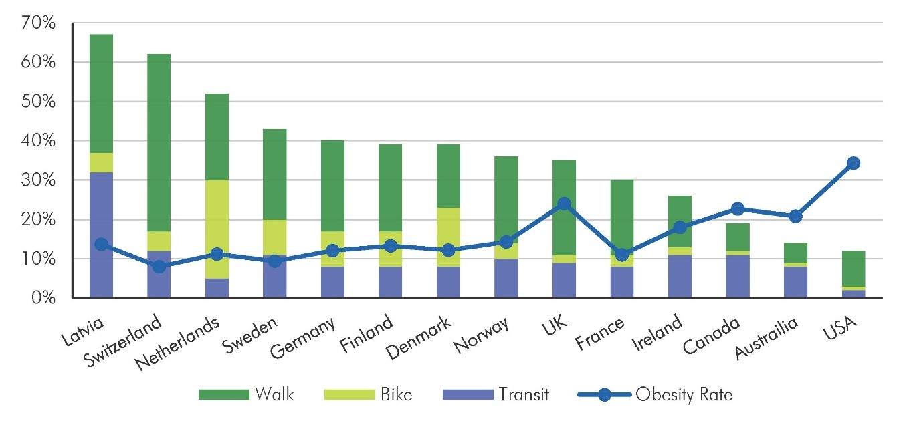
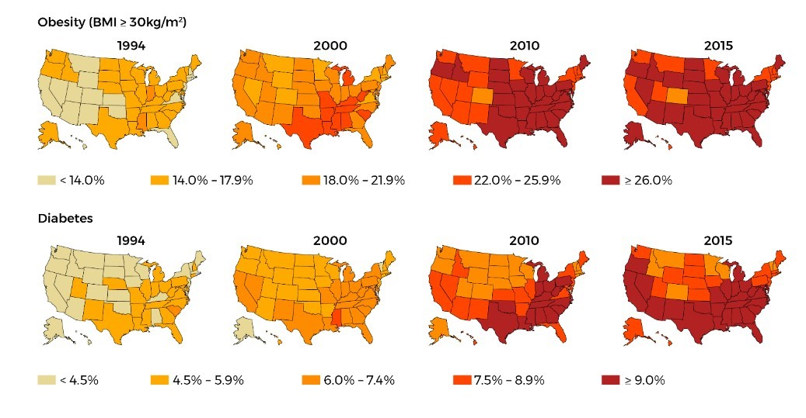
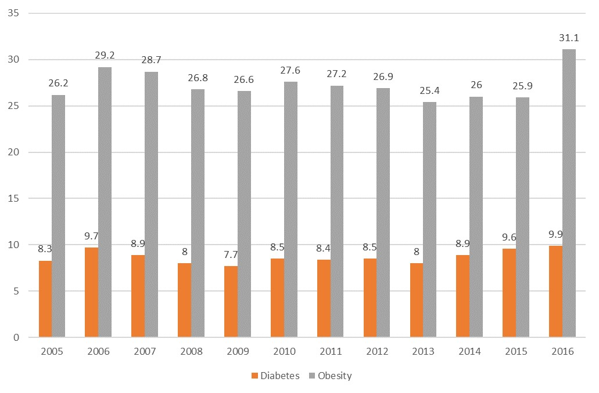
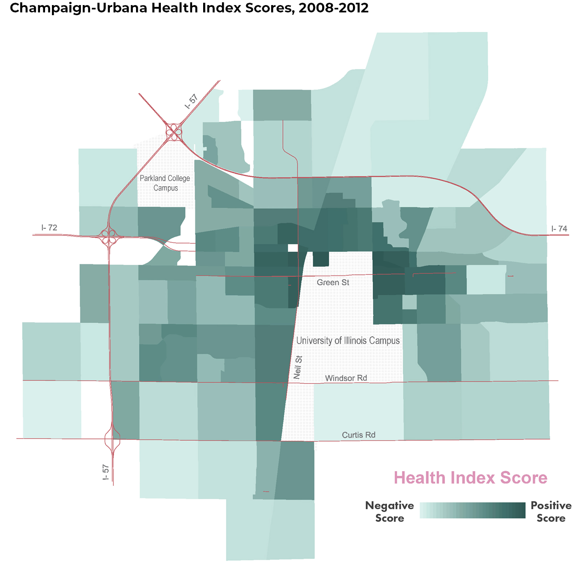
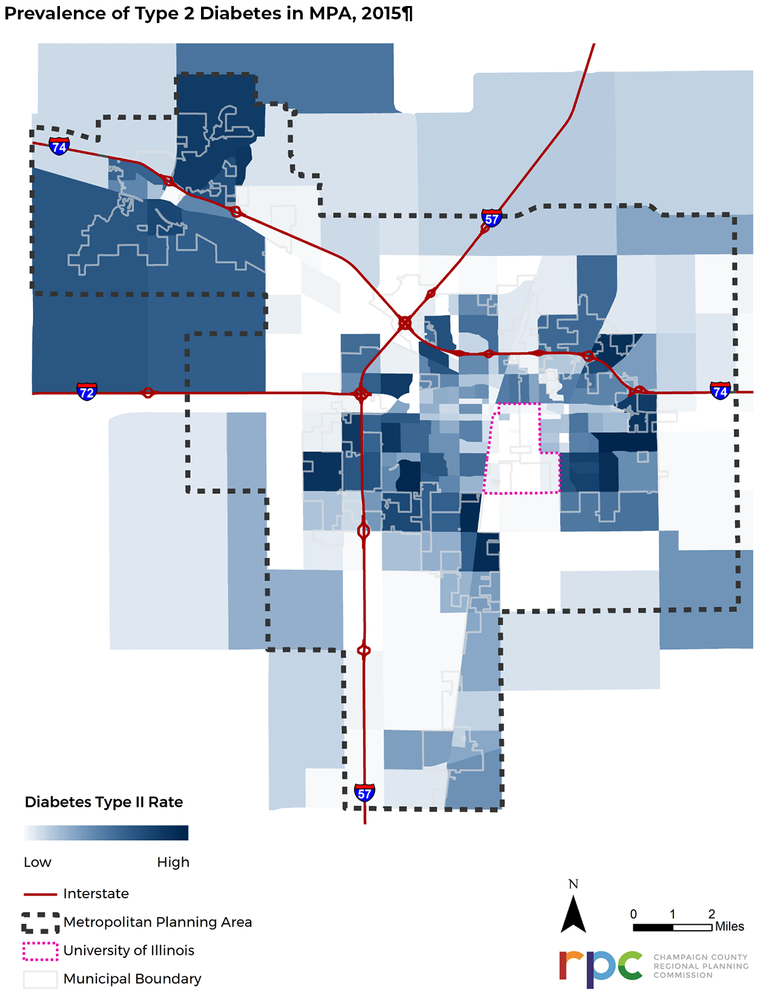
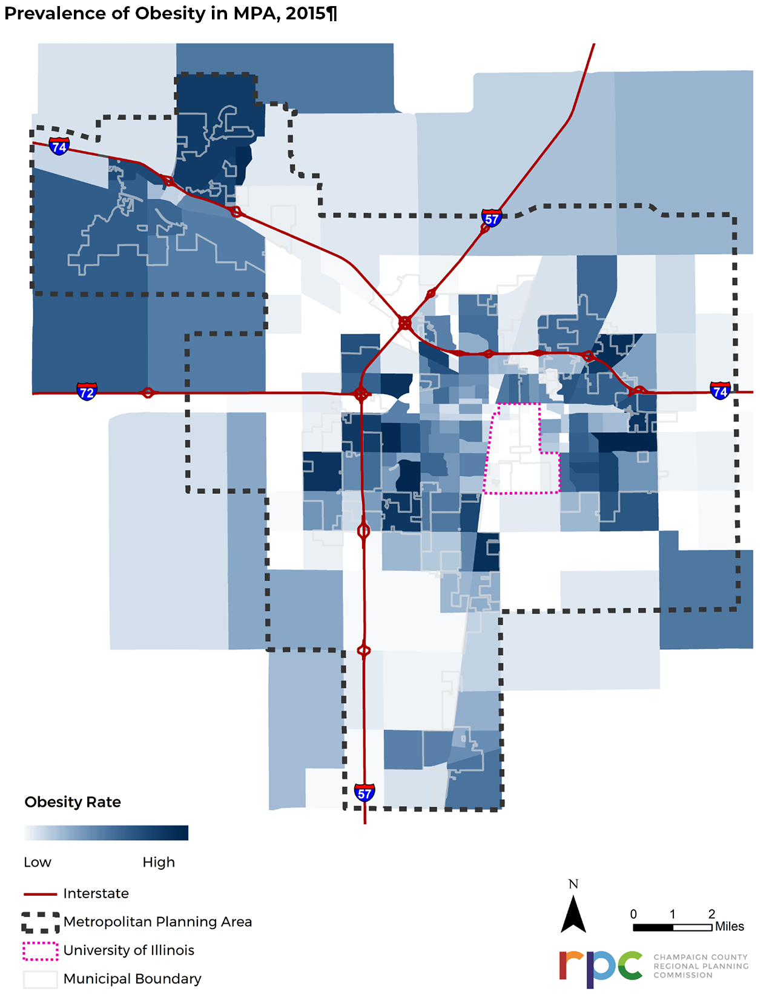
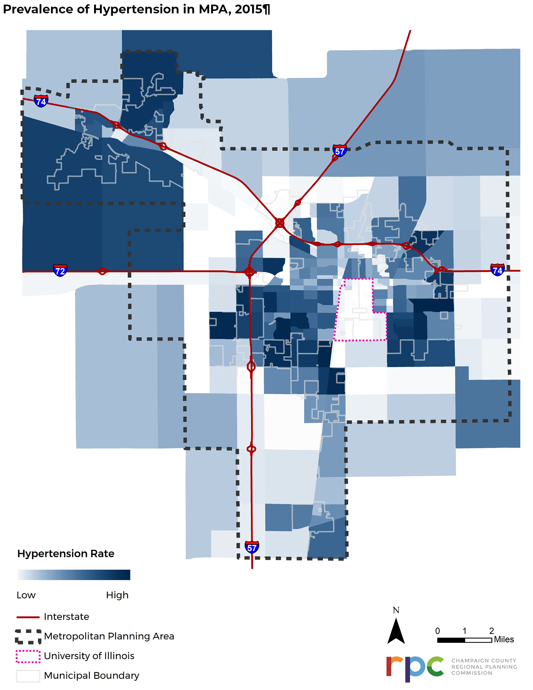
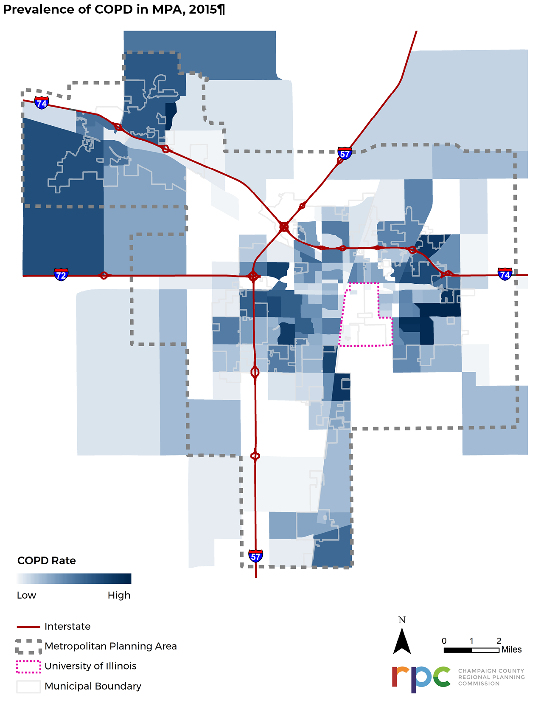

# Health

CUUATS aims to increase understanding about the different ways physiological, social, and environmental health is connected to the transportation system by including public health data in the long range transportation planning process.

# Health

Scientific evidence in public health literature has firmly established the
relationship between transportation mode choice and public health, separate from
the risk of injury or death as a result of a crash. In a 2010 report titled [*The Hidden Health Costs of Transportation*] (<https://www.apha.org/~/media/files/pdf/factsheets/hidden_health_costs_transportation.ashx),> prepared
for the American Public Health Association by Urban Design 4 Health, Inc., the
authors cite several studies demonstrating differences between car-based
communities and communities that facilitate more active modes of transportation
through better support and infrastructure for walking, biking, and public
transit. Residents in communities with more options for active transportation
show significant physiological, social, and environmental improvements over
residents in car-based communities. By choosing more active forms of
transportation, such as walking, biking, or taking the bus, individuals can
increase their amount of physical activity and reduce their risk of obesity.
Active transportation systems combined with fewer cars on the road can also lead
to environmental improvements such as lower rates of air pollution, which can
contribute to pulmonary diseases and trigger asthma attacks. The figure below
demonstrates this correlation on a global scale, with the US recording the
highest rate of obesity as well as the lowest rates of walking, biking, and
transit compared with 13 other countries.

#### Mode Split and Obesity Rates of Various Countries, 2008

Image:

PolicyLink, Prevention Institute, and Convergence Partnership. 2009 Healthy, Equitable Transportation Policy

Obesity and diabetes are two health conditions that closely tie to low levels of physical activity. Within the United States, rates of both health conditions have risen significantly since 1994, as
shown in the figures below. In 2015, about 93.3 million U.S. adults (39.8
percent) were [obese](https://www.cdc.gov/obesity/data/adult.html) . The
prevalence of high rates of obesity is not only a major health concern but also
increases the risk of other health problems including type 2 diabetes and high
blood pressure. An estimated 30.3 million people of all ages (9.4 percent of the
U.S. population) had diabetes in 2015 and type 2 diabetes accounts for 90
percent to 95 percent of all [diabetes
cases](https://www.cdc.gov/diabetes/pdfs/data/statistics/national-diabetes-statistics-report.pdf)
. About 75 million adults (32 percent) have high blood pressure in the U.S.,
making it one of the primary or [contributing causes of
death](https://www.cdc.gov/dhdsp/data_statistics/fact_sheets/fs_bloodpressure.htm)
. Another leading cause of death related to the transportation system has to do
with vehicle emissions. Chronic Obstructive Pulmonary Diseases (COPD) is a group
of diseases, including chronic bronchitis and emphysema, which has been linked
to exposure to vehicle emissions including, but not limited to, particulate
matter, volatile organic compounds, and nitrogen oxides. The percent of adults
in the U.S. with diagnosed chronic bronchitis in 2017 was 3.5 percent and
emphysema was 1.4 percent.

#### United States Prevalence of Obesity and Diabetes by State, 1994-2015

Image:

CDC’s Division of Diabetes Translation. National Diabetes Surveillance System

Local health data is incorporated into transportation planning processes, when
possible, to better understand the different ways local health is impacted by
the transportation system in the MPA. The Champaign-Urbana MPA, like most
communities in the United States, is considered auto-centric, which means most
people rely on automobiles for getting around, although it is important to note
that local rates of active transportation are higher than the national average.
As referenced in the [transportation
section](https://ccrpc.gitlab.io/lrtp2045/existing-conditions/transportation/), the majority of
workers 16 years and older in the MPA drove alone to work in 2017, which does
not include additional time spent driving alone to places other than work like
school, the supermarket, restaurants, etc. Despite the MPA having higher rates
of active transportation than the national average, the most recent data shows
that local rates of obesity and diabetes have risen in Champaign County (from
26.2 percent to 31.1 percent and 8.3 to 9.9 percent respectively) from 2005 to
2016, similar to national trends. The chart below shows increases in the
prevalence of obesity and diabetes in Champaign County from 2005-2016.
Diabetes/obesity continues to be identified as one of the top four health
concerns in the Champaign County community, first in the 2014-2016 and again in
the 2018-2020 Community Health Improvement Plan, coordinated by the
Champaign-Urbana Public Health District (CUPHD) .

#### Rates of Diabetes and Obesity in Champaign County, 2005-2016

Image:
[CDC’s Division of Diabetes Translation. National Diabetes Surveillance System](https://gis.cdc.gov/grasp/diabetes/DiabetesAtlas.html)

What changes could be made in the local transportation system that could
positively impact the health of its users? To combat obesity, the U.S.
Department of Health and Human Services recommends that adults age 18-64 get at
least 150 minutes of physical activity a week. For kids the recommendation is
even higher: kids ages 6-17 should get at least 60 minutes of physical activity
every day to grow and maintain a healthy body. Increasing local rates of active
transportation would go a long way to increasing physical activity. To do this,
not only does active transportation infrastructure need to be in place, but
homes need to be located near schools, places of
employment, and other destinations to make active modes of transportation
realistic and desirable. Education and outreach regarding active transportation
and physical activity help encourage these healthy behaviors. Programs such as the local
Champaign-Urbana Safe Routes to School Project works with children and families
to establish safe ways to walk and bike to schools to increase physical activity
and instill positive active transportation habits at a young age.

## Local HIA

[CUUATS](https://ccrpc.org/programs/transportation/) is currently in the process of updating a local [Health Impact
Assessment (HIA)](https://ccrpc.org/documents/health-impact-assessment/) created
in 2014. The local HIA is intended for use as a policy analysis tool that can be
used to formalize public health considerations in planning processes. The HIA
was originally designed to identify relationships between the built environment
and local occurrences of obesity. The analysis revealed that there were
significant correlations between obesity and built environment variables such as
density, service accessibility, transit connectivity, active transportation
infrastructure, and more. Obesity rates were generally lower in neighborhoods
that had higher population density, better land use mix, higher accessibility to
jobs and services, and better transit connectivity. The following map is the
2014 HIA’s summary health index map based on health data from 2008-2012, where
the higher scores represent locations with more built environment features that
are correlated with higher physical activity and lower obesity. A full
explanation of the results and methodologies of the 2014 HIA can be found in the
[HIA report](https://ccrpc.org/documents/health-impact-assessment/), the content
of which is also included in the [LRTP 2040, Appendix
B](https://lrtp.cuuats.org/lrtp-appendices_011615_reduced_b-hia/)

Image:

Champaign-Urbana Health Impact Assessment, CUUATS, 2014

For the HIA update currently underway,
[CUUATS](https://ccrpc.org/programs/transportation/) staff hope to expand the
assessment to include local occurrences of type 2 diabetes, hypertension, and/or
chronic pulmonary disease along with obesity. Although the HIA update is ongoing
and no results are currently available, the following maps show the frequency of
persons diagnosed with obesity, type 2 diabetes, hypertension, and chronic
pulmonary disease in each traffic analysis zone within the MPA based on a
dataset from one local health provider obtained for 2015. These maps do not
reflect any data from the McKinley Health Center which serves the students at
the University of Illinois. This lack of data is why it appears that there is
very a low prevalence of illness in an around the University district in all
four maps, despite the high population density in that area.

An important limitation related to studying the relationships between different
health conditions and the transportation system is that correlations do not
necessarily prove causation. Many illnesses and health conditions reveal
themselves in different ways in different people and result from intersections
of multiple factors and risk modifiers. Investigations of local health and
transportation factors should not be interpreted as asserting that the
transportation system is the only factor that determines health outcomes in the
community. At the same time, scientific evidence asserts that even small
increases in active transportation could lead to significant decreases in
chronic disease and increases in overall public health, which makes this a
unique opportunity for the local transportation system to facilitate positive
change in the health of the community.

## Definitions