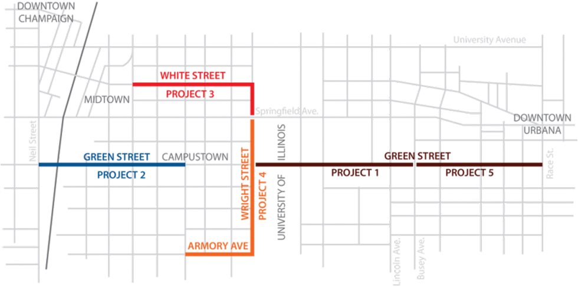
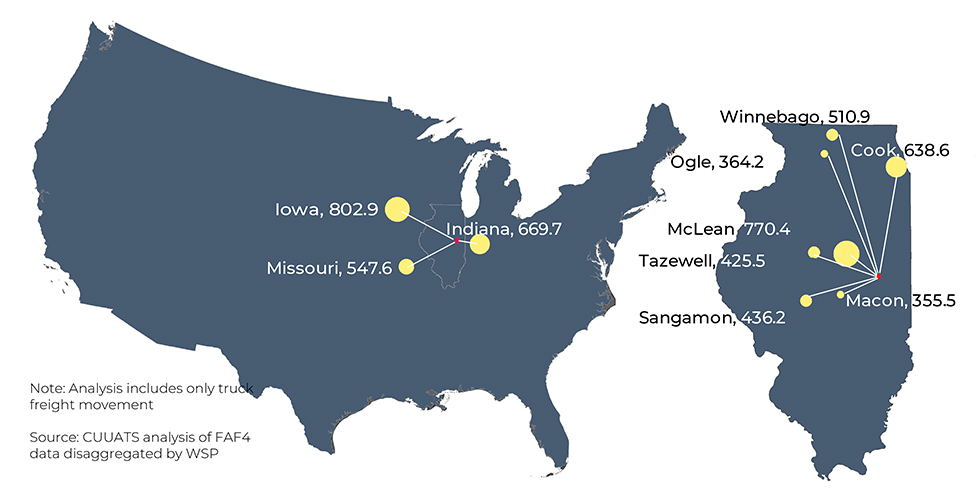
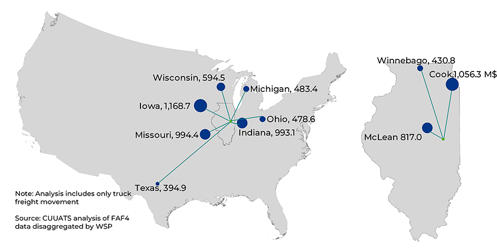

# Transportation

Understanding how the transportation system currently works with regard to the quantity of the infrastructure and frequency of use, planners can better assess how the system should evolve into the future.

# Transportation

The following sections provide an overview of transportation behavior in the
community including each mode in the local transportation system. Data regarding
infrastructure, safety, and ridership are included where available.

## Commuting Behavior

According to commuting data for workers 16 years and over, the majority of MPA
residents choose to drive alone to work over walking, biking, or transit, but at
significantly different rates depending on the municipality. In the cities of
Urbana and Champaign, commuters choose to walk, bike, and take transit to work
at significantly higher rates than the other local municipalities and national
averages. Only 52 percent of Urbana commuters and 65 percent of Champaign
commuters choose to drive alone to work compared with 86 percent of commuters in
Mahomet and 76 percent of commuters nation-wide. Alternatively, commuters in
Urbana and Champaign choose to walk, bike, and use transit at much higher rates
than other municipalities and the national overall. The wider range of
employment opportunities located in the Cities of Champaign and Urbana and the
lack of mode choices to travel to and from the surrounding villages contribute
to the heavy reliance on personal motor vehicles in these areas.

<rpc-chart url="acs-transportationwork.csv" type="bar" chart-title="Commuting Mode Choice" description="Percentage of workers using different transportation modes by municipality."></rpc-chart>
<rpc-chart url="acs-traveltimetowork.csv" type="bar" chart-title="Travel Time to Work" description="Average commute times in minutes for MPA municipalities."></rpc-chart>

The average commute time in MPA municipalities ranges from 15.6 minutes to 20.9
minutes. Despite higher than average rates of walking, biking, and taking
transit to work, over 90 percent of Champaign and Urbana workers commute less
than half an hour. The longest commute times are in Mahomet followed by Tolono
where 16 and 18 percent of worker’s commutes exceed 30 minutes. For most workers
in the MPA, average commute times have changed little since 2012. Savoy has been
the most affected with average travel times increasing by almost 4 minutes,
followed by Bondville where worker commutes decreased by almost 3 minutes.

## Complete Streets

In 2012 the [Champaign Urbana Urbanized Area Transportation Study
(CUUATS)](https://ccrpc.org/programs/transportation/) adopted a [Complete
Streets Policy](https://ccrpc.org/documents/complete-streets-policy/) that
promotes “Complete Streets” principles for all transportation infrastructure
projects carried out within the Champaign-Urbana Urbanized Area, whether by the
Illinois Department of Transportation, Champaign County, the Champaign-Urbana
Mass Transit District, the Cities of Urbana and Champaign, the Village of Savoy,
or the University of Illinois. The principles of this Complete Streets Policy
are to design, build, maintain, and reconstruct public streets in order to
provide for the safety and convenience of all users of a corridor, including
pedestrians, cyclists, users of mass transit, people with disabilities,
motorists, freight providers, emergency responders, and adjacent land users;
regardless of age, ability, income, or ethnicity.

## Pedestrians and Persons with Disabilities

Walking has many advantages for those without physical or environmental
limitations; it is healthy, sustainable, and free. Some people may choose to
walk only during exceptional weather days, or when a short travel distance
reduces the efficiency of other modes. For others, walking may play a more
extensive role in their everyday lives. Regardless of the extent, nearly
everyone relies on the pedestrian network to some degree.

The ACS estimates 14 percent of Urbana workers and 11 percent of Champaign
workers walked to work in 2017, compared with just three percent in the U.S.
overall. Although ACS commuting data is the only reliable dataset available for
transportation mode choice in our region, it does not likely paint a full
picture of walking behavior. According to the [2012 National Survey of Bicyclist and Pedestrian Attitudes and Behavior](https://one.nhtsa.gov/Driving-Safety/Research-&-Evaluation/2012-National-Survey-of-Bicyclist-and-Pedestrian-Attitudes-and-Behavior),
more than 70 percent of walking trips were for exercise, personal errands, or
recreation purposes.

### Pedestrian Safety

Pedestrians and people with disabilities are some of the most vulnerable people
using the transportation network due to lack of protective gear and slow travel
speed compared with buses, cars, and even bicycles. In the MPA, more than 30
percent of motor vehicle crashes involving pedestrians result in a fatality or
incapacitating injury. Local pedestrian crashes, while rare at about 2 percent
of overall crashes, account for 18 percent of traffic fatalities and 9 percent
of serious injuries. Pedestrians more often [cite feeling threatened by
motorists](https://one.nhtsa.gov/Driving-Safety/Research-&-Evaluation/2012-National-Survey-of-Bicyclist-and-Pedestrian-Attitudes-and-Behavior)
than by poor surface conditions, animals, or the potential for crime.

The map below shows pedestrian crashes in the MPA from 2012 to 2016. The
majority of pedestrian crashes occurred within the city limits of Champaign and
Urbana. There were a total of eight fatal pedestrian crashes during these years,
with 5 occurring in Urbana, two in Champaign, and one in Mahomet. Both fatal
pedestrian crashes in Champaign occurred along Bradley Avenue. Two of the fatal
pedestrian crashes in Urbana were located directly south of Crystal Lake Park on
University Avenue. The remaining fatal crashes in Urbana occurred on Lincoln
Avenue near the University of Illinois, at the intersection of Race Street and
Washington Street, and north of Interstate 74 on Cunningham Avenue. Mahomet’s
fatal pedestrian crash occurred on Oak Street.

<rpc-chart url="ped-crashes.csv" type="bar" chart-title="Pedestrian Crashes (2012-2016)" description="Frequency and severity of motor vehicle crashes involving pedestrians."></rpc-chart>

Map of the pedestrian crashes within the metropolitan planning area from 2012 to 2016.

The accessibility of the pedestrian network is vital to local mobility. Families
with young children, the elderly, and people with disabilities become more
independent when pedestrian infrastructure is more accessible. An accessible
pedestrian network enables all people to experience the surrounding community
while decreasing the risk of injury for all transportation network users.

The [Sidewalk Network Inventory and Assessment](https://ccrpc.gitlab.io/sidewalk-explorer/) for the urbanized area,
carried out by the Champaign County Regional Planning Commission, began with
baseline data collection in 2014. This data has been updated every summer to
monitor improvements and progress towards increasing compliance with Americans
with Disabilities Act (ADA) standards. The main components of sidewalk
accessibility include various characteristics of sidewalks, curb ramps,
crosswalks, and pedestrian signals. Current overall compliance and condition
scores for each of the facility types assessed are provided in the tables and
charts below. Compliance scores determine the extent to which a feature meets
standards set by the ADA, while the condition scores capture relevant
qualitative features not covered in the compliance evaluation.

Crosswalks in the metropolitan planning area had the best compliance scores with
95 percent of crosswalks scoring above 90 out of 100. Pedestrian signals and
sidewalks received the lowest compliance scores with a small fraction of these
features receiving scores above 90. Half of pedestrian signals and nearly 30
percent of sidewalk mileage received the lowest range of compliance scores. Many
curb ramps also need improvement, but they performed better than the pedestrian
signals and sidewalks with about 40 percent of compliances scores in the top
range.

Condition scoring was completed for sidewalks and curb ramps. Condition scores
account for conditions such as deteriorating surface conditions, grass
over-growth, faults, and cracks. One-third of sidewalk mileage and almost
two-thirds of curb ramps received condition scores above 90.

The chart below illustrates the percent change in compliance scores for each of
the sidewalk network features between 2015 and 2018. The greatest positive
change occurred with pedestrian signals. There was over a 50 percent increase in
pedestrian signals with compliance scores between 80 and 90 out of 100.
Substantial progress also occurred in many curb ramp features. Curb ramps
decreased in all lower compliance score ranges and scores in the highest range
(above 90) increased by about 15 percent. Sidewalks did not show the same
positive change. Sidewalks in the lowest compliance score ranges increased while
decreasing in the higher compliance score ranges.

## Bicycles

The ACS estimates six percent of Urbana workers and three percent of Champaign
workers rode a bicycle to work in 2017 compared with less than one percent in
the U.S. overall. As with other commuting data, these percentages do not include
children under 16 years of age, or bicycle trips associated with recreation,
exercise, and personal errands. Based on results from the [2012 National Survey
of Pedestrian and Bicyclist Attitudes and
Behaviors](https://one.nhtsa.gov/Driving-Safety/Research-&-Evaluation/2012-National-Survey-of-Bicyclist-and-Pedestrian-Attitudes-and-Behavior),
approximately 78 percent of bicycle trips related to recreation, exercise, or
personal errands.

The map below illustrates the location of various types of bicycle facilities in
the MPA. Champaign and Urbana host the majority of the facilities, but Mahomet
and Savoy have also established a smaller but growing network of bicycle
facilities. Within the municipality boundaries of Champaign, Urbana, and Savoy,
nearly 60 percent of bicycle facilities are shared-use paths, followed by bike
lanes at about 25 percent while all of Mahomet’s facilities are shared-use
paths. There are currently no designated facilities for bicycles in Tolono or
Bondville.

Map of the bike and trail facilities within the metropolitan planning area.

The chart below tracks the change in mileage of each type of bicycle facility,
and illustrates the dominance that shared-use paths and bicycle lanes have in
the local bicycle network. The other four facility types, bicycle paths,
sharrows, shared bicycle/parking lanes, and bicycle routes, collectively
comprise about 15 percent of the network mileage. Bicycle paths are the only
facility type that has decreased in mileage, attributed to the conversation of
several University of Illinois bicycle paths to other types of facilities since
2010. The metropolitan planning area currently contains about 124 miles of
bicycle facilities, representing a 22 percent increase since 2015.

<rpc-chart url="bike-crashes.csv" type="bar" chart-title="Bicycle Crashes (2012-2016)" description="Frequency of crashes involving bicycles by year."></rpc-chart>

<rpc-chart
url="bike-facilities-mileage.csv"
type="line"
switch="true"
stacked="false"
y-label="Miles of Bicycle Facilities"
legend-position="top"
legend="true"
grid-lines="true"
tooltip-intersect="true"
source="CUUATS, Greenways and Trails Database, 15 January 2019"
chart-title="Miles of Bicycle Facilities in the MPA, 2010-2018">
</rpc-chart>

### Bicycle Safety

Like pedestrians, bicyclists are some of the most vulnerable people using the
transportation network, travelling in close proximity to much heavier and faster
motorized vehicles. Only five percent of reported bicycle crashes result in no
injuries in the MPA. Due to this vulnerability, prioritizing bicycle safety is
fundamental to encouraging and supporting bicycling.

The map below shows bicycle crashes in the MPA from 2012 to 2016. The majority
of bicycle crashes occurred within the city limits of Champaign and Urbana
including two fatal crashes. The first fatal crash was near the intersection of
Springfield Avenue and Country Fair Drive in January 2012, and the second was
along Olympian Drive west of Market Street in January 2016. During the same time
period, the University of Illinois and nearby areas experience a greater
frequency of bicycle crashes, including crashes resulting in severe injuries.
Other areas of concern include many major street corridors such as University
Avenue, Cunningham Avenue, Kirby Avenue, Mattis Avenue, and Bradley Avenue.

Map of the bicycle crashes within the metropolitan planning area from 2012
to 2016.

Over 50 percent of crashes involving a bicycle in the MPA between 2012 and 2016
resulted in a “B-injury” meaning one or more people involved in the crash
received apparent, moderately severe injuries that were not disabling in nature.
Fifteen percent of crashes resulted in one or more “A-injuries” meaning one or
more people involved in the crash received an incapacitating injury, while one
percent of all reported bicycle crashes were fatal.

The bar chart below graphs the age distribution of bicyclists involved in
crashes from 2012 to 2016. The largest number of bicyclists involved in crashes
were ages 20 to 24, which is not surprising given the large number of students
in that age range attending the University of Illinois. Across multiple age
groups, male bicyclists had significantly greater involvement in bicycle crashes
than female bicyclists. Although national statistics on gender participation in
bicycle crashes also reflect this pattern, there is insufficient local data on
male and female bicycling rates to discern whether males overall are more likely
to be involved in bicycle crashes than females.

## Transit

Buses are an excellent and inexpensive option for traveling around the
Champaign-Urbana community. Buses accommodate more people than personal vehicles
with fewer resources. Fewer single-occupancy vehicles on the road lead to fewer
emissions, less parking demand, less traffic congestion, and better population
health. Public transit is considered a form of “active transportation,” along
with bicycling and walking, due to the additional physical activity required to
get to and from bus stops. Studies show that [transit riders get 8-33 additional
minutes of physical activity each
day](https://dx.doi.org/10.3390%2Fijerph9072454) compared with non-transit
riders.

The Champaign-Urbana Mass Transit District (MTD) provides a full range of
mobility services to the urbanized area. The main fixed-route bus service
includes over 2,000 bus stops and 70 different daytime, weekend, night, and
late-night routes. MTD also provides ADA Paratransit service, C-CARTS rural
service, Half Fare Cab, SafeRides, and MTD Connect to make sure people of all
ages and abilities can safely get where they need to go. In addition, MTD is the
local transportation provider for the University of Illinois as well as
Champaign and Urbana public middle and high school students. MTD provides around
twelve million trips annually, though ridership has declined slightly since its
most recent peak in 2014, as seen in the chart below.

<rpc-chart
url="mtd-ridership.csv"
type="line"
y-label="Number of Unlinked Passenger Trips"
grid-lines="true"
source="Champaign-Urbana Mass Transit District"
chart-title="MTD Ridership, 2007-2018">
</rpc-chart>

In 2019, the price for an annual bus pass is $84 and a one-way ride with a free
transfer is $1. Rides for veterans, senior citizens, persons with disabilities,
and children ¬under 46 inches in height are free. All eligible University of
Illinois students, faculty, and staff have unlimited access to MTD service with
their valid University-issued ID card. University students pay a mandatory fee
each semester for this unlimited access, which was $62 per semester during the
2018-2019 academic year. A 2015 MTD survey determined that 46 percent of MTD
riders do not have access to a vehicle, and 53 percent of users have ridden for
over five years.

According to ACS 2017 data, almost 12 percent of workers in Champaign and Urbana
took the bus to work each day which was more than double the national average of
five percent. The rate of workers taking the bus to get to work in the overall
metropolitan planning area was similar to the national average, around five
percent, due to the fact that the villages of Bondville, Mahomet, and Tolono are
outside the MTD service area. In order to increase mobility and the use of buses
for commuters in the urbanized area, the MTD service area should be expanded to
be coterminous with the urbanized area as much as possible.

Because of the multimodal nature of transit, MTD works with local agencies to
support walking, biking, and ride share activities. Recent collaborations
include Residents Accessing Mobility Providing Sidewalks (RAMPS), C-U Safe
Routes to School (SRTS), Zipcar car share, VeoRide bike share, and most
recently, [Multimodal Corridor Enhancement Projects
(MCORE)](https://www.mcoreproject.com/). In 2015, MTD, with the support of the
City of Champaign, City of Urbana, and the University of Illinois, applied for
and received $15.7 million from a competitive federal grant program,
Transportation Investment Generating Economic Recovery Grant (TIGER), for the
construction of MCORE within the University District.

The goal of the MCORE project is to construct complete street corridors
connecting the Cities of Champaign and Urbana to the University of Illinois. The
MCORE project will improve transit travel between the cities and the campus,
create new economic opportunities in the surrounding commercial areas, and
improve local quality of life. The project includes a multimodal network of
roads, on-street bike lanes, shared lane markings, bus-only lanes, and other
transit services that will enhance mobility for residents and visitors,
particularly non-drivers, persons with disabilities, senior citizens, and
economically disadvantaged populations.

Map of MCORE projects

MTD has also been a leader in adopting new technologies to reduce the
environmental impact of the local transportation system. In 2018, 80 percent of
their bus fleet was hybrid diesel-electric, up from 9 percent in 2009. These
vehicles consume 25 percent less fuel than their diesel-only vehicles, emit
fewer greenhouse gases, and produce less noise when in operation. MTD is
currently working on installing infrastructure to support hydrogen fuel cell
technology in the community and was the first transit agency in the nation to
order 60-foot, zero-emission, hydrogen fuel cell buses which are expected to be
operating in 2020. In addition, MTD installed a 1200 panel, 297-kilowatt solar
array in 2013 that provides approximately 20 percent of the power used by the
MTD maintenance facility and bus garage in Urbana.

<rpc-chart
url="fleet2018.csv"
type="bar"
y-label="Bus Units"
grid-lines="true"
colors="indigo,orange"
stacked="true"
switch="false"
source="Champaign-Urbana Mass Transit District"
chart-title="MTD Fleet Composition, 2009-2018">
</rpc-chart>

#### Champaign County Area Rural Transit System

Community planning efforts to establish a Champaign County rural public transit
system have been ongoing since the 1970s. In 1995, a preliminary needs
assessment identified a significant need for rural public transportation and a
more comprehensive study was completed in 2004, which confirmed the need for
rural public transportation and suggested the need would continue to grow as the
population ages.

CRIS Rural Mass Transit District began operating rural general public
transportation in Champaign County in February 2011 Mondays through Fridays from
7:00 a.m. to 4:00 p.m. Initially, service was provided in the northeast quadrant
(Village of Rantoul and surrounding areas) of the county where surveys
demonstrated the highest need for rural transit service. In May 2013, CRIS
expanded service to the entire rural Champaign County and service hours were
extended to Monday through Friday from 6:00 a.m. to 6:00 p.m.

In February 2014, CRIS ceased providing service to Champaign County. In order to
continue to meet the need for rural public transit service in Champaign County,
on October 1, 2014, the Champaign-Urbana Mass Transit District (MTD) began
operating a new rural transit service under the name [Champaign County Area
Rural Transit System (C-CARTS)](https://c-carts.com/). C-CARTS currently
provides general public rural transportation in Champaign County, Monday through
Friday from 5:00 a.m. to 6:00 p.m.

In November 2016, C-CARTS expanded rural transit services in Rantoul after
forming a service contract with the Village. C-CARTS currently operates
fixed-route and demand-response services in Rantoul. The fixed-route stops at
designated bus stops along three established routes. Passengers can board at any
of the 65 bus stops in Rantoul. Input from the public, employers, and employees
helped create the fixed-route system. Residents who desire a custom trip, also
known as a ‘demand-response’ trip, may call 48-hours in advance. Demand-response
trips are not available during the times that C-CARTS operates the fixed-route
system. Riders under the age of 12 may ride for a reduced rate at $1 one-way.

#### C-CARTS Services

| Service Name | Service Type | Cost | Hours of Operation | Area of Operation |
| --- | --- | --- | --- | --- |
| C-CARTS | Demand-Response | $2 to $5 one-way | Demand-Response: 8:00am to 3:00pm | Trips must begin or end in rural Champaign County |
| Eagle Express | Fixed-Route, Demand-Response | $2 one-way | Fixed-Route: Monday-Friday 5:00am to 8:00am, 3:00pm to 6:00pm; Demand-Response: 8:00am to 3:00pm | Within Rantoul Service Area |
| Rantoul Connector | Fixed-Route | $5 one-way | Fixed-Route: Monday-Friday 5:00am to 8:00am, 3:00pm to 6:00pm | Between Rantoul and the Champaign-Urbana-Savoy Urbanized Area |

The Rantoul Connector links Rantoul to specific stops in Champaign-Urbana
Urbanized area. Most riders utilize this route to go to medical appointments or
work in the urbanized area. The service increases the economic capabilities and
improves the health of Rantoul residents who would otherwise not be able to make
trips to the urbanized area. The Rantoul Connector service operates
approximately every 60 minutes from 5:00am to 8:00am and again from 3:00pm to
6:00pm.

Both fixed-route and demand-response trips in Rantoul have increased since 2016.
Fixed-route ridership increased from 382 trips in November 2016 to 1,165 trips
in November 2018. Demand-response trips increased from 176 to 840 during the
same period. In 2019, C-CARTS utilized thirteen, 14-passenger buses.

According to C-CARTS data, the majority of all rural transit trips are for the
purpose of getting to work and visiting medical facilities. Other trip purposes
include social, educational, shopping, and personal reasons.

<rpc-chart url="ccarts_ridership.csv" type="line" chart-title="C-CARTS Ridership" description="Monthly ridership for rural transit services."></rpc-chart>

### Human Services Transportation

Human services transportation providers help meet the transportation
needs of the elderly, individuals with disabilities, and persons and families
with low income(s). Often, these individuals and families have four types
of limitations that preclude them from driving:

* Physical: old age, blindness, paralysis, developmental disabilities,
  acute illness, etc.
* Financial: Unable to purchase or rent a personal vehicle
* Legal: Too young, loss of driver’s license, or driver’s license not
  obtained
* Self-imposed: Choose not to own or drive a vehicle

In order to meet the transportation needs of these populations, there are
numerous human services transportation providers in the region and many
opportunities exist to improve how these services function. In terms of
accessibility, there are issues concerning ease of use, under-served and
unserved areas, and a lack of centralized information. In terms of availability,
issues of scheduling and temporal limitations are present. The reliability of
the system is also an issue because of the frequency of service, in addition to
restrictions that result from program eligibility requirements and trip
purposes. More detailed information can be found in the [Champaign-Urbana
Urbanized Area Human Services Transportation
Plan](https://ccrpc.org/documents/2018-champaign-urbana-urbanized-area-human-service-transportation-plan-hstp/).

### Champaign-Urbana Urbanized Area Transportation Providers

**General Public Providers**

| Services | Organization |
| --- | --- |
| Urban Transit | Champaign-Urbana Mass Transit District (MTD) |
| Rural Transit | Champaign County Rural Transit System (C-CARTS) |

**Human Services Providers**

| Services | Organization |
| --- | --- |
| Medical Vans | A Precious Cargo Carrier |
| Medical Vans | Carle Arrow Ambulance |
| Medical Vans | OSF PRO Ambulance |
| Medical Vans | Quality Med Transportation |
| Specialized | American Cancer Society |
| Specialized | Carle Foundation Hospital |
| Specialized | OSF Healthcare/Faith in Action |
| Persons with Disabilities | Champaign-Urbana Special Recreation |
| Persons with Disabilities | Developmental Services Center |
| Persons with Disabilities | MTD Paratransit |
| Persons with Disabilities | Swann Special Care Center |
| Persons with Disabilities | University of Illinois Disability Resources & Educational Services (DRES) |
| Senior | Family Service of Champaign County (volunteer) |
| Senior | Faith in Action (volunteer) |
| Senior | Various Senior Living Facilities (see transportation directory) |

**Student Providers**

| Services | Organization |
| --- | --- |
| School Districts | Champaign Unit 4 Yellow Buses |
| School Districts | First Student (contracts with USD 116 and Unit 7) |
| School Districts | Head Start (Savoy & Rantoul only) |
| Public Transportation | MTD (contracts with Champaign Unit 4, USD 116, & University Student/Faculty Passes) |

**Private Providers**

| Services | Organization |
| --- | --- |
| Inter-City | Amtrak |
| Inter-City | Greyhound/Burlington Trailways |
| Inter-City | Peoria Charter |
| Other | Willard Airport (American Airlines) |

## Automobiles

Automobiles are convenient for allowing people to travel freely and connect them
to long-distance destinations within and outside the community. However, the
expense of purchasing, maintaining, and operating an automobile is prohibitively
expensive for many households, underscoring the potential for multimodal
transportation choices (i.e. car-sharing, public transit, bicycling, walking) to
reduce household transportation costs. Moreover, all people within the community
experience the byproducts of widespread automobile use including safety risks,
emissions, noise, infrastructure costs, and traffic congestion. Within the
metropolitan planning area, anywhere from 52 to 86 percent of municipality
residents drive alone to work each day, with another 7 to 13 percent of workers
carpooling. There are many other trips not included in these numbers such as
trips for shopping, visiting the doctor, and taking children to school.

### Automobile Ownership

[Annual vehicle registration numbers](https://www.cyberdriveillinois.com/departments/vehicles/statistics/lpcountycounts/home.html) from the Illinois Secretary of State provide
an estimate of the total number of motor vehicles on local roadways. Motor
vehicles listed in the Illinois vehicle registrations include an aggregation of
passenger cars and trucks, motorcycles, B trucks\*, fiscal trucks\*\*, and
other\*\*\* vehicles. Accounting for the number of out-of-county university
students owning personal vehicles is one limitation to this dataset. According
to the latest numbers, the total number of registered vehicles has increased by
16 percent within the last 18 years. Fiscal trucks witnessed the greatest change
in number of vehicle registrations with a 396 percent increase from 2000 to
2018. Registered passenger vehicles increased by 8 percent during the same time
period.

<rpc-table
url="automobile-vehicleregistration.csv"
table-title="Annual Vehicle Registrations in Champaign County, 2000-2018"
source="Office of the Illinois Secretary of State, 2000-2018 Registration Counts by County, 21 January 2019.">
</rpc-table>

In 2017 the Illinois Secretary of State also started recording electric vehicle
ownership by county. The number of electric vehicles in Champaign County
increased from 88 vehicles to 152 vehicles, a 72 percent increase, from December
2017 to December 2018. Increasing electric vehicle ownership coincides with an
increasing number of alternative fueling stations. According to the [CUUATS
Annual LRTP 2040 Report
Card](https://reportcard.cuuats.org/accessibility-and-affordability/alternative-fuel-station/),
Electric charging stations in the MPA have increased from 27 to 47 from 2015 to
2018. Other alternative fueling options in the region, E85 and liquefied
petroleum gas (LPG), have decreased slightly during the same timeframe.

Map of the various locations throughout the MPA with alternative fueling options.

Household access to motor vehicles is an ACS dataset that can help illustrate
the relationship between income and mobility. Not all households have access to
a vehicle for a variety of reasons, including lack of money to purchase and
maintain a vehicle, lack of a driver’s license, or lack of desire or physical
ability to drive or own a vehicle. For households and individuals without access
to a vehicle, mobility depends on safe walking, bicycling, and transit
infrastructure to participate in the activities that structure daily life, like
work, school, social engagement, shopping, physical exercise, and more. For
households with good access to other forms of transportation, the lack of
vehicle ownership can be a significant cost savings.

The ACS estimates over 8,300 households in the MPA did not have access to a
motor vehicle in 2017, which is an almost 7 percent increase over 2012. This
increase could be attributed to rising vehicle ownership costs, University
efforts to minimize student vehicles in the campus district, and improvements in
walking, biking, and transit infrastructure that reduce reliance on vehicles.
Champaign, Savoy, Tolono, and Mahomet saw increases in zero-vehicle households
between 2013 and 2017 while zero-vehicle households in Urbana and Bondville
decreased. The percent of zero-vehicle households in Champaign and Urbana is
significantly above the national average, which speaks to higher levels of
walking, biking, and transit infrastructure as well as higher numbers of
university students and higher levels of poverty in those cities.

### Roadway Network Characteristics

#### Functional Classification

Functional classification is a process of categorizing roads primarily based on
mobility and accessibility. Mobility relates to operating speed, level of
service, and riding comfort. It is a measure of the expedited traffic conditions
between origin and destination. Accessibility identifies travel conditions with
increased exit and entry locations. IDOT uses the following classifications for
roadways throughout the state:

* **Principal arterials** have the highest level of mobility and the lowest level of
  accessibility. Interstates and other major arterials serve trips through
  urban areas and long-distance trips between urban areas.
* **Minor arterials** serve shorter trips between traffic generators within urban
  areas; they have more access but a lower level of mobility than interstates
  and other principal arterials.
* **Major and Minor Collectors** provide both mobility and access by gathering trips from
  localized areas and feeding them onto the arterial network.
* **Local streets** are lower-volume roadways that provide direct land access but
  are not designed to serve through-traffic.

The map below distinguishes roadway functional classification within the
metropolitan planning area. Approximately 20 percent of roadway mileage in the
MPA is categorized as arterials, 11 percent as collectors, and 69 percent as
local roads or streets. Two interstates, I-74 and I-57, traverse the MPA. A
third interstate, I-72, terminates in Champaign. US-45 and sections of
Springfield Avenue, Prospect Avenue, and Mattis Avenue are examples of other
principal arterials in the area.

Map of the 2017 IDOT functional classification within the metropolitan planning area.

#### Annual Average Daily Traffic

IDOT counts and publishes annual average daily traffic (AADT) volumes for
interstates and selected major arterials and collectors. The AADT map for the
metropolitan planning area uses the IDOT data to display the most frequently
travelled roadways in the area. Interstates I-74 and I-57 have the highest AADT
volumes. After interstate traffic, the highest volumes were recorded along
portions of the following roadways: Prospect Avenue, Mattis Avenue, University
Avenue/US-45, Neil Street/US-45, and Cunningham Avenue/US-45. From 2011 to 2017,
the highest AADT volumes for the interstates have increased by 11 to 16 percent,
while volumes for Mattis Avenue, Neil Street, and Cunningham Avenue have
decreased by 5 to 11 percent.

Map of the 2017 IDOT average daily traffic counts within the metropolitan planning area.

### Automobile Safety

#### Crash Rates per Vehicle Miles Traveled

One measure of automobile safety performance is the number of crashes per the
total vehicle miles traveled (VMT). By using VMT, the resulting crash rate
accounts for the variance of motor vehicle usage between different regions. The
table and chart below use Illinois Department of Transportation data to compare
the MPA crash rate to the Illinois crash rate. In 2016, for every 100 million
vehicle miles traveled in the MPA, there were 254 crashes. The crash rate in the
MPA increased each year from 2012 to 2016, but has remained consistently lower
than the statewide crash rate.

<rpc-chart url="automobile-crashes-rate.csv" type="line" chart-title="Crash Rate per 100M VMT" description="Comparison of local and statewide crash rates."></rpc-chart>

#### Fatal Traffic Crashes

The following map shows the fatal crash locations in the MPA from 2012 to 2016.
Crashes were most frequently located within municipal boundaries. The City of
Champaign had the most fatal crashes in the MPA, many of which were in the
northern part of the city. The majority of the MPA’s fatal crashes outside
municipal boundaries occurred between Mahomet and northwest Champaign.

Map of the fatal crash locations within the metropolitan planning area from 2012 to 2016.

The five-year rolling average of total fatalities per 100 million VMT in the MPA
has been relatively stable since 2012, but has increased approximately 11
percent from 0.69 in 2014 to 0.77 in 2016. In 2016, the Champaign-Urbana MPA saw
1.03 fatalities per 100 million VMT, higher than the statewide rate of 1.01.

<rpc-chart
url="automobile-crashes-fatalityrate.csv"
type="bar"
y-label="Fatalities per 100M VMT"
legend="true"
grid-lines="true"
source="Illinois Department of Transportation, 2012-2016 Crash-level Data"
chart-title="Fatalities per 100 Million VMT in the MPA and State, 2007-2016">
</rpc-chart>

## Commercial Trucks

A large part of the local economy relies on the freight transportation system.
An estimated 20.7 million tons of goods, valued at about $20.9 billion, were
moved on the region’s freight system by trucks and trains in 2017. Eighty-five
percent of the total goods tonnage, accounting for 94 percent of total goods
value, were moved by trucks.

There are three types of truck routes designated
in the MPA:

* **Class One:** Interstates I-57, I-72, and I-74
* **Class Two:** Segments of U.S. 150, Bloomington Road, Mattis Avenue, Prospect Avenue, Springfield Avenue, US 45/Neil Street/Dunlap Avenue, High Cross Road, Guardian Drive/Butzow Drive\*, and IL 47 in Mahomet
* **Class Three:** Airport Road west of U.S. 45/Cunningham Avenue\*

\*Truck routes locally designated by the City of Urbana

Map of the 2017 IDOT truck routes within the metropolitan planning area.

The heaviest truck traffic volumes occur along the Class One truck routes. These
interstates have also experienced increases in overall traffic volumes in the
past 5 years. In addition to the interstates, segments of Market Street, Lincoln
Avenue, University Avenue, Prospect Avenue, Mattis Avenue, and Bradley Avenue
saw an average daily truck traffic of more than 1,000 in 2018.

Map of the 2018 IDOT heavy vehicle average daily traffic counts in the metropolitan planning area.

### Truck Trade

Freight trucks in the Champaign-Urbana region also facilitate the
transportation of goods throughout Illinois and the United States. In terms of
tonnage, the map below shows Champaign County traded the most tonnage with Iowa
in 2017, at 803 tons. McLean County was the next largest trading partner at 770
tons, followed by Indiana and Cook County.

The map below highlights the County’s 10 largest truck trading partners by
tonnage followed by a graph that includes the 20 largest truck trading partners
by tonnage.

Map of Champaign County top 10 truck trading partners by tonnage in 2017

Image:
[CCRPC](https://ccrpc.org/)

When it comes to trading partners by value, Iowa was still Champaign County’s
largest partner in 2017 at $1,169 million. Cook County was the second largest
trading partner at $1,056 million, followed by Indiana and Missouri.

The map below highlights the County’s 10 largest truck trading partners by value
followed by a graph that includes the 20 largest truck trading partners by
value.

Map of Champaign County top 10 trading partners by value in 2017

Image:
[CCRPC](https://ccrpc.org/)

## Trains

The four railroad lines in the metropolitan planning area are owned by two rail
companies: Canadian National Railroad and Norfolk Southern Railroad. Canadian
National owns the north-south line with the heaviest traffic as well as the
east-west line from downtown Champaign through Bondville. Norfolk
Southern owns and operates the east-west line connecting Mahomet to
Champaign-Urbana and the east-west line running through Tolono.

Map of the railroads and their respective ownership within the
metropolitan planning area.

On the MPA’s north-south Canadian National line, Amtrak operates three passenger
train routes that stop at Illinois Terminal in downtown Champaign: the *Saluki*,
*Illini*, and *City of New Orleans*. Each of these three routes has one daily
trip northbound and one daily trip southbound. The *Saluki* and the *Illini*
provide service between Carbondale and Chicago, and the *City of New Orleans*
provides service between New Orleans and Chicago.

Amtrak ridership has generally increased since 2000, with the greatest increase
between 2006 and 2007 corresponding to the addition of the *Saluki* route. In
the four years since 2013, Amtrak ridership has declined. At least part of the
decline can be attributed to consistent delays experienced by riders. According
to the latest [Amtrak Host Report
Card](https://media.amtrak.com/wp-content/uploads/2018/03/CY2017-Report-Card-%E2%80%93-FAQ-%E2%80%93-Route-Details.pdf),
90 percent of local Amtrak trains were delayed in 2017 due to Canadian National
freight trains receiving priority. The north-south Canadian National rail line
supports both passenger and freight traffic, though freight traffic generally
has priority over passenger traffic.

CCRPC has been working with [Champaign County
First](https://www.champaigncountyedc.org/champaign-county-first) to obtain
support from legislators to increase Amtrak on-time performance for trains
traveling through Champaign. In November, Senator Durbin introduced the [Rail
Passenger Fairness
Act](https://www.durbin.senate.gov/newsroom/press-releases/durbin-introduces-bill-to-improve-amtrak-on-time-performance)
to improve Amtrak on-time performance in Illinois and around the country.

All rail traffic also results in delays for local roadway traffic at at-grade
railroad crossings. The table below provides general information on train
activity at the at-grade railroad crossing located on Curtis Road in the Village
of Savoy. In 2017 the railroad gates were down and blocking roadway traffic
while trains were passing for an average of 52 minutes each day in 2017.

## Airplanes

Two airports, Willard Airport and Frasca Field, are located in the MPA. Willard
Airport is a public airport owned by the University of Illinois and located
southwest of Savoy in between I-57 and U.S. 45. Frasca Field is a private
airport open for public use located north of Interstate-74 in Urbana.

Willard Airport provides non-stop service to three destinations: Chicago,
Illinois; Dallas, Texas; and Charlotte, North Carolina. All Willard flights are
currently operated by one carrier, Envoy Air, a subsidiary of American Airlines.
Similar-sized airports in the region generally have three to four carriers. The
charts below show enplanements and flights at Willard Airport between 2000 and
2017.

The following charts show on-time performance and causes of delays at Willard
Airport. The main [causes of
delays](https://www.bts.dot.gov/explore-topics-and-geography/topics/airline-time-performance-and-causes-flight-delays)
in 2015 were aircraft arriving late from previous destinations (34.4 percent),
air carrier delays (28.2 percent), national aviation system delays such as heavy
traffic volume (23.4 percent), and weather conditions (14 percent).

<rpc-chart url="airplanes-flights.csv" type="bar" chart-title="Flights at Willard Airport" description="Annual number of flights between 2000 and 2017."></rpc-chart>
<rpc-chart url="airplanes-enplanementsregional.csv" type="line" chart-title="Regional Enplanements" description="Comparison of regional airport passenger numbers."></rpc-chart>