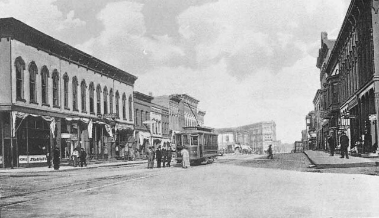
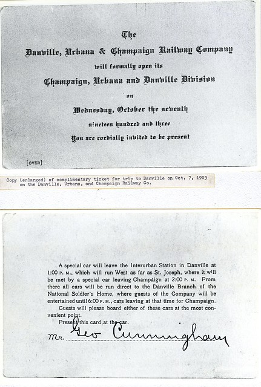
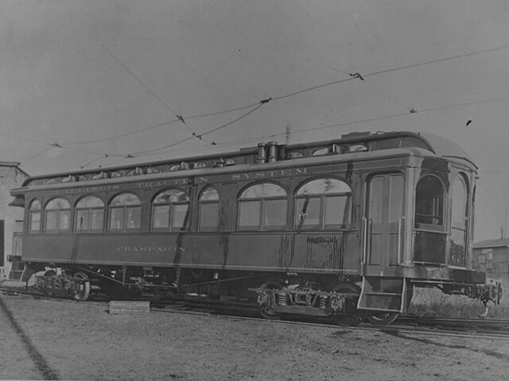
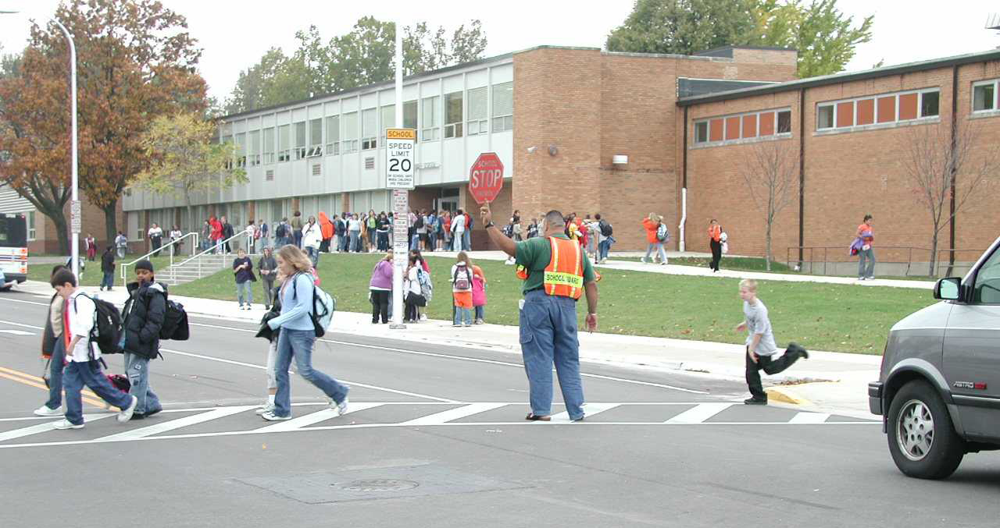
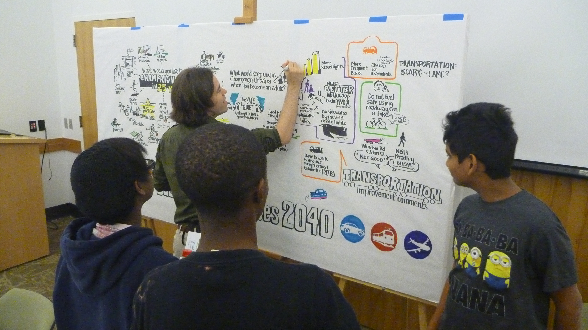

# Historical Review

This section offers a brief review of the history of transportation and transportation planning in the Champaign-Urbana Urbanized Area.

# History

## Transportation Network

### 1855 | Inter-Urban Rail

A horse-drawn “omnibus” connected travelers between the county seat
of Urbana and the Illinois Central Railroad depot in Champaign. This line was
upgraded in 1863, with the Urbana Railroad Company operating a mule-powered
trolley on a rail between the two points.

### 1891 | Electrified Inter-Urban Rail

The previous inter-urban rail was electrified in 1891, and expanded in the
following years to include services between:

* **Urbana**
* **University of Illinois campus**
* **Illinois Central depot**
* **Champaign County Fairgrounds**
* **Eisner Park**

Interurban omnibus, Main Street, Urbana.

Image:
[Champaign County Historical Archives](http://www.flickr.com/photos/98945443@N05/albums/72157688365487294/with/37930877051/)

This inter-urban railroad line, along with several other lines, was consolidated
into the Illinois Traction System in the early 1900s.

### 1903 | The First Electric Railway

William B. McKinley established the first electric inter-urban railway
connecting Urbana, Champaign, and Danville. The railway was extended beyond
Springfield, Illinois to St. Louis, Missouri by 1912, and was discontinued in
1953.

Letter connecting Urbana, Champaign, and Danville.

Image:
[Champaign County Historical Archives](http://www.flickr.com/photos/98945443@N05/albums/72157688365487294/with/37930877051/)

### 1937 | Illinois Terminal

The Illinois Traction System, which consisted of a series of consolidated
inter-urban rails, was renamed the Illinois Terminal Railroad Company.

Illinois Traction System cart.

Image:
[Champaign County Historical Archives](http://www.flickr.com/photos/98945443@N05/albums/72157688365487294/with/37930877051/)

## Previous Long Range Transportation Plans

### Pre 1960 | The First Street and Highway Plans

Prior to 1960, two major street and highway plans had been completed for
Champaign-Urbana. Civic design classes at the University of Illinois prepared
the first regional plan, and Swanson Associates completed the first
comprehensive plan. Swan Associates proposed an efficient transportation
network to improve street network irregularities.

### 1960 | Major Street and Highway Plan

Harland Bartholomew and Associates prepared *A Major Street and Highway
Plan for the Champaign-Urbana Urban Area for the State of Illinois Division of
Highways*. During the 1960’s, Champaign-Urbana experienced rapid urban growth,
creating an immediate need for the Long Range Transportation Planning (LRTP)
process. The proposed plan was based on detailed studies of:

* **Anticipated population increase**
* **Land use**
* **Vehicular travel in the Champaign-Urbana urbanized area**

The proposed routes were primarily determined by the economic and transportation
needs of the growing urban population. The plan was written to guide the
development of a healthy street system based on the existing transportation
network.

### 1970 | Comprehensive Transportation Plan

To accommodate the transportation needs of the projected population for the next
20 years, Harland Bartholomew and Associates prepared the first comprehensive
transportation plan for the Champaign-Urbana Urban Area in 1970. This plan
summarized transportation data and made recommendations for the implementation
of short and long range improvements, as well as ongoing transportation planning
and operations.

### 1979 | Major Review of the Comprehensive Long Range Transportation Plan

Apart from planning for a safe, efficient and economical transportation system,
the 1979 plan update worked to incorporate different land uses within a
transportation network. The plan included a variety of factors affecting the
transportation system in the area, including:

* **Land use**
* **The development of a mass transit plan**
* **Vehicle registration**
* **A bikeway plan to accommodate increased biking activity**
* **Transportation funding resources**

This plan focused on guiding growth and expansion in harmony with the natural
environment, and aimed to accommodate a system that would safely and
conveniently encompass a variety of transportation modes.

### 1982 | Major Review of the Comprehensive Long Range Transportation Plan

The 1982 LRTP review recommended different short and long-range transportation
improvement projects prioritized by urgency. Some of the projects included in
this plan were signal enhancements, road widening, and implementing then-modern
technology to improve intersection crossings.

### 1986 | Long Range Transportation Plan Update

The 1986 LRTP update involved an assessment of previous and ongoing
transportation plans and recommendations. Specifically, the plan prioritized
recommendations from previous transportation plans that reflected both the
changing growth patterns and the area wide priorities within available financial
resources.

### 1994 | Long Range Transportation Plan and Mobility Plan: C-U in 2020

In 1994, Champaign Urbana Urbanized Area Transportation Study
([CUUATS](https://ccrpc.org/programs/transportation/)) staff updated the long
range transportation plan, in combination with a new Mobility Plan, for a
25-year planning horizon. This plan went further than previous plans since it
included existing data and future recommendations for the following elements of
the transportation system:

* **Highways**
* **Bicycles**
* **Pedestrians**
* **Public transit**
* **Land use**
* **Rails**
* **Air**
* **Freight**

At that time, the urbanized area included the City of Champaign, the City of
Urbana, and the Village of Savoy.

### 1999 | Long Range Transportation Plan and Mobility Plan: C-U in 2030

[CUUATS](https://ccrpc.org/programs/transportation/) updated the LRTP and
Mobility Plan to cover a 30-year period. This plan aimed to prepare for the
future needs of an estimated county population of 203,847 by the year 2030. At
that time, the mass transit system’s primary service was a fixed route and
scheduled system, with principal transfer locations in:

* **Downtown Champaign (Illinois Terminal)**
* **Downtown Urbana (Lincoln Square)**
* **University of Illinois (Illini Union)**

The plan called for additional investment in rail services, and suggested
investigating the feasibility of establishing a high-speed rail corridor along
the Chicago-Champaign-Carbondale-Memphis line. The plan also recommended
studying ways to increase air travel at Willard Airport.

### 2004 | Long Range Transportation Plan: 2025

[CUUATS](https://ccrpc.org/programs/transportation/) published the [LRTP
2025](https://ccrpc.org/documents/lrtp-2025/) in 2004. Overall, the plan aimed
to:

* **Decrease congestion by increasing mobility**
* **Decrease dependency on cars by offering alternative transportation modes**
* **Decrease fringe development by promoting core development**
* **Decrease new construction by including transportation system management**

This plan also included portions of Bondville in the study area for the first
time, and established the use of performance measures to track progress towards
goals and objectives over time.

### 2009 | Long Range Transportation Plan: Choices 2035

The [LRTP 2035](https://ccrpc.org/documents/lrtp-choices-2035/) further developed
the process of utilizing performance goals in long-range transportation planning
by using annual report cards to help evaluate ongoing performance and guide
future decision-making for the region. The plan also addressed land use and
transportation issues to emphasize the need for more equity in the community,
and began shifting to a multi-modal approach when planning for future
transportation improvements.

Urbana Middle School students cross Vine Street with assistance from a crossing guard

Image:
[CCRPC](https://ccrpc.org/)

### 2014 | Long Range Transportation Plan: Sustainable Choices 2040

The [LRTP 2040](https://ccrpc.org/documents/lrtp-sustainable-choices-2040/) used
improved modeling tools and an expanded public involvement campaign to define
the region’s current transportation issues and future transportation goals.
Additional models and an expanded definition of transportation-related issues
included:

* **A more substantive consideration of local transportation costs**
* **Population health as it is related to active modes of transportation**
* **Accessibility to different modes**
* **Economic development**

Youth Visioning Meeting, LRTP 2040.

Image:
[CCRPC](https://ccrpc.org/)

This plan also continued to build on the practice of utilizing performance
goals and annual report cards to track ongoing performance.

## Policies and Organizations

### 1964 | Champaign Urbana Urbanized Area Transportation Study (CUUATS)

The Federal Highway Act of 1962 established
[CUUATS](https://ccrpc.org/programs/transportation/) as a [regional planning
agency in 1964](https://ccrpc.org/programs/transportation/history/). The
Federal-Aid Highway Act required that in urbanized areas, programs for
Federal-Aid Highway projects must be based on a “…continuing and comprehensive
transportation planning process carried on cooperatively by states and local
communities.” This legislation established the basis for metropolitan
transportation planning used today.

### 1974 | Metropolitan Planning Organization

In 1974, the State of Illinois designated the [Champaign County Regional
Planning Commission (CCRPC)](https://ccrpc.org/) as the [Metropolitan Planning
Organization
(MPO)](https://ccrpc.org/documents/metropolitan-planning-organization-self-certification/)
for the area, in order to encourage efficient regional planning efforts. At that
time, [CUUATS](https://ccrpc.org/programs/transportation/) was incorporated into
[CCRPC](https://ccrpc.org/) as the regional transportation entity, where it
remains today.

### 1991 | Intermodal Surface Transportation Efficiency Act of 1991 (ISTEA)

[ISTEA](https://www.fhwa.dot.gov/planning/public_involvement/archive/legislation/istea.cfm)
is a federal act that recognized changing development patterns, diversity within
metropolitan areas, and the importance of providing more control for MPOs over
transportation in their regions. ISTEA had significant effects on the long range
transportation planning process, by stressing the importance of integrating
environmental and intermodal considerations within a financially constrained
future, and making MPOs responsible for developing Long Range Transportation
Plans within their respective areas. LRTPs are to be developed in cooperation
with both the State and transit operators.

### 1998 | Transportation Equity Act of the 21st Century (TEA-21)

[TEA-21](https://www.fhwa.dot.gov/tea21/index.htm) was enacted June 9, 1998 as
Public Law 105-178. TEA-21 authorized the Federal surface transportation
programs for highways, highway safety, and transit for the 6-year period
1998-2003. The TEA-21 Restoration Act, enacted July 22, 1998, provided technical
corrections to the original law.

### 2005 | Safe, Accountable, Flexible, Efficient Transportation Equity Act: A

#Legacy for Users (SAFETEA-LU) ###

[SAFETEA-LU](https://www.fhwa.dot.gov/safetealu/summary.htm) built on the firm
foundation of ISTEA and TEA-21, supplied the funds and refined the programmatic
framework for investments needed to maintain and grow our vital transportation
infrastructure.

### 2012 | Moving Ahead for Progress in the 21st Century Act (MAP-21)

[MAP-21](https://www.fhwa.dot.gov/map21/) was a milestone for the U.S. economy
and the Nation’s surface transportation program. By transforming the policy and
programmatic framework for investments to guide the system’s growth and
development, MAP-21 created a streamlined and performance-based surface
transportation program and built on many of the highway, transit, bike, and
pedestrian programs and policies established in 1991.

### 2015 | Fixing America’s Surface Transportation Act (FAST Act)

The [FAST Act](https://www.fhwa.dot.gov/fastact/) was the first federal law in
over a decade to provide long-term funding certainty for surface transportation
infrastructure planning and investment. The FAST Act maintains focus on safety,
keeps intact the established structure of the various highway-related programs,
continues efforts to streamline project delivery and, for the first time,
provides a dedicated source of federal dollars for freight projects.