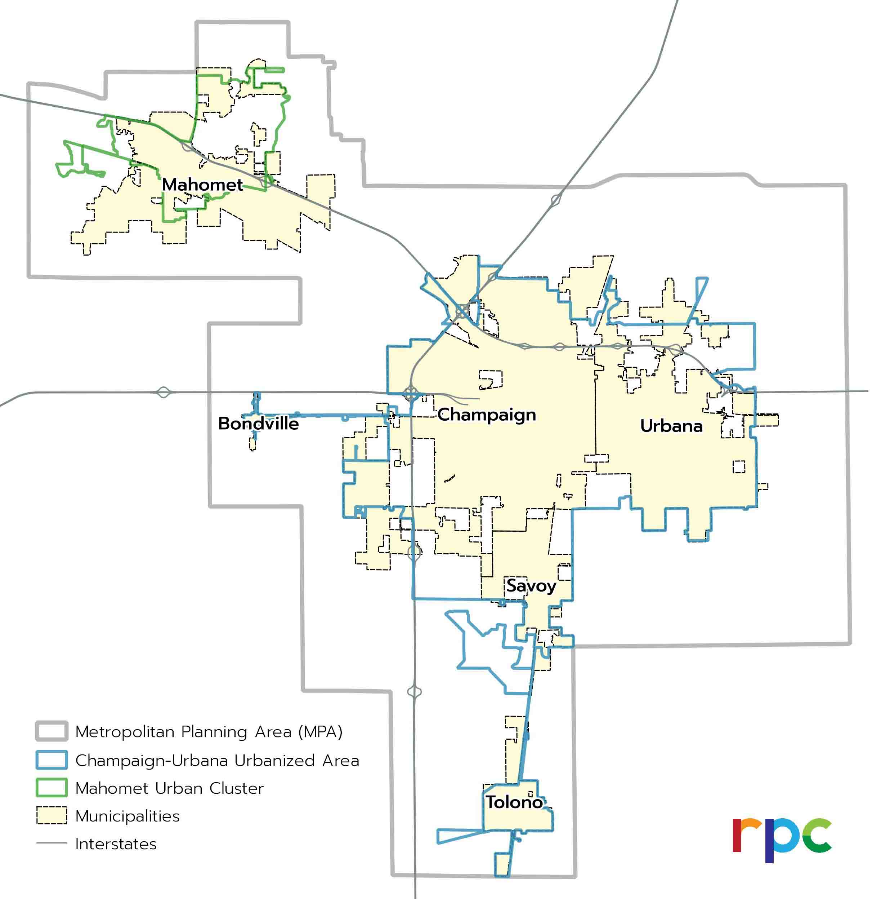
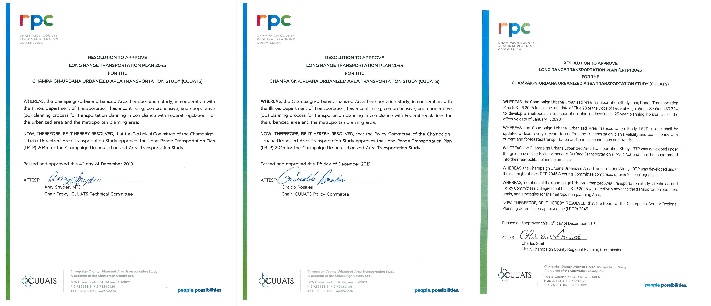

# Executive Summary

The overarching goals of the LRTP are based on improving safety, multimodal connectivity, equity, the economy, and the environment.

# Executive Summary

LRTP 2045 MPA and Champaign-Urbana Urbanized Area

Image:
[CUUATS](https://ccrpc.org/)

The Long Range Transportation Plan (LRTP) is a federally mandated document that
is updated every five years, and looks at the projected evolution of pedestrian,
bicycle, transit, automobile, rail, and air travel over the next 25 years. The
LRTP covers a 25-year Metropolitan Planning Area (MPA), which encompasses the
Champaign-Urbana Urbanized Area as delineated by the 2010 U.S. Census as well as
land outside the urbanized area that could be included in the urbanized area
between the years 2020 and 2045.

Carried out by [Champaign Urbana Urbanized Area Transportation Study
(CUUATS)](https://ccrpc.org/programs/transportation/) staff, in conjunction with
the [LRTP Steering
Committee](http://ccrpc.gitlab.io/lrtp2045/overview/introduction/#lrtp-2045-steering-committee),
this plan has a regional scope, and is not meant to take the place of local
transportation plans or comprehensive land use plans. Its main purpose is to
identify major regionally beneficial transportation projects that can be
targeted for federal funding. While smaller, localized transportation projects
are reviewed and taken into consideration during the planning process, the LRTP
lends itself to a broader regional focus and attempts to bring multiple
jurisdictions together under one common vision. The Long Range Transportation
Plan 2045 focuses on increasing the mobility of the urbanized area’s residents
and improving the connectivity of the entire transportation system, in order to
provide residents with greater access to services and to create a more efficient
travel network.

[Input from the
public](https://ccrpc.gitlab.io/lrtp2045/process/public-involvement/) and local
agencies was combined with the existing conditions data analysis to develop
goals, objectives, and performance measures that reflect the transportation
vision for 2045 and provide direction for the plan’s implementation. The five
overarching long-term goals are
**[safety](https://ccrpc.gitlab.io/lrtp2045/goals/safety/), [multimodal
connectivity](https://ccrpc.gitlab.io/lrtp2045/goals/multicon/),
[equity](https://ccrpc.gitlab.io/lrtp2045/goals/equity/),
[economy](https://ccrpc.gitlab.io/lrtp2045/goals/economy/), and
[environment](https://ccrpc.gitlab.io/lrtp2045/goals/environment/)**. These
goals and their objectives are based on a combination of the Federal
transportation goals, State of Illinois transportation goals, local knowledge,
current local planning efforts, and input received from the public.
Additionally, short-term objectives and performance measures translate the long
range vision for 2045 into short term action. Lists and maps of both funded and
unfunded [future
projects](https://ccrpc.gitlab.io/lrtp2045/vision/futureprojects/) provide
additional detail about transportation improvement priorities in the region.

## VIDEO: LRTP 2045 Planning Process

The following videos provides an overview of
the LRTP 2045 planning process in the Champaign-Urbana region.

[View this video in Spanish/Vea este video en español](https://youtu.be/RBSfi29tIWw)
[View this video in Chinese/观看本片中文版](https://youtu.be/M4sO1F7WJ0s)

## VIDEO: LRTP 2045 Vision

The intent of the following LRTP 2045 video is to imagine different changes in
the local community in 2045. This video is not intended to be a comprehensive or
literal representation of the LRTP 2045.

[View this video in Spanish/Vea este video en español](https://youtu.be/BSRXSnY1Fxs)
[View this video in Chinese/观看本片中文版](https://youtu.be/24HyrLskMVs)

Video Illustration: David Michael Moore  
Video Animation: Jason Dockins & David Michael Moore  
Video Music: Michael Linder  
Video Sound: HatPineapple Productions  
Video Narration: Kimmy Schofield  
Voice of Mom: Laura Christine  
Voice of Dad: Luis Alcantara  
Voice of Child: Leo Bakker

## LRTP 2045 Steering Committee

Representatives from the following agencies/organizations/municipalities helped
oversee the LRTP 2045 planning process:

* [Champaign County](http://co.champaign.il.us/HeaderMenu/Home.php)
* [Champaign County Emergency Management Agency](http://www.champaigncountyema.org/)
* [Champaign County Regional Planning Commission](https://ccrpc.org/)
* [Champaign County Bikes](http://www.champaigncountybikes.org/)
* [Housing Authority of Champaign County](https://hacc.net/)
* [Champaign County Economic Development Corporation](https://www.champaigncountyedc.org/)
* [PACE, Inc.](https://pacecil.org/)
* [Willard Airport](https://www.ifly.com/champaign-airport)
* [Champaign-Urbana Mass Transit District](https://mtd.org/)
* [Champaign-Urbana Public Health District](https://www.c-uphd.org/)
* [University of Illinois: Facilities and Services](https://fs.illinois.edu/)
* [University of Illinois: Center on Health, Aging, and Disability](https://ahs.illinois.edu/center-on-health-aging-&-disability)
* [City of Champaign](https://champaignil.gov/)
* [Champaign Park District](https://champaignparks.com/)
* [City of Urbana](https://www.urbanaillinois.us/)
* [Urbana Park District](https://www.urbanaparks.org/)
* [Village of Savoy](https://www.savoy.illinois.gov/)
* [Village of Mahomet](https://www.mahomet-il.gov/)
* [Village of Tolono](https://www.tolonoil.us/)
* [Champaign Township](https://www.toi.org/township/Champaign-county-Champaign-township/)
* Urbana Township
* Somer Township
* [Illinois Department of Transportation](http://idot.illinois.gov/)
* [Federal Highway Administration](https://highways.dot.gov/)

## Approved December 2019

The LRTP 2045 received final approval from the CUUATS Technical Committee on
December 4, 2019, the CUUATS Policy Committee on December 11, 2019, and the
Champaign County Regional Planning Commission on December 13, 2019. The plan
will be effective from January 1, 2020 through the end of 2024.

