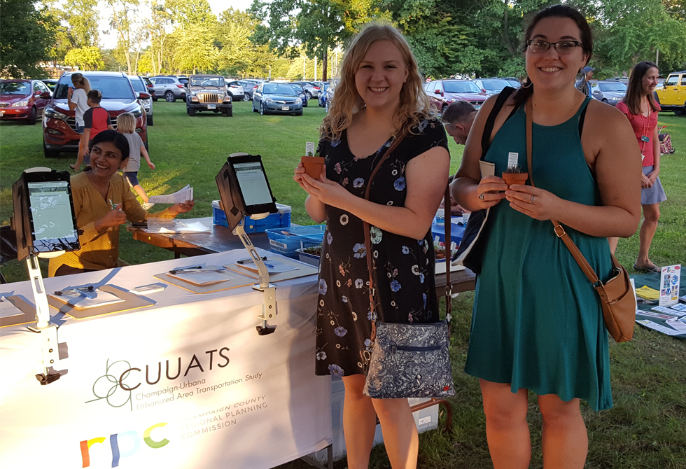

# Public Involvement

Public input is integral to the development of the LRTP because it affects every resident, employee, and visitor in our community.

# Overview

Outdoor concert at Prairie Park, Urbana, August 8th, 2018

Image:
[CUUATS](https://ccrpc.org/)

The LRTP 2045 planning process provided multiple opportunities for public
involvement during the plan’s development.
[CUUATS](https://ccrpc.org/programs/transportation/) staff advertised these
opportunities via the Champaign County Regional Planning Commission website and
local news outlets. For the LRTP 2045, public outreach efforts included an
[online interactive map
tool](https://ccrpc.gitlab.io/transportation-voices-2045/), surveys,
[videos](https://www.youtube.com/channel/UCg1MqXmO1487StASqmgWv1A/), a social
media presence, and outreach tables at popular community events. Public
involvement aids in educating the public about the long range transportation
planning process, raising awareness of existing transportation services, and
providing opportunities for the public to inform the direction of planning
efforts. Special emphasis is placed on public involvement because the LRTP
affects every resident, employee, and visitor in the community. To gain local
support and produce a plan that is grounded in a shared vision for the future,
all participation is welcomed and appreciated.

[CUUATS](https://ccrpc.org/programs/transportation/) staff designed and
scheduled the LRTP 2045 public involvement strategies and events to capture a
representative sample of the population in the metropolitan planning area, with
special emphasis on engaging underrepresented populations. The following charts
provide an overview of participant demographics based on voluntary information
provided by approximately 60 percent of participants from [phase
1](https://ccrpc.gitlab.io/lrtp2045/process/round-one/) and [phase
2](https://ccrpc.gitlab.io/lrtp2045/process/round-2/) of LRTP 2045 public
involvement which included **27 in-person events as well as online engagement**,
and resulted in **over 1,200 transportation system comments** and **over 1,100
surveys** submitted about current transportation behavior and future
transportation priorities.

<rpc-table
url=“input\_allevents.csv”
table-title=“Public Outreach Events by Municipality - Phases One and Two”
columns=“1,2”
rows=“1,2,3,4,5,6,7”

## Social Media Strategy

[CUUATS](https://ccrpc.org/programs/transportation/) staff used
[Twitter](https://twitter.com/cuuats/),
[Facebook](https://www.facebook.com/CUUATS/), and
[Instagram](https://www.instagram.com/cuuats/) to encourage people to use the
[online input map/survey](https://ccrpc.gitlab.io/transportation-voices-2045/)
on our website and to promote public LRTP events.

[CUUATS](https://ccrpc.org/programs/transportation/) staff keep these accounts
active and engaging to increase traffic. Staff purchased Facebook ads to target
certain age groups, such as the population aged 60 years and older and residents
who live in rural areas and in municipalities outside of Champaign or Urbana,
which are locations that are sometimes underrepresented at traditional public
meetings or events. Through Facebook,
[CUUATS](https://ccrpc.org/programs/transportation/) staff measured how many
individuals from each age group and municipality the post reached. Metrics such
as the number of likes, comments, views, and map link clicks indicated a post’s
strength in reaching residents.

[CUUATS](https://ccrpc.org/programs/transportation/) staff encouraged residents
to think of their own transportation suggestions by publishing photos of a
comment location with the original poster’s suggested fix. For example, cyclists
voiced their desire for a [bike
path](https://www.facebook.com/CUUATS/posts/10156616792259583) from Champaign to
Mahomet. In addition to posting transportation suggestions, Champaign-Urbana
metropolitan area [transportation
statistics](https://www.facebook.com/CUUATS/photos/rpp.52198774582/10156560052194583/?type=3&theater)
were shared on [CUUATS](https://ccrpc.org/programs/transportation/) social media
platforms. All social media posts directed residents to the online survey and
map.

### Partners

Local organizations supported LRTP outreach efforts by promoting
[CUUATS](https://ccrpc.org/programs/transportation/)
[Facebook](https://www.facebook.com/CUUATS/),
[Twitter](https://twitter.com/cuuats), and
[Instagram](https://www.instagram.com/cuuats/) posts in an effort to reach more
community members. The Champaign-Urbana Mass Transit District, City of Urbana,
City of Champaign, Champaign County Regional Planning Commission, Champaign
County Economic Development Corporation, University of Illinois, MCORE Project,
and State Rep. Carol Ammons’ team assisted with social media outreach. The City
of Urbana Community Development department passed out LRTP informational
business cards at their Neighborhood Night events in the summer as well.

## News Coverage

Throughout the planning process, local news agencies helped raise awareness
about public involvement opportunities. Illinois Public Media, also known as
WILL, [wrote about the
project](https://will.illinois.edu/news/story/going-where-the-people-are-for-comments-on-long-range-plan).
[CUUATS](https://ccrpc.org/programs/transportation/) staff appeared on [local
television
news](https://www.wcia.com/news/local-news/talking-transportation/1270999440) to
promote the LRTP outreach initiative. Smile Politely, Champaign-Urbana’s online
culture magazine, posted the [press
release](http://www.smilepolitely.com/splog/give_your_input_on_long_range_transportation_plans/)
created by [CUUATS](https://ccrpc.org/programs/transportation/) staff. The
Champaign County Regional Planning Commission also shared the press release and
other LRTP announcements on their
[website](https://ccrpc.org/news/2018/public-outreach-phase-for-long-range-transportation-plan-begins/).
In addition, [CUUATS](https://ccrpc.org/programs/transportation/) published
legal advertisements in the News Gazette.