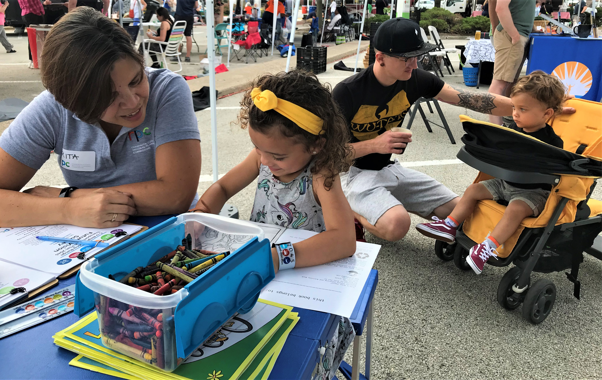
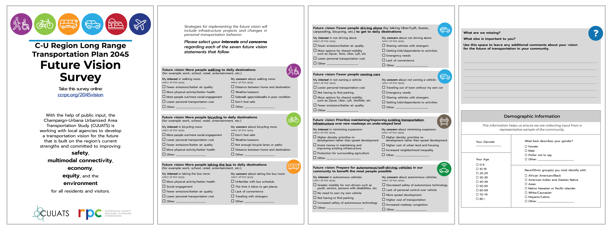

# Phase Two Public Involvement

Documenting residents' interests and concerns about the LRTP 2045 future vision.

# Phase Two Public Outreach

## September 2019

[CUUATS](https://ccrpc.org/programs/transportation/) staff collected the second
round of public input in fall 2019 at 10 community events. Residents completed
surveys regarding their concerns and interests about the LRTP future vision,
such as lower greenhouse gas emissions, lower personal transportation costs, and
higher quality transportation infrastructure. A digital survey was posted online
to provide access to residents who were unable to meet with staff in-person.

### September 2019 Events

6 - Jettie Rhodes Neighborhood Day at King Park, Urbana   
7 - Outdoor Concert at Garden Hills Park, Champaign  
14 - Block Party at Human Kinetics Park, Champaign  
15 - Tolono Fun Days at Westside Park, Tolono  
6 - Farmer’s Market, Mahomet  
7 - Illinois Terminal, Champaign  
12 - Illinois Terminal, Champaign  
14 - RPC Family Resource Fair at Hessel Park, Champaign  
15 - Activities and Recreation Center (ARC) at UIUC  
17 - Activities and Recreation Center (ARC) at UIUC  
18 - Tolono Public Library, Tolono  
19 - Douglass Park, Champaign  
21 - Farmer’s Market at Lincoln Square, Urbana  
26 - Hays Recreation Center, Champaign

Urbana Farmer's Market, Urbana, September 21st, 2019

Image:
[CUUATS](https://ccrpc.org/)

## Survey

[CUUATS](https://ccrpc.org/programs/transportation/) staff used paper and
digital surveys to collect transportation and demographic information from
residents. Residents completed 146 paper surveys and 256 digital surveys.

Note: To expand the image to full-size, right-click the graphic and choose 'open image in new tab'.

Image:
[CUUATS](https://ccrpc.org/)

## Survey Response Trends

### Future vision: More people walking, bicycling and taking bus to daily destinations

*LRTP 2045 Goals: Safety, Multimodal Connectivity, Equity, Environment*

Physical activity/better health was the most commonly identified interest for
people walking (81% of all respondents), and bicycling (74% of all respondents)
to daily destinations. Residents also reported a desire to walk, ride bikes, and
take public transit to save money and reduce carbon footprint.

#### Summary of additional comments: Interest in increased walking

* “Do not own a car”
* “I don’t drive a car for health reasons, so I need to be able to walk places.”
* “I do not know how to drive or ride a bike.”
* “I like to walk.”
* “More people out = safer public spaces”
* “Reduces traffic”

#### Summary of additional comments: Interest in increased bicycling

* Bicycling is faster than walking (5 comments)
* Bicycling is fun (6 comments)
* “Lower cost of infrastructure maintenance, taxes etc”

#### Summary of additional comments: Interest in increased public transit usage

* Convenient to use (3 comments)
* Getting to places faster (6 comments)
* “I don’t know how to drive.”
* “Not everyone should need a car”
* “Reduce congestion”

Respondents expressed their concerns for walking distances between home and
their destinations (58% of all respondents). The lack of bicycle and pedestrian
connectivity in the region also concerns residents (47% and 35% respectively).
Poor weather deters many pedestrians and cyclists in the region as well.

#### Summary of additional comments: Concerns for increased walking

* Clearing sidewalks for those with mobility limitations (6 comments)
* Interactions with dangerous drivers (2 comments)
* Poor accessibility/infrastructure (6 comments)
* Time spent walking to destinations (4 comments)

#### Summary of additional comments: Concerns for increased bicycling

* Do not own a bicycle/cannot afford a bicycle (6 comments)
* “I do not know how to ride a bike.”
* Interactions with dangerous drivers (16 comments)
* Potholes/poor infrastructure or network (10 comments)

Top three issues limiting public transit use were:

* The time it takes to get places (57% of all respondents)
* Lack of convenience (48% of all respondents)
* Unfamiliar with bus schedule (35% of all respondents)

Public transit ridership has declined slightly since its most recent peak in
2014. MTD has been working with local agencies to support walking, biking, and
other active transportation ride-share activities. Recent collaborations include
Residents Accessing Mobility Providing Sidewalks (RAMPS), C-U Safe Routes to
School (SRTS), Zipcar car share, VeoRide bike share, and most recently,
Multimodal Corridor Enhancement Projects (MCORE) (see [Transportation
Section](https://ccrpc.gitlab.io/lrtp2045/existing-conditions/transportation/)
for details).

#### Summary of additional comments: Concerns for increased public transit usage

* Current system does not run late nights/early mornings/24 hours (8 comments)
* Longer time to get to destinations (6 comments)
* Need bus system to Mahomet (3 comments)
* Reliability (3 comments)

### Future vision: Fewer people driving alone to get to daily destinations

*LRTP 2045 Goals: Safety, Multimodal Connectivity, Environment*

Over 40 percent of survey respondents listed lower personal transportation costs
and fewer emissions/better air quality as their top interests in reduced solo
driving. Nearly 40 percent of respondents desire more options for shared
mobility services (such as ZipCar, Taxis, Uber, Lyft, etc.) within the region.

#### Summary of additional comments: Interests for fewer solo drivers

* Cannot use or do not own a car anyway (5 comments)
* “I would like it if my family owned only 1 vehicle”
* “Less personal cost”

Respondents cited lack of convenience as a barrier to reducing or eliminating
their solo driving (45% of all respondents). Residents also expressed their
concern for sharing vehicles with strangers (37% of all respondents).

#### Summary of additional comments: Concerns for fewer solo drivers

* Convenience (8 comments)
* Enjoys own independence (2 comments)
* Traveling with a pet or large packages/furniture (3 comments)

### Future vision: Fewer people owning cars

*LRTP 2045 Goals: Multimodal Connectivity, Equity, Environment*

Residents cited saving time spent looking for parking and lower personal
transportation cost (51% and 48% of all respondents, respectively) as primary
interests for not owning a car. Respondents also showed interest for more
options for shared mobility services, which will result in lower personal
transportation costs and save time spent looking for parking.

#### Summary of additional comments: Interests for fewer vehicle owners

* Do not like driving or owning a car (3 comments)
* Lower personal transportation cost (2 comments)

Residents ranked out of town travel as a top concern (57% of all respondents)
for not owning a car. Nearly 55 percent of respondents mentioned needing a
vehicle for emergency situations as a reason to own their own car.

#### Summary of additional comments: Concerns for fewer vehicle owners

* Emissions from ride-share vehicles (2 comments)
* Exploitation of ride-share drivers (2 comments)
* “Shared car trips are still car trips and do not address the underlying problem that we need to reduce car dependency.”

### Future vision: Prioritize maintaining/improving existing transportation infrastructure over new roadways on undeveloped land

*LRTP 2045 Goals: Multimodal Connectivity, Equity, Environment, Economy*

Respondents specified financial investment in maintaining and improving existing
infrastructure as the highest priority (65% of all respondents). Survey
respondents also listed a preference for higher density: prioritizing
re-development rather than sprawl development (48% of all respondents).
Protection for surrounding agriculture was also a concern for 44 percent of all
respondents.

#### Summary of additional comments: Interests for maintaining/improving existing transportation infrastructure

* Increasing density (7 comments)
* Improvement of current infrastructure (5 comments)
* Protection of natural areas (10 comments)

Respondents ranked both increased neighborhood inequality and the higher cost of
urban land and housing as a concern equally at 43 percent of all respondents.

#### Summary of additional comments: Concerns for maintaining/improving existing transportation infrastructure

* “I worry about access to affordable housing.”
* “Poor ability to travel fast with less lanes”

### Future vision: Prepare for autonomous/self-driving vehicles

*LRTP 2045 Goals: Multimodal Connectivity, Equity*

Residents acknowledged greater mobility for non-drivers such as youth, seniors,
persons with disabilities, etc. as the greatest potential benefit for using
autonomous vehicles (56% of all respondents), as well as reducing demand to own
a vehicle (44% of all respondents).

#### Summary of additional comments: Interests in autonomous vehicles

* Ability to do something productive or sleep (2 comments)

Respondents cited their concern about losing control over the vehicle (51% of
all respondents), safety (41% of all respondents), and potentially higher
transportation costs associated with autonomous vehicle usage (35% of all
respondents).

#### Summary of additional comments: Concerns in autonomous vehicles

* Do not trust autonomous vehicle technology/safety (14 comments)
* Less investment in transit (2 comments)
* No reduction in emissions (4 comments)

### Other Comments

[CUUATS](https://ccrpc.org/programs/transportation/) staff provided space at the
end of the survey for respondents to write additional comments. A file of the
nearly 100 comments may be downloaded [here](OtherComments_SurveyRound2.csv).

### Demographics

#### Race or Ethnicity

White/Caucasian, African American/Black, and Hispanic/Latino residents had lower
representation than their overall percentage of the Champaign-Urbana urbanized
area population.

#### Age

The 20-29 age group outweighed other age groups, while adults ages 50-59 and
children under the age of 9 years had lower representation than their percentage
of the Champaign-Urbana urbanized area population.

#### Gender

The survey respondents split nearly evenly between male and female, which
closely mirrored the Champaign-Urbana urbanized area population.