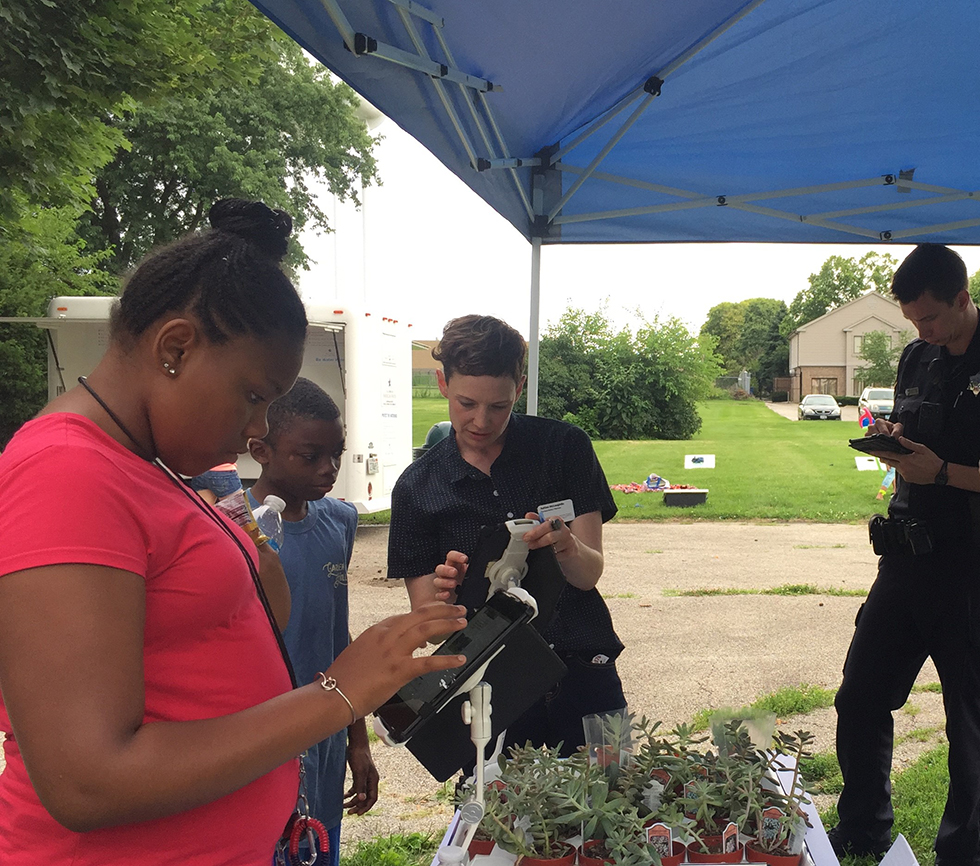
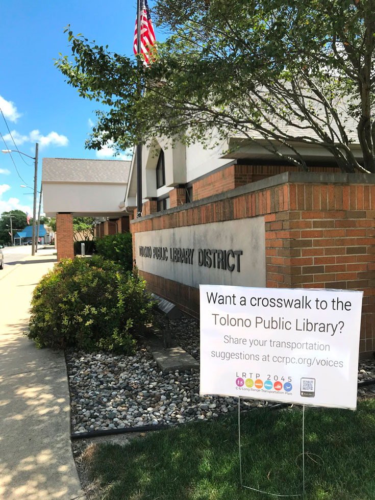
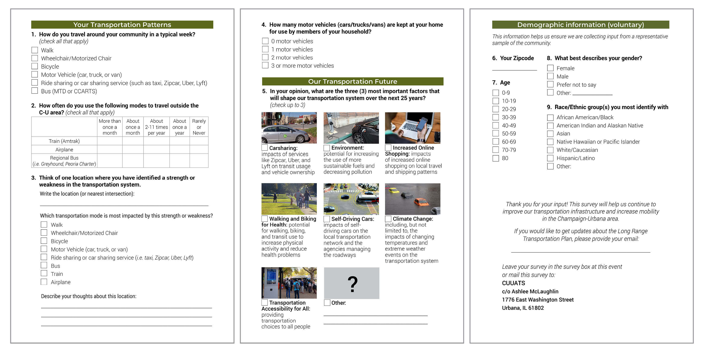

# Phase One Public Outreach

Documenting current strengths and weaknesses in the transportation system and residents' priorities for transportation in 2045.

# Phase One Public Outreach

## June 2018 to October 2018

The first round of public outreach took place between June and October of 2018.
[CUUATS](https://ccrpc.org/programs/transportation/) staff prepared a table for
the public at 17 community events during the initial outreach period. During
this period, public input focused on gathering information about current
transportation usage patterns, existing transportation network conditions, and
priorities for the future of transportation.

### June 2018 Events

23 - Jettie Rhodes Neighborhood Day at King Park, Urbana   
24 - Outdoor Concert at Garden Hills Park, Champaign  
28 - Block Party at Human Kinetics Park, Champaign  
30 - Tolono Fun Days at Westside Park, Tolono

### July 2018 Events

07 - Outdoor Concert at Hessel Park, Champaign  
21 - Farmer’s Market at Lincoln Square, Urbana  
25 - Outdoor Concert at Crestview Park, Urbana  
26 - Block Party at Johnston Park, Champaign

### August 2018 Events

03 - Farmer’s Market at Community Center, Mahomet  
07 - Block Party at Beardsley Park, Champaign  
08 - Outdoor Concert at Prairie Park, Urbana  
11 - C-U Days at Douglass Park, Champaign  
27 - Senior Picnic at Hessel Park, Champaign  
27 - RPC staff outreach lunch at Brookens, Urbana

### September 2018 Events

19 - East Central Illinois Low Vision Group at PACE, Urbana  
19 - Deaf Advisory Committee at PACE, Urbana

### October 2018 Events

09 - Future Cities Club at Urbana Middle School, Urbana

Block Party at Human Kinetics Park, Champaign, June 28th, 2018

Image:
[CUUATS](https://ccrpc.org/)

### Yard Signs

Staff used some of the initial comments entered into the online map to increase
project awareness by installing temporary yard signs at the comment locations.
For example, multiple metropolitan area residents expressed the desire for a
bike path from Mahomet to Champaign.
[CUUATS](https://ccrpc.org/programs/transportation/) staff hoped that sharing
others’ suggestions would cause residents to think of their own transportation
ideas to add to the map. Fifteen yard signs were placed in Champaign, Urbana,
Tolono, Savoy, and Mahomet from July 27th to August 17th.

Yard sign posted outside of the Tolono Public Library as a public awareness effort.

Image:
[CUUATS](https://ccrpc.org/)

## Online Input Map

[CUUATS](https://ccrpc.org/programs/transportation/) staff developed an online
map to collect input on strengths and weaknesses in the local transportation
system. This input contributed to the plan’s goals and informed the agencies
that own and maintain local transportation facilities. The online map, while no
longer interactive, will serve as a public repository of input as long as
possible.

Map displaying current land-use in the metropolitan planning area by
parcel-level tax data.

### Online Input Map Input Trends

#### Pedestrian Input

* Better-timed pedestrian crossings and more frequent and obvious signals for automobiles (13-15 comments, different locations)
* Improve wheelchair accessibility on sidewalks (14 comments, different locations)
* Improve Neil Street/St. Marys Road intersection for pedestrians (crosswalk, sidewalk under bridge)
  + “There is not a way to walk under this bridge without walking in the road. If you walk in the one-way bike lane on the South side of the road, it disappears very quickly, and, there is no sidewalk at that side of the intersection on Neil and St. Marys.” (9 likes)
  + “There is no button at this corner to request a light to cross Neil. Yet the only safe way through the viaduct when heading west is on this side of St Marys since you need to walk in the street (so should walk facing traffic).” (7 likes)
  + “Please add a sidewalk on St. Marys Rd between Neil St and Oak St. This would allow employees of Research Park to easily access the restaurants near Harvest Market. It would also allow Research Park employees living in neighborhoods West of Neil St to walk to work.” (4 likes)
* Add path to Colbert Park from nearby neighborhood and around Colbert Park Lake (6 comments)
* Improve crosswalk timing, infrastructure, and overall intersection functionality for pedestrians on Race Street/Main Street in Urbana (6 comments, 6 likes)
* Add sidewalks at John Street/Duncan Road in Champaign (5 comments, 2 likes)
* Improve sidewalk accessibility at Sixth Street/Daniel Street in Champaign (4 comments, 1 like)
* Add/improve crosswalks to make it easier to cross Prospect Avenue, especially North Prospect Avenue (3 comments)
* Add crosswalks at schools, better signage/signals, connectivity (3 comments)
* Add/improve sidewalks by schools and parks and in neighborhoods
  + Champaign (3 comments)
  + Tolono (1 comment)
  + Savoy (3 comments)
  + Urbana (2 comments)

#### Bicycle Input

* Cleaner, more evenly paved bike paths (7-22 comments, different locations)
* Bike lane separation from automobile traffic for safety (18 comments, different locations)
* Bicycle parking (18 comments, different locations)
* “The Thornewood Subdivision needs to be connected to the Lake of the Woods
  Forest Preserve and the rest of the Village of Mahomet with a bike path off of
  Route 47. The traffic is too fast and too voluminous to allow safe passage for
  pedestrians and cyclists. I know that all involved parties are aware but the
  need cannot be overstated, in my opinion.” (15 likes) [two similar pedestrians
  comments]
* Add bike path from Champaign to Mahomet (5 comments, 7 likes)
* Add bike lane/widen road on bridge from Kirby Avenue across I-57 (6 comments, 5 likes total, including pedestrian comments)
* Clearer separation between pedestrian and bike ways in Campustown (5 comments, 1 like)
* “North Prospect is uncomfortable, unpleasant, and unsafe for anyone who is
  transiting without a car. Improved access for bikers, pedestrians.” (4
  comments)
* “Improve entrance to Boulware Trail. Cyclists are forced to enter the sidewalk
  through private drive and perform a very tight turn to enter the trail” (4
  likes)
* Bike paths disappearing/ending, especially from Campustown heading west into Champaign (4 comments)
* Bicyclists failing to follow rules of the road (3 comments)
* Bicycle parking at bus stops, Champaign and Urbana (4 comments)
* Increase bike paths and connectivity in Savoy (3 comments)
* Remove/stop adding bike lanes on busy roads (2 comments)
* Add bicycle access on 130 to Kickapoo Rail Trail (3 comments, 2 likes)

#### Bus Input

* Improve safety and lighting at shelters and add shelters (4-8 comments)
* Increase bus service in Savoy (7 comments)
* MTD to Willard Airport (5 comments, 4 likes)
* MTD access to Carle Clinic on Curtis Road (3 comments)
* Empty buses (3 comments)
* Improve paratransit services (3 comments)

#### Automobile Input

* Fix potholes (10 comments, different locations)
* Convert intersections to roundabouts (5 comments, 4 likes)
  + Florida Avenue/Vine Street
  + Florida Avenue/Race Street
  + Philo Road/Washington Street (2 comments)
  + 1200 N/1350 E
  + Savoy in general (2 comments)
* Dangerous flooding (5 comments)
  + Kirby Avenue by Mattis Avenue
  + Harris Avenue/Vine Street
  + One comment outside the MPA
  + Wright Street/Armory Avenue
  + Neil Street/St. Marys Road
* Increase parking on campus and in downtown Champaign (11 comments)
* Improve congestion/visibility at State Street and Kirby Avenue (5 comments, 8 likes)
* Reduce congestion at Prospect Avenue and Marketview Drive (6 comments, 4 likes)
* Reduce speed limits in neighborhoods with children (3 comments, different locations)
* Lower speed limit on Kirby Avenue (3 comments, 1 like)

#### Train

* Add high speed rail to Chicago (5 comments, 20 likes)
* Reduce Amtrak train delays (9 comments, 4 likes)

#### Plane Input

* Add more destinations (7 comments, 2 likes)
* High prices (2 comments)

#### Comments Common to All Modes

* Increase lighting for walking, biking, and driving (24-25 comments)
* Overgrown bushes/trees, infrastructure blocking visibility (18-20 comments, different locations)

## Survey

[CUUATS](https://ccrpc.org/programs/transportation/) staff used paper and
digital surveys to collect transportation and demographic information from
residents. This input contributed to the plan’s goals and informed the agencies
that own and maintain local transportation facilities.

The survey used by CUUATS staff to collect transportation information from residents. Note: To expand the image to full-size, right-click the graphic and choose 'open image in new tab'.

Image:
[CUUATS](https://ccrpc.org/)

### Survey Response Trends

#### Question One

Motor vehicles were the most commonly used mode of transportation across all
respondent age groups followed by walking, biking, and taking the bus. A small
number of respondents report that they regularly skate, use a wheelchair, or use
a rideshare service to travel.

Female respondents cited driving more frequently than males, who conversely walk
slightly more than women. According to a [2017 Stanford Activity Inequality
report](https://usa.streetsblog.org/2018/03/08/what-explains-the-gender-gap-in-walking/),
women shy away from walking as frequently because of gender-based crime that
occurs worldwide and infrastructure issues that prevent easy stroller use.

Only three percent of respondents cited using rideshare services, which entail
booking a ride with a privately-owned vehicle via mobile app, including Uber,
Lyft, and Go Go Grandparent, among other companies. According to a [2018 Gallup
poll](https://news.gallup.com/poll/237965/snapshot-uses-ride-sharing-services.aspx),
our survey data largely matches the national trend showing highest use among the
20-29 age group with waning usage with each subsequently older age group.

A higher percentage of African-Americans and respondents in the “other ethnic
group” category reported using motor vehicles as their primary transportation
mode than other ethnic groups. Caucasian and Native Hawaiian/Pacific Islander
respondents walk at slightly higher rates than other ethnic groups.

#### Question Two

Approximately 45 percent of respondents reported using a plane, train, or
regional bus to travel outside the region one or more times a year. While air
travel is the most frequently used mode for regional travel overall, respondents
who travel outside the region once a month or more tend to use a regional bus or
train.

Only 39 respondents did not own a car, which did not appear to correlate with
greater frequencies of train, plane, or regional bus use. No correlations
between gender or ethnicity and regional travel showed in the data.

#### Question Three

The 20-29 age group possessed the fewest vehicles per household, a common trend
in university cities. Most of the student population falls into this age group.
This age group used Mass Transit District buses at higher rates than other age
groups as well. No strong relationships between gender or ethnicity and vehicle
ownership showed in the data.

#### Question Four

Survey respondents were asked to select what they thought would be the three
most important factors affecting the transportation system over the next 25
years. The following eight factors were listed as options including an “other”
option where respondents could add their own:

* **Carsharing:** impacts of services like Zipcar, Uber, and Lyft on transit usage and vehicle ownership
* **Environment:** potential for increasing the use of more sustainable fuels and decreasing pollution
* **Increased Online Shopping:** impacts of increased online shopping on local travel and shipping patterns
* **Walking and Biking for Health:** potential for walking, biking, and transit use to increase physical activity and reduce health problems
* **Self-Driving Cars:** impacts of self-driving cars on the local transportation network and the agencies managing the roadways
* **Climate Change:** including, but not limited to, the impacts of changing temperatures and extreme weather events on the transportation system
* **Transportation Accessibility for All:** providing transportation choices to all people
* **Other:** \_\_\_\_\_\_\_\_\_\_\_\_\_\_\_\_\_\_\_\_\_\_\_\_\_\_\_\_

Overall, respondents selected Walking and Biking for Health, Environment, and
Accessibility for All as the top three most important factors influencing
transportation in the next 25 years. Females selected Accessibility for All at a
higher rate than males. This trend could be tied to the question one responses
that suggested that women do not walk as much as men due to safety and
infrastructure issues. Males selected Self-Driving Cars and Carsharing at higher
rates than females. The top three factors overall match the top three factors
listed by each gender, age, and race/ethnic group.

#### Demographics

According to voluntary data provided by approximately 60 percent of survey
respondents, although Caucasian residents submitted more survey responses than
any other groups, Caucasian residents and Asian residents are slightly
underrepresented proportional to these groups' overall percentage of the
Champaign-Urbana urbanized area population. All other race/ethnic groups have
slightly higher representation than their percentage of the Champaign-Urbana
urbanized area population.

The survey elicited twice as many female responses as male responses.

The 20-29 age group outweighed other age groups because of the large student
population associated with the University of Illinois Urbana-Champaign, located
in the Champaign-Urbana Urbanized Area.

[CUUATS](https://ccrpc.org/programs/transportation/) staff will continue to try
to collect input from a representative sample of the population in future
outreach efforts through different techniques, advertising, and incentives.