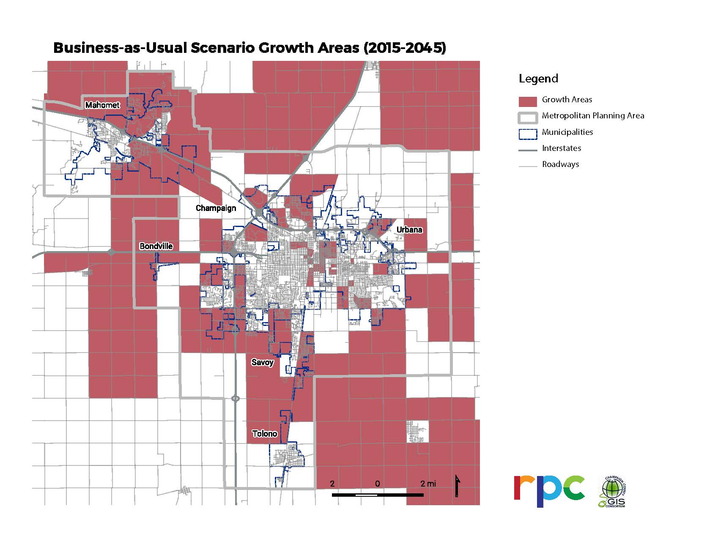
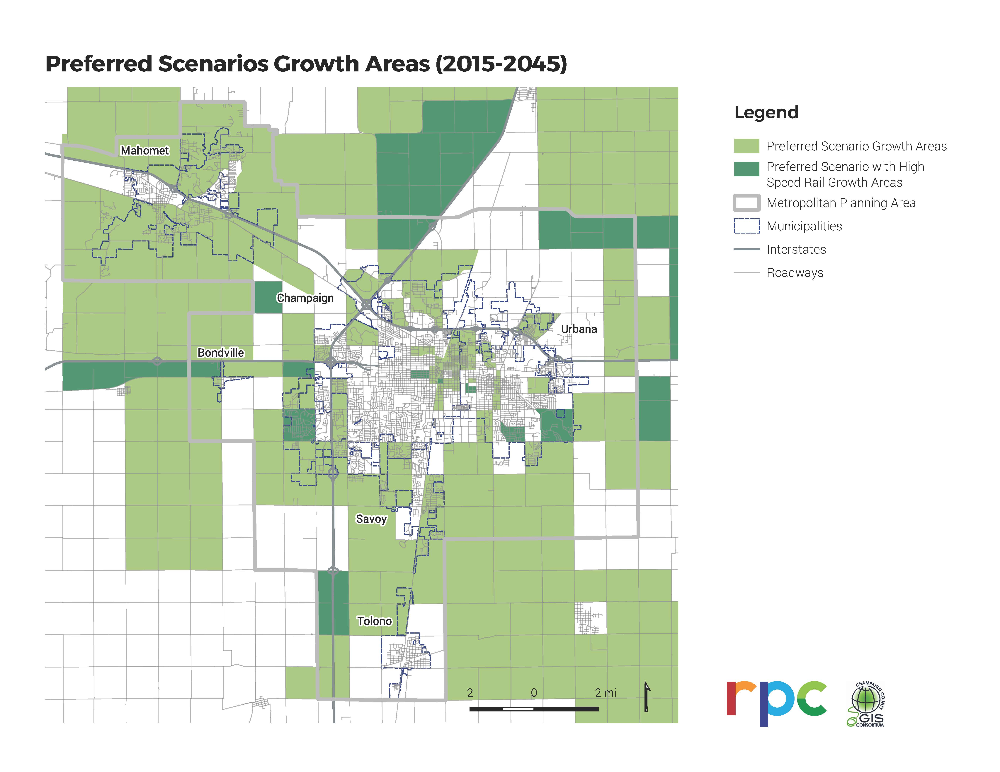

# Phase Three Public Outreach

30-day public comment period and local agency presentations.

# Phase Three Public Outreach

The third and last phase of LRTP 2045 public involvement is a 30-day review
period for the DRAFT LRTP 2045 from Wednesday October 23 to Thursday November
21, 2019. In addition to promoting this website for review, printed copies
of the website are available at the following locations:

* Champaign Public Library
* Urbana Free Library
* Illinois Terminal in Champaign
* Savoy Municipal Center
* Tolono Public Library
* Mahomet Administration Building
* Champaign County Regional Planning Commission in Urbana

Input received and updates made to the LRTP 2045 during the public comment
period will be documented in this section as they are processed by
[CUUATS](https://ccrpc.org/programs/transportation/) staff.
[CUUATS](https://ccrpc.org/programs/transportation/) staff will also be
presenting the DRAFT LRTP 2045 to the following local agencies for review and
feedback:

* October 30, 8:00AM - Chamber of Commerce
* October 30, 3:00PM - MTD Board of Trustees
* November 8, 9:00AM - County Board, Highway and Transportation Committee
* November 13, 7:00PM - Savoy Board of Trustees
* November 15, 10:00AM - University of Illinois
* November 18, 7:00PM - Urbana City Council
* November 19, 6:00PM - Mahomet Board of Trustees
* November 19, 7:00PM - Champaign City Council
* November 22, 8:30AM - RPC Board

## Public Comments Received

### Email received 10/25/2019 regarding [Multimodal Connectivity strategies](https://ccrpc.gitlab.io/lrtp2045/goals/multicon/#objectives-and-performance-measures)

Regarding Strategy #6:“Identify cost effective ways of including bicycle,
pedestrian, and transit accommodations into all new roadway projects.”

Based on our complete streets policy we do not build accommodations for walking,
bicycling, and transit just when it is “cost effective”. It is not clear what
“cost effective” means or how this is determined. These accommodations are
necessary to our transportation system and should be built whenever feasible,
not just when it is cost effective. The wording implies that sidewalks, bicycle
infrastructure and bus stops are luxuries that will be included only if there is
funding leftover.

Sidewalks, bicycle infrastructure, and transit facilities save communities and
families money. They are the most cost effective investment we make in
infrastructure providing a plethora of benefits for much lower costs than
infrastructure for single occupancy vehicles. So if we want to build cost
effective infrastructure we should start by providing for walking, biking, and
transit and include accommodations for cars when it is “cost effective”.

* Updated:  
  Strategy #6 was updated to read: “To maximize pedestrian, bicycle, and transit
  improvement implementation efforts, identify ways of including bicycle,
  pedestrian, and transit accommodations into all new roadway projects that don’t
  already consider other modes.”

### Email received 10/25/2019 regarding [Multimodal Connectivity strategies](https://ccrpc.gitlab.io/lrtp2045/goals/multicon/#strategies)

“6. Identify cost effective ways of including bicycle, pedestrian, and transit
accommodations into all new roadway projects. Responsible Parties: IDOT, Cities,
Villages, University of Illinois, Developers, Townships”

If we measure “cost-effectiveness” of transportation infrastructure relative to
SOV lanes then, *all* bike, pedestrian, and transit accommodations are *cost
effective*. Bike lane miles and sidewalk lane miles are drastically cheaper
than the same lane miles of car infrastructure and are more efficient for moving
people. Transit infrastructure is the same cost as SOV lanes and moves an order
of magnitude more people than a similar lane devoted to moving car traffic.
Rather than identifying places where bike, pedestrian, or transit infrastructure
is cost-effective, the assumption should be that cycling, pedestrian, and
transit infrastructure will be accommodated into all roadway projects, and SOV
lanes will be built if they make sense. Not the other way around.

* Updated:  
  Strategy #6 was updated to read: “To maximize pedestrian, bicycle, and transit
  improvement implementation efforts, identify ways of including bicycle,
  pedestrian, and transit accommodations into all new roadway projects that don’t
  already consider other modes.”

### Phone call received 11/14/2019 regarding [LRTP 2045 Vision Video](https://ccrpc.gitlab.io/lrtp2045/vision/futureprojects/#future-projects-regionally-significant-vision-projects)

The video references the desired railroad grade separation at Curtis Road as an
“overpass,” though it should be referred to a an “underpass” from the
perspective of the roadway and drivers, as the road will go under the railroad
and the railroad will go over the roadway.

### Comments left with printed version of the website at one of the public review locations

My overall comment is that the trends in VMT need to be quantified, particularly
in order to track weather it is declining or rising.

Additionally, 30-days is not a sufficient public input period. Please plan for a
60-90 day public input period next time.

It was nice to have access to a printed copy, it really fits together much
better that way as one can reference several sections instantly. Overall, it
provides a nice vision of what rational and transformative transportation
planning and implementation could do for the C-U area in terms of equity,
economy, and the environment. Good job!

#### Regarding [Pedestrian Safety](https://ccrpc.gitlab.io/lrtp2045/existing-conditions/transportation/#pedestrian-safety)

This section seems to attempt to minimize ped casualties. Please fix as
suggested: Replace “Local pedestrian crashes, while rare, are about twice as
likely to result in death or disability as bicycle crashes” with “Local
pedestrian crashes, while rare at about 2% of overall crashes, account for 22%
of traffic fatalities and 16% of serious injuries.”

* Update:   
  After double-checking the numbers, replaced the sentence
  referenced above with, “Local pedestrian crashes, while rare at about 2
  percent of overall crashes, account for 18 percent of traffic fatalities and 9
  percent of serious injuries.”

#### Regarding [Fatal Traffic Crashes](https://ccrpc.gitlab.io/lrtp2045/existing-conditions/transportation/#fatal-traffic-crashes)

You need to continue the parallel construction from previous paragraph. The
fatal crashes per 100 Million VMT have increased significantly from 2012 and are
higher than the statewide fatal crash rate.

* Update:  
  Added the sentence, “The five-year rolling average of
  total fatalities per 100 million VMT in the MPA has been relatively stable
  since 2012, but has increased approximately 11 percent from 0.69 in 2014 to
  0.77 in 2016. In 2016, the Champaign-Urbana MPA saw 1.03 fatalities per 100
  million VMT, higher than the statewide rate of 1.01.”

#### Regarding Map of [Fatal Crash Location in the MPA, 2013-2017](http://localhost:1313/lrtp2045/existing-conditions/transportation/#fatal-traffic-crashes)

Unclear map legend

* Updated map legend with more descriptive labels

#### Regarding [Trains](https://ccrpc.gitlab.io/lrtp2045/existing-conditions/transportation/#trains)

Worsening delays as discussed in the next paragraph likely played a role.

* Update:  
  Rearranged and edited section text to make that connection more obvious.

#### Regarding [Multimodal Connectivity Performance Measures](https://ccrpc.gitlab.io/lrtp2045/goals/multicon/#objectives-and-performance-measures)

The performance measure of Vehicle Miles Traveled per Household needs to show
the current value in order to measure performance.

* Information: The LRTP 2045 Annual Report Card will serve as the data source for measuring performance going forward. The current LRTP 2040 report card has more information regarding [Household VMT](https://reportcard.cuuats.org/healthy-neighborhoods/vmt-per-household/).

### Email received 11/21/2019 regarding the [home page](https://ccrpc.gitlab.io/lrtp2045/)

1. I personally appreciate the web plan instead of a lengthy pdf; you can click to a new header/page without doing endless scrolling or searching.
2. The embedded maps you can interact with are gold.
3. Picture at the top of each page makes them more engaging in my opinion.

Suggestion:

1. Web plan layout can be really confusing for some, I wonder if there should be a blurb on the main page about why/how to interact with and flow through the plan?

### Request made at presentation 11/22/2019 regarding [Future Projects: Local and Unfunded](https://ccrpc.gitlab.io/lrtp2045/vision/futureprojects/#future-projects-local-and-unfunded)

Add the Boneyard Creek Multiuse Path (connecting downtown Urbana to Campus) to
the list of local and unfunded projects as listed in the City of Urbana City
Council and Mayor Priorities 2018-2021.

## Additional Updates Made After October 23rd, 2019

### Residential Land Area Update

A member of the LRTP Steering Committee recognized a mistake in the calculation
of residential land area change by residence type. The following text and chart
were removed and replaced in the [Residential Population Density
section](https://ccrpc.gitlab.io/lrtp2045/existing-conditions/land/#residential-population-density).

#### REMOVED:

The chart below shows changes in residential land area in Champaign, Urbana, and
Savoy from 2007 to 2017. This time period was dominated by increases in
residential land area designated for multi-family residences, particularly in
Champaign and Urbana. Land area designated for single-family residences also
increased significantly in Savoy and modestly in Urbana, but decreased slightly
in Champaign. Land area designated for mobile homes increased in Urbana but did
not change in Champaign or Savoy.

<rpc-chart
url=“landuse-residential-change.csv”
type=“bar”
switch=“false”
stacked=“true”
y-label=“Percent Change in Residential Land Area”
legend-position=“top”
legend=“true”
tooltip-intersect=“true”
source=" Champaign County, Tax Assessor, 2007-2017 Parcel-level Data"
description=“Note: Residential land area did not change significantly in Bondville from 2007 to 2017. Tolono and Mahomet did not have sufficient data to calculate land use change between 2007 and 2017.”"
chart-title=“Residential Land Area Change by Residence Type, 2007-2017”>

### Access Score Updates

The Access Score web application was embedded in the [Access Score, 2015
Baseline](https://ccrpc.gitlab.io/lrtp2045/vision/model/#access-score-2015-baseline)
section of the [Modeling](https://ccrpc.gitlab.io/lrtp2045/vision/model/) page.

#### ADDED:

Map of the pedestrian crashes within the metropolitan planning area from 2012 to 2016.

### Public Involvement Overview Updates

Additional information and tables were added to the [Overview
page](https://ccrpc.gitlab.io/lrtp2045/process/public-involvement/) to summarize
the public involvement for Phase 1 and Phase 2 combined.

#### ADDED:

[CUUATS](https://ccrpc.org/programs/transportation/) staff designed and
scheduled the LRTP 2045 public involvement strategies and events to capture a
representative sample of the population in the metropolitan planning area, with
special emphasis on engaging underrepresented populations. The following charts
provide an overview of participant demographics based on voluntary information
provided by approximately 60 percent of participants from [phase
1](https://ccrpc.gitlab.io/lrtp2045/process/round-one/) and [phase
2](https://ccrpc.gitlab.io/lrtp2045/process/round-2/) of LRTP 2045 public
involvement which included **27 in-person events as well as online engagement**,
and resulted in **over 1,200 transportation system comments** and **over 1,100
surveys** submitted about current transportation behavior and future
transportation priorities.

<rpc-table
url=“input\_allevents.csv”
table-title=“Public Outreach Events by Municipality - Phases One and Two”
columns=“1,2”
rows=“1,2,3,4,5,6,7”

### UrbanCanvas - Land Use Modeling Update

Two maps showing UrbanCanvas' projected future growth for the Metropolitan
Planning Area were updated to illustrate growth at a smaller geographic scale.
Geographic units based on population such as traffic analysis zones (TAZs) and
Census blocks are much smaller in dense urban areas and get much larger as
population density decreases outside urban areas. This phenomenon can visually
exaggerate changes between urban and rural areas. Since the difference in size
between urban Census blocks and rural Census blocks is smaller than the
difference in size between urban TAZs and rural TAZs, two new growth maps
showing projected growth by Census block replaced two maps showing projected
growth by TAZ in an attempt to provide a more accurate visual representation of
projected growth. Additionally, the definition of “significant growth”
highlighted in the maps was changed from greater than 25 percent to 20 percent
or more, with a minimum absolute change of 20. The following text and maps were
removed and replaced in the [UrbanCanvas - Land Use Modeling
section](https://ccrpc.gitlab.io/lrtp2045/vision/model/#urbancanvas-land-use-modeling).

#### REMOVED:

The distributions of areas of significant growth can be seen in the
following two maps, and were defined as TAZs with more than 25% growth in
population or employment between 2015 and 2045.

Note: To expand the image to full-size, right-click the graphic and choose 'open image in new tab'.

Image:
[CUUATS](https://ccrpc.org/)

Note: To expand the image to full-size, right-click the graphic and choose 'open image in new tab'.

Image:
[CUUATS](https://ccrpc.org/)

### System Performance Report

The Moving Ahead for Progress in the 21st Century (MAP-21) enacted in 2012, and
the subsequent Fixing America’s Surface Transportation Act (FAST Act), enacted
in 2015, established a national performance measurement system for the highway
and transit programs. The U.S. Department of Transportation (USDOT) instituted
this performance management requirement by establishing performance measures for
four categories through rulemakings. Each performance measure’s baseline and
targets must be included in a System Performance Report in the MPO’s long-range
transportation plan to document the condition and performance of the
transportation system with respect to required performance measures.

#### ADDED:

[System Performance Report](https://ccrpc.gitlab.io/lrtp2045/data/tpm/#introduction)

### Forecasting Revenues, 2020-2045

#### REPLACED:

The State of Illinois just released their multi-year program on October 21,
2019. Given the program’s impact on local transportation investment, this
section will be updated as soon as CUUATS staff are able to process the state’s
multi-year program and incorporate the information into the plan.

#### ADDED:

The entire [Forecasting Revenues, 2020-2045](https://ccrpc.gitlab.io/lrtp2045/vision/funding/#forecasting-revenues) section was updated to reflect current federal and state funding
levels as well as local revenue and expenditure projections through 2045.

### Public Involvement Overview

An error was found in the calculation of the demographics of the public input
participants. The following table was removed and replaced in the [Public Involvement
Overview](https://ccrpc.gitlab.io/lrtp2045/process/public-involvement/).

#### REMOVED: