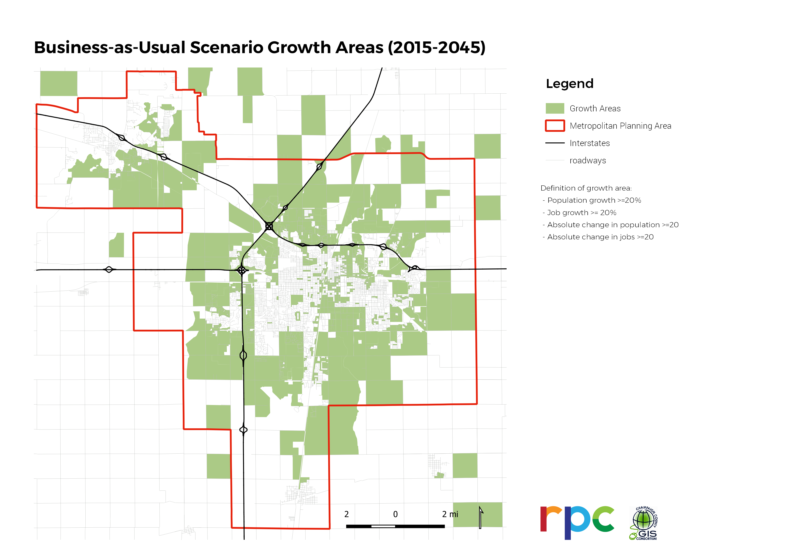
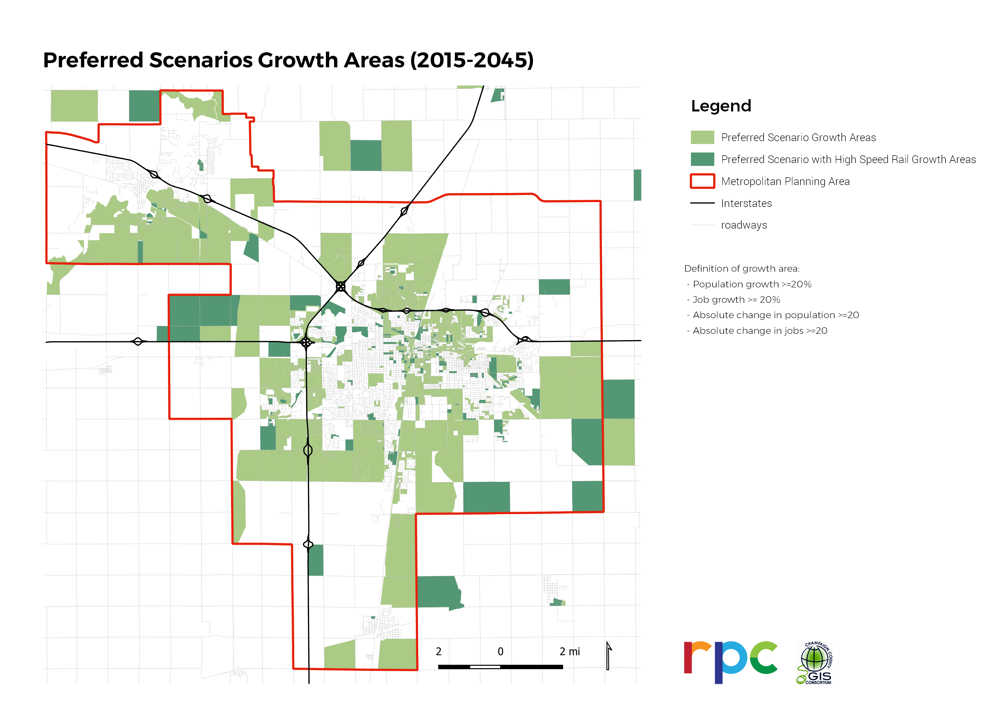

# Modeling Future Conditions

The modeling process, which considers the existing transportation, socio-economic, land use, and environmental conditions of the region, helps determines what planning actions are most supportive of the goals and objectives identified for the planning horizon.

# Modeling

The combined input about the current and future transportation system conveyed
strong public support for a set of overlapping ideas about the future of
transportation: a more environmentally sustainable transportation system,
additional pedestrian and bicycle infrastructure, shorter off-campus transit
times, equitable access to transportation services, and a compact urban area
that supports active transportation and limits sprawl development. Because of
the complementary nature of these ideas, CUUATS staff, with the help of the LRTP
2045 Steering Committee, developed one preferred scenario for 2045 that
incorporated these overarching ideas summarized by the LRTP 2045 goals, as well
as emerging transportation technology such as electric and automated vehicles
(AVs). The LRTP 2045 goals correlate with the [pillars identified in the
previous LRTP
2040](https://lrtp.cuuats.org/lrtp-main_011615_reduced_8-planning-pillars/),
also based on public input, bolstering the foundation of the community’s vision
for the future.

* **Bicycle and pedestrian infrastructure:** 100 percent of recommended
  pedestrian and bicycle projects from local plans were incorporated into the
  preferred scenario for 2045. Although no local agency could feasibly commit
  to implementing more than 80 percent of all currently-recommended pedestrian
  and bicycle projects in their respective jurisdictions over the next 25
  years, the small scale and large volume of these projects made it
  time-prohibitive to select which projects should be excluded.
* **Shorter off-campus transit times:** MTD staff helped develop a hypothetical
  future transportation network that would shorten some off-campus transit
  times though route changes, frequency changes, and the incorporation off
  off-campus hubs.
* **A more environmentally-sustainable transportation system:** Staff used
  increased rates of active transportation as well as industry projections for
  the increase of electric vehicles to reduce vehicle emissions in the region.
  In addition, staff incorporated growing rates of solar production potential to
  decrease the region’s future reliance on fossil fuels for residential,
  business, and electric car energy needs.
* **Limited sprawl:** To discourage additional sprawl development and maintain
  short commute distances to services, restrictions were placed on peripheral
  development and incentives were assumed for infill development. In addition,
  the selection of projects modeled for the future emphasize existing
  transportation network maintenance over new roadway construction.
* **Automated Vehicles (AVs):** Automated vehicles, fully autonomous, or
  self-driving vehicles are vehicles that can guide themselves without humans
  behind the wheel. CUUATS staff used industry projections as well as local
  research to estimate the timing and framework of future AV integration. As a
  smaller urban area, staff used conservative estimates for when AV technology
  might start to infiltrate the region. In conjunction with other
  transportation goals, staff also assumed that the vast majority of AVs would
  be both electric (in order to maintain a decrease in vehicle emissions) and
  shared (in order to discourage additional congestion and potential inequality
  in terms of access to new AV technology and infrastructure).
* **High Speed Rail:** Being able to travel to Chicago via high speed rail in
  45 minutes has been a goal of residents for many years, as documented in the
  LRTP 2045 [public
  input](https://ccrpc.gitlab.io/lrtp2045/process/round-one/#specific-projects)
  as well as the two previous LRTPs for
  [2040](https://lrtp.cuuats.org/documents/) and
  [2035](https://lrtp.cuuats.org/final-plan/). The technology is not new, but
  the expense is well beyond the scope of local agencies and it’s hard to
  predict how and when it would be possible to obtain that kind of funding. Due
  to this uncertainty, it was determined by the LRTP Steering Committee and
  CUUATS staff that the preferred scenario would be modeled twice: once without
  high speed rail and once with high speed rail.

The three separate future scenarios modeled for the Metropolitan Planning Area
(MPA) and compared with a 2015 baseline are briefly defined in the table below.

| Scenario Name | Scenario Description |
| --- | --- |
| 2015 Baseline | Based on 2015 data, intended to reflect current conditions. |
| 2045 Business-as-Usual Scenario | Forecasts how and where development will occur between 2015 and 2045 based on historic development trends, relatively certain future development projects and transportation system changes, as well as conservative integration of connected and autonomous vehicles starting around 2030. |
| 2045 Preferred Scenario | Designed to incorporate relatively certain future developments and transportation system changes as well as Federal, State, and local goals as summarized in the Goals, Future Conditions, and Future Projects sections. This scenario reflects ambitious implementation of bike and pedestrian recommendations in current plans, projected transit system changes, future environmental considerations and actions, and an emphasis on infill (over peripheral or sprawl) development. |
| 2045 Preferred Scenario + HSR | Incorporates the construction of a high speed rail (HSR) line to Chicago by the year 2040 into the 2045 Preferred Scenario. |

The CUUATS modeling suite is designed to provide a holistic approach to planning
analysis through the integration of localized transportation, land use,
emission, social costs, accessibility, and mobility data. Each model addresses a
specific area of concern at the necessary level of detail to make it appropriate
for Champaign County or the metropolitan planning area. The synergy of the
different models allows CUUATS planners to assess how different population
changes and development patterns will impact the transportation system in the
future. By quantifying the various impacts of potential transportation system
changes, planners are able to compare different future development scenarios as
well as develop individual performance measures. While all transportation
improvements require some combination of labor, materials, and expertise to
carry out, some desired improvements are more straightforward to measure and
model than others. For instance, completing gaps in the bicycle network or
improving curb ramps to improve multimodal connectivity can be counted,
measured, and tracked as improvements are completed over time. Other desired
improvements, like limiting sprawl development or reducing greenhouse gas
emissions to improve environmental health, rely on a number of additional
factors and future unknowns that are not as clearly measurable and are therefore
more difficult to model for the future.

Two models serve as the foundation of the CUUATS modeling suite: a land use
model and a travel demand model (TDM). The land use model projects population,
employment, and land use change into the future while the TDM estimates the
number and location of auto and transit in the future. The TDM is integrated
with the land use model, running in a 5-year iterative process over the 25-year
planning period, to identify the relationships between land use changes and
travel patterns in the region. Three additional models, SCALDS, MOVES, and
Access Score, use the outputs from the first two models to project different
costs of development, vehicle emissions, and transportation network
accessibility for all modes. Models can’t *predict* the future, but they can
help us *imagine* the future and try to understand how our actions today could
impact our transportation system down the road. Countless variables will
determine the health and relative success of the region over the next 25 years.
While the LRTP 2045 models and projections were carefully designed and validated
whenever possible, they are not perfect reflections of the social and physical
processes in play, and the input data used is imperfect.

Overall, the models’ results show that the increased density of the two 2045
Preferred Scenarios reduce vehicle miles traveled, new infrastructure costs,
resource usage, and per capita emissions compared with the 2045
Business-as-Usual Scenario. The inclusion of high speed rail increases commuters
between Champaign County and Chicago and produces additional but modest
increases in population, employment, and density in the metropolitan planning
area over the 2045 Preferred Scenario without high speed rail. For more
information about the different models and related inputs utilized in the
development of the LRTP 2045 scenarios, see the [Data and
Models](https://ccrpc.gitlab.io/lrtp2045/data/) section.

#### CUUATS LRTP 2045 Modeling Suite

![Diagram showing the types of software used to develop the future vision. CUUATS staff started with the Travel Demand Model and Urban Sim. These two programs analyze the vehicle miles traveled, mode choice, traffic volume by road link, congestion speed, population projections, employment projections, and areas of future growth. From there, the data collect from the Travel Demand Model and Urban Sim are used in three other programs: Social Cost of Alternative Land Development Scenarios (SCALDS), Motor Vehicle Emissions Simulator (MOVES), and Neighborhood Level Accessibility Analysis (Access Score). SCALDS measures transportation cost by mode, energy cost, infrastructure cost, and water and sewer cost. MOVES calculates GHG emissions, urban/rural emissions, and PM 25 and other emissions. Access Score measures the level of traffic stress, by transportation mode, accessibility score by transportation mode, and the accessibility scores by destination type.](LRTP2045_modelingdiagram_final.jpg)

Diagram of the modeling process used by CUUATS staff to develop the Long-Range Transportation Plan 2045 vision. Note: To expand the image to full-size, right-click the graphic and choose 'open image in new tab'.

Image:
[CUUATS](https://ccrpc.org/)

## UrbanCanvas - Land Use Modeling

UrbanSim’s UrbanCanvas modeler is a microsimulation land use model designed to
support the regional transportation planning process by forecasting future
scenarios based on the interactions of individual persons and households.
UrbanCanvas consists of a series of interconnected models that allow planning
agencies to analyze anticipated and possible future changes in land use and
development patterns, regulations, and growth rates, over a designated planning
horizon. The outputs forecasted by the model can vary based on the wide array of
[inputs](https://cloud.urbansim.com/docs/general/documentation/urbansim.html#urbansim-section).

CUUATS employed a Census block-level cloud platform of the model to analyze each
of the future scenarios considered from the base year, 2015, to the horizon
year, 2045. To create these predictions, UrbanCanvas relies on a set of core
tables, including the Census block designated boundaries, residential units,
households, persons, and jobs. In the cloud platform, the households and persons
tables are generated by UrbanSim, using a population synthesizer, which uses
block-group level American Community Survey (ACS) estimates to distribute
households and individual people to the [blocks](https://cloud.urbansim.com/docs/general/documentation/urbansim%20block%20model%20data.html). As part of defining the 2015
base year for the model, CUUATS opted to replace UrbanSim’s standard jobs data
from Census Longitudinal Employer-Household Dynamics (LEHD), with region
specific data from Database USA, accessed through EMSI. This data was further
processed and refined based on research and local knowledge. CUUATS staff also
used an iterative proportional fitting (IPF) process to distribute ACS
tract-level housing unit data to the block-level to create the 2015 residential
units table.

In addition to the core tables, the model requires user-uploaded datasets,
including household and employment control tables, which establish the total
regional households and employment by North American Industry Classification
System (NAICS) defined sectors. The user uploads also include zoning
constraints, additional development constraints, known future developments, and
travel model skims, which provide measures of the ability to travel between each
traffic analysis zone (TAZ).

UrbanCanvas was used to analyze and predict population, households, employment
by industry, residential units, and areas of future growth for each of the
scenarios. Population and employment projections play an especially critical
role in visualizing future regional characteristics.

Based on the process used to create the population and employment projections,
the 2045 Business-as-Usual Scenario and the 2045 Preferred Scenario have the
same projected population and employment. This is because the same control
tables were used to generate these values, as it was assumed that no other
variables controlled by the model would indicate increases in these values.
Greater population and employment growth are projected for the 2045 Preferred
Scenario + High Speed Rail. This is because a [network benefits study](https://www.midwesthsr.org/sites/default/files/studies/MHSRA_TranSystems_2012.pdf) from the
Midwest High Speed Rail Association indicated that in simulation years 2042 to
2045, following the completion of the rail line, new households and jobs would
be attracted to the area. Staff reflected these values through a manual edit to
the household and employment controls tables. These increases can be seen in the
population and employment projections table above.

While the overall population and employment values are projected to be the same
for the 2045 Business-as-Usual Scenario and the 2045 Preferred Scenario, the
distribution of growth is different in these two potential futures. While
Business-as-Usual represents on-going development at the edges of the municipal
boundaries in the county, the two Preferred Scenarios include additional
development controls that result in increased redevelopment within current
municipal boundaries post-2020, when most known development projects will be
complete. The following two maps highlight Census blocks that are projected to
see 20 percent or more population and/or employment growth by 2045.

Note: To expand the image to full-size, right-click the graphic and choose 'open image in new tab'.

Image:
[CUUATS](https://ccrpc.org/)

Note: To expand the image to full-size, right-click the graphic and choose 'open image in new tab'.

Image:
[CUUATS](https://ccrpc.org/)

Through the outputs it produces, UrbanCanvas is linked with the other tools in
the CUUATS modeling suite. It has the strongest connection with the TDM. By
allowing user defined geographic boundaries to be uploaded to the cloud
platform, UrbanCanvas is able to distribute the population, household, and
employment projections it creates to each of the TAZs used in the TDM. Based on
local knowledge, staff made some adjustments to these values to better reflect
what currently exists in the county, as well as certain known futures. The
distributed population, employment, and household values create the
socioeconomic inputs needed to run the TDM. The UrbanCanvas model and TDM then
run in an iterative process that allows any congestion or other transportation
patterns that may impact regional development in the next 25 years to be
considered in UrbanCanvas’s prediction of future development. Outputs from
UrbanCanvas are also used in the Social Costs of Alternative Land Development
Scenarios (SCALDS) model.

## Travel Demand Model (TDM)

The Champaign County travel demand model (TDM) is a person trip model built
using the Cube Voyager software platform. The TDM employs the four-step travel
forecasting process to evaluate auto and transit trips for both daily and peak
hour scenarios. The countywide travel demand model is integrated with UrbanSim’s
UrbanCanvas modeler to identify the relationships between land use changes and
travel patterns in the region. Due to the unique relationship between the TDM
and UrbanCanvas, multiple horizon year forecasts can be evaluated. The base year
for the model is 2015.

To forecast trips and roadway volumes for each of the future scenarios, the TDM
relies on a set of core inputs, including population and employment projections
generated from UrbanCanvas, future roadway network and transit service
projections identified with state and local roadway agencies, and other
variables including overall vehicle stock and fuel economy. The CUUATS TDM also
considers the advent of connected and/or autonomous vehicles (C/AV) and their
impact on regional travel patterns and transportation infrastructure, detailed
in the [Data and Models](https://ccrpc.gitlab.io/lrtp2045/data/) section.

The TDM models trips for all purposes, including work, school, shopping, and
other trips. The following two figures report the TDM’s vehicle miles traveled
(VMT) and mode share projections for the 2015 Baseline and the three 2045
scenarios.

The total VMT is projected to increase approximately 39 percent from between
2015 and 2045 under the Business-As-Usual Scenario. This is mainly due to the
projected increase in population and employment, as well as the projected
additional induced-trips from connected/autonomous vehicles. The total VMT under
the Preferred Scenario is projected to be less than that of the
Business-As-Usual Scenario as a result of an increased share of transit,
bicycling, and walking trips due to improved and expanded infrastructure for
those modes. Under the Preferred Scenario + HSR, the higher population and
employment in the MPA results in a higher VMT, but still lower than that of the
Business-As-Usual Scenario, as [approximately 204,750 annual car trips between
the Champaign-Urbana region and Chicago are projected to be replaced with high
speed rail trips](https://nepis.epa.gov/Exe/ZyPDF.cgi?Dockey=P100VOWM.pdf).

The CUUATS TDM was utilized to measure levels of congestion during peak hours
within the urbanized area roadway network. Levels of congestion were determined
based on Volume to Capacity (V/C) ratio values of different roadway segments
during the peak hours. A Volume to Capacity ratio compares demand (roadway
vehicle volumes) with supply (roadway carrying capacity). The following maps
show modeled congested links in baseline year 2015 and projected congested
links in 2045 where the volume of traffic on the roadway threatens to exceed (a
value of 0.9-1) or exceeds (a value greater than 1) the capacity of the roadway
during peak travel times in the MPA.

*To view traffic congestion for different scenarios, use the menu button to
expand the map options.*

The baseline map shows areas of congestion for the baseline year 2015.
Roads with medium congestion include north Prospect Avenue and the northern
campustown area. A small section of north Neil Street has the highest level
of congestion.
&lt;p&gt;The business as usual map shows areas of projected congestion for
business-as-usual 2045. Roads with medium congestion include west Kirby
Avenue, north Mattis Avenue, south Lincoln Avenue, south First Street, and
the northern campustown area. Roads with the highest congestion include
north Mattis Avenue, north Prospect Avenue, north Market Street, north Neil
Street, and areas in campustown.&lt;/p&gt;
&lt;p&gt;The preferred scenario map shows areas of projected congestion for the
preferred scenario 2045. Roads with medium congestion include west Kirby
Avenue, north Mattis Avenue, south Lincoln Avenue, south First Street, and
the northern campustown area. Roads with the highest congestion include
north Mattis Avenue, north Prospect Avenue, north Market Street, north Neil
Street, and areas in campustown.&lt;/p&gt;
&lt;p&gt;The preferred scenario and high speed rail map shows areas of projected
congestion for the preferred scenario 2045 and high speed rail scenario
combined. Roads with medium congestion include west Kirby Avenue, north
Mattis Avenue, south Lincoln Avenue, south First Street, and the northern
campustown area. Roads with the highest congestion include north Mattis
Avenue, north Prospect Avenue, north Market Street, north Neil Street, and
areas in campustown. The congestion in campustown is slightly higher in this
2045 scenario than the others.&lt;/p&gt;

## Social Cost of Alternative Land Development Scenarios (SCALDS)

The [Social Cost of Alternative Land Development Scenarios (SCALDS)](https://www.fhwa.dot.gov/scalds/scalds.html) model was
created in 1998 by Parsons Brinckerhoff and ECONorthwest for the Federal Highway
Administration. The model tests the impacts of various scenarios of land
development that are often unforeseen by policymakers. It is a comprehensive
model of the initial costs of development (such as building out utilities),
ongoing maintenance costs, and externalities like travel time and natural
resource use. CUUATS staff have updated and reviewed the model using local data
for Champaign County.

When comparing the Business-as-Usual with both preferred scenarios, the key
differences in land development are the location and density of new growth.
While Business-as-Usual assumes ongoing development at the peripheries of
municipal areas in the region, the preferred scenarios implemented building
constraints, limiting new development to the existing municipal boundaries.
These growth patterns can be seen in the future growth area maps shown above.
This shift in development patterns maximizes the utility of existing
infrastructure and helps to preserve land for important agricultural uses.

Limiting the area for new development not only changes the location of future
growth, but also the type of residential units constructed. While
Business-as-Usual predicts an increase of 2,021 single family homes, the
preferred scenarios show much larger increases in multi-family housing units.
Due to the assumed increase in population, the preferred scenario with high
speed rail still predicts the construction of new single-family homes, but only
about 10% of what is expected from Business-as-Usual. The preferred scenario
without rail predicts a negative value for the construction of single-family
homes, which represents the demolition and redevelopment of low-density
residential parcels to higher density multi-family uses. The following two
figures show these trends in residential development.

Shifting a large portion of the regional growth to the core of the community and
prioritizing urban redevelopment over new peripheral development, decreases the
need to extend infrastructure to meet the needs of new development far away from
already developed areas. Both preferred scenarios predict significantly lower
new infrastructure costs between 2015 and 2045, at about 30% lower than that
predicted by Business-as-Usual. These cost estimates can be seen in the
following chart. The infrastructure cost estimate for the Preferred Scenario +
HSR is higher than the Preferred Scenario without HSR due to the need to provide
for the additional population and employment projected with the installation of
high speed rail.

While both preferred scenarios predict a lower demand for new infrastructure to
be built, this does not necessarily represent reduced maintenance costs. All
three scenarios predict very similar per capita annual operating costs in 2045,
with the Preferred Scenario + HSR predicted to be the highest. This estimate
includes maintenance of transportation, sanitary and storm sewer, and all energy
infrastructure. While there may be less new infrastructure constructed in the
preferred scenarios, an increase in biking and walking was assumed, which would
increase demand and maintenance for new and existing infrastructure associated
with active transportation. The larger population and employment assumed with
high speed rail would also increase the use and therefore the maintenance of all
infrastructure represented in this model.

In addition to reducing the cost of new infrastructure, increased density of
development in both of the preferred scenarios also results in lower annual
transportation and non-transportation energy consumption per capita (see figure
below). Increasing density [reduces the energy](https://www.sciencedirect.com/science/article/pii/S0378778802000750) consumed by buildings, as well as
transportation energy needs. Annual transportation and non-transportation
energy consumption per capita is also lower in both of the preferred scenarios
because it was assumed that solar production would continue to increase at the
present rate of adoption, so the estimated solar production was removed from the
predicted consumption. The preferred scenarios also anticipated a greater
adoption of electric vehicles, but the increase of solar production offsets this
increased demand for electricity.

## Mobile Source Emissions (MOVES)

The MOtor Vehicle Emission Simulator (MOVES) model was developed by the
Environmental Protection Agency’s (EPA) Office of Transportation and Air
Quality. MOVES is required for use by states and metropolitan planning
organizations (MPO) where measurements of one or more pollutants exceed the
maximum allowable levels under the National Ambient Air Quality Standards
(NAAQS) and must be run at the county scale for all non-attainment areas.
Although the Champaign-Urbana urbanized area is currently an attainment area for
all emissions quality standards, CUUATS staff proactively includes MOVES in the
modeling suite to estimate the environmental impact of alternative planning
scenarios. This data also allows the region to continually track and better
understand how ongoing development affects emissions in order to remain an
attainment area. Several calculated assumptions impact the MOVES 2045 outputs
including [increased temperature](https://www.vox.com/a/weather-climate-change-us-cities-global-warming), a significant increase in the share of
electric vehicles, and transportation network recommendations outlined in the
Data and Models section.

The figure below shows the modeled annual mobile vehicle emissions in the MPA.
Since a 39 percent electric vehicle fleet share is projected for the 2045
Business-as-Usual scenario, the percentage increase in emissions from the 2015
baseline is less than the percentage increase in VMT shown from the TDM. The
projected increase in active transportation mode share and an even higher share
of electric vehicles under both 2045 Preferred Scenarios result in a decrease in
the amount of emissions generated compared with 2015, despite projected
population and employment gains.

## Access Score

Many of the long-range transportation planning assessment processes are
concerned with data and trends that occur at the regional level. While this is
beneficial for understanding the overall future direction of the community, it
is not localized enough to help identify specific limitations in the
transportation network. To help address this spatial mismatch and make the
CUUATS transportation planning and modeling processes more complete, staff
developed a geography neutral, multimodal accessibility assessment, known as
Access Score. This tool utilizes level of traffic stress (LTS) assessments for
each mode and travel time to calculated accessibility scores to several
destination types. These accessibility scores help staff to assess the current
and potential future status of accessibility in the Champaign-Urbana region, to
identify areas in need of improvement, and to observe potential benefits from
the construction of new infrastructure.

To develop Access Score staff utilized an existing bicycle level of traffic
stress (BLTS) assessment from the [Mineta Transportation
Institute](http://transweb.sjsu.edu/research/low-stress-bicycling-and-network-connectivity),
and an existing pedestrian level of traffic stress (PLTS) assessment from the
[Oregon Department of
Transportation](https://www.oregon.gov/ODOT/Planning/Documents/APMv2_Ch14.pdf).
Automobile level of traffic stress (ALTS) is assessed using an in-house
analysis, created by CUUATS staff to emulate the assessments for BLTS and PLTS,
by considering elements of the automobile transportation network and its
interactions with other modes. In each of these LTS assessments, network
infrastructure characteristics were assessed and assigned a level of stress, one
(1) being the lowest stress and four (4) being the highest. Each segment in the
network was assigned an overall level of stress based on the highest, or most
stressful score it received for any one of the characteristics considered.
Transit level of traffic stress (TLTS) is assessed using the Pandana
accessibility tool, which uses general transit feed specification (GTFS) and
transit headway and schedule data to assess transit trips based on the time
required to reach a destination, which is then combined with the pedestrian
score required to get from the point of origin to the nearest bus stop.

Once the modal LTS scores were complete, accessibility was calculated by
multiplying the LTS scores by the travel time. The assessment includes
accessibility to the following ten destination types: grocery stores, health
facilities, jobs, parks, public facilities, retail stores, restaurants, schools,
arts and entertainment, and services.

Access Score allows not only for the assessment of current accessibility, but
also for the analysis of future scenarios. To evaluate future accessibility for
both preferred scenarios, staff geocoded all bicycle, pedestrian, and automobile
projects recommended in current plans that would impact infrastructure
considered in one or more of the LTS scores. Other LTS characteristics were also
updated using the relevant TDM scenario outputs. Due to the significant overlaps
in the elements of the two preferred scenarios, a comparison of the two
different assessments showed no discernable differences. Overall, the addition
of new infrastructure from 2015 to 2045 had positive impact on bicycle and
pedestrian access scores, with slight decreases to automobile scores. Transit
accessibility increased slightly, despite no change in the routes and schedule
in the analysis. This increase can be attributed to improved scores for the
pedestrian portions of those trips. The scores for the 2015 and 2045 scenarios
can be seen in the Access Score application embedded below.

Map of the pedestrian crashes within the metropolitan planning area from 2012 to 2016.